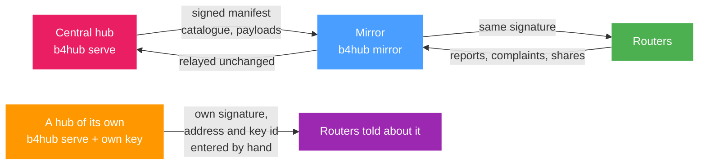

# Running a hub

`b4hub` is the service behind `hub.b4core.app`. It holds the catalogue, accepts shared sets and the reports and complaints routers send, signs what it publishes, and serves the [moderation console](./moderation.md). It is a separate binary from b4, versioned and released on its own, and it never runs on the router.

It runs in one of two shapes.

| | A hub of its own | A mirror |
| --- | --- | --- |
| Command | `b4hub serve` | `b4hub mirror` |
| Catalogue | Built from the sets shared to it | Copied from an upstream hub |
| Signing key | Its own, from `b4hub keygen` | None for the catalogue, which keeps the upstream signature; an announcing mirror holds a key only to sign its announcement |
| Moderation | Its own moderators and console | None |
| Records from routers | Stored and acted on | Forwarded upstream unchanged |
| Database | SQLite in the data directory | None |
| What a router has to be told | The address and the key id | Nothing, once the upstream hub has approved it |

A hub of its own is a second catalogue. Its sets are the ones its own moderators approved, its reports are counted separately, and a router reaches it only after both its address and its key id have been entered by hand. A mirror is the same catalogue at a second address: it verifies the upstream signature, copies the files, and forwards everything a router sends to the hub that signed them.



:::info
The **Hub mirrors** field described under [Community Hub](./index.md#switching-it-on) has nothing to do with [Update mirrors](../advanced/update-mirrors.md), which are the hosts b4 downloads its own releases from.
:::

## The service

One static binary with the console embedded in it. Every command takes `--data`, the directory that holds everything the service owns.

| Command | What it does |
| --- | --- |
| `b4hub keygen` | Creates the signing identity and prints the key id. Refuses to overwrite an existing one. |
| `b4hub serve` | Runs a hub: the catalogue builder, the endpoints routers talk to, and the console. |
| `b4hub mirror` | Runs a mirror of another hub. |
| `b4hub build` | Builds and signs the catalogue once, then exits. `--new-epoch` and `--revoke` do the same as the console's Catalogue page. |
| `b4hub moderate` | Approves, rejects, hides, bans and handles mirrors from the command line, without the console. |
| `b4hub version` | Prints the hub version and the b4 source tree it was built from. |

The flags below have an environment variable counterpart, which is what a unit file or a container normally sets. The per-command flags `--new-epoch`, `--revoke`, `--announce` and `--refresh` are given on the command line only.

| Flag | Variable | Default |
| --- | --- | --- |
| `--data` | `B4HUB_DATA` | `data` |
| `--listen` | `B4HUB_LISTEN` | `127.0.0.1:7100` |
| `--public-url` | `B4HUB_PUBLIC_URL` | empty |
| `--geosite-url` | `B4HUB_GEOSITE_URL` | the v2ray-rules-dat release |
| `--geoip-url` | `B4HUB_GEOIP_URL` | the b4geoip release |
| `--upstream` | `B4HUB_UPSTREAM` | empty, required by `mirror` |
| `--upstream-key` | `B4HUB_UPSTREAM_KEY` | empty, meaning the built-in key |
| `--trusted-proxies` | `B4HUB_TRUSTED_PROXIES` | empty |
| no flag | `B4HUB_ADMIN_PASSWORD` | empty, which closes the console |

The data directory holds `hub.key` (the signing seed), `hub.db` (the SQLite store), `secret` (created on first use), `blobs/` (payload files by hash), `public/` (the signed files routers download) and `geo/`.

:::warning
b4hub speaks plain HTTP and terminates no TLS of its own. The default listen address is loopback because a reverse proxy in front of it is assumed. The deployment bundle, with an nginx vhost, a systemd unit and a Compose file, is published in the [b4hub repository](https://github.com/DanielLavrushin/b4hub) along with the releases.
:::

### What routers ask for

| Path | Answer |
| --- | --- |
| `/b4/health` | `ok` |
| `/b4/hub/manifest.json` | The signed manifest: the catalogue file, its size and hash, the mirror list, revoked keys, the validity window |
| `/b4/hub/catalogue-<epoch>-<seq>.json.gz` | The catalogue itself |
| `/b4/hub/blob/<sha256>` | One payload file |
| `/b4/hub/v1/msg` | Where a shared set, a report or a complaint is posted |
| `/b4/hub/v1/network` | The ASN, country and ISP name the hub sees the caller on |

A mirror serves all of these except `/b4/hub/v1/network`, which needs the hub's own view of the network.

## A hub of its own

```sh
b4hub keygen --data /var/lib/b4hub
```

The command prints one line, the key id. It is the only thing that identifies this hub to a router, and it is generated once: there is no rotation command, and `keygen` refuses to overwrite an existing `hub.key`.

The moderation password is read from the environment and nowhere else:

```sh
B4HUB_ADMIN_PASSWORD=... b4hub serve --data /var/lib/b4hub \
  --listen 127.0.0.1:7100 --public-url https://hub.example.org
```

`--public-url` is the address the hub advertises for itself in the manifest, so it should be the address routers actually reach, not the loopback one.

:::warning
With `B4HUB_ADMIN_PASSWORD` unset the hub serves its catalogue normally but the console is closed: the sign-in page reports that moderation is not configured, and every sign-in and moderation request is refused. Moderation is then only possible through `b4hub moderate`, which runs alongside the service; the store is SQLite in WAL mode, so a running hub does not lock it out, and that hub picks the decision up at its next build.
:::

### Pointing a router at it

Two values go into **Settings, Integrations, Community Hub**: the base URL into **Hub mirrors**, and the key id into **Hub public key**.

:::warning
Both fields are needed. The key alone replaces the one b4 trusts, but `hub.b4core.app` drops out of the addresses b4 tries only once **Hub mirrors** names the self-hosted hub. With the key set and the address field empty, every sync still reaches `hub.b4core.app` and then refuses its catalogue for the wrong signature.
:::

The address must be `https://`, with no credentials, query or fragment. Plain `http://` is accepted only for `localhost`, a loopback, a private or a link-local address, which covers a hub on the same network but not one on a public hostname. An address b4 does not accept is dropped without a message.

A key that does not match what the hub signs with fails every sync with "manifest is not signed by a trusted key", and the stored catalogue is dropped as soon as the key it was signed with stops being trusted, so the Community page empties until a good sync.

### The catalogue it publishes

Nothing is published until a moderator approves it, so a new hub starts with an empty catalogue.

| | |
| --- | --- |
| Build | Checked on start and every 5 minutes after that; one runs when nothing has been published yet, when something changed, or when the last one is a day old |
| After a moderation action | The build runs inside the request, so an approval publishes at once |
| File | `public/catalogue-<epoch>-<seq>.json.gz`, the newest three kept |
| Manifest | Signed, valid for 14 days from the build |
| Payloads | Swept hourly; a file that no stored version refers to, and that was last written more than an hour ago, is deleted |

A router accepts a manifest only when it is newer than the one it holds: a higher epoch, or the same epoch and a higher sequence number. An older one is refused and the router moves to the next address.

:::info
A hub that stops building degrades rather than breaks. Routers keep the last catalogue they received, mark it expired after the two weeks the manifest is valid for, and go on running the sets already applied from it.
:::

### The network a contribution is attributed to

The hub resolves the ASN and country of the address a record arrives from, and that is what a report counts towards. Behind a reverse proxy the address it sees is the proxy's, unless the proxy is on loopback or is named in `--trusted-proxies` as an address or a CIDR.

:::warning
An untrusted proxy collapses the whole hub into one network. Every contribution is attributed to the proxy, per-network limits are shared by everyone at once, and a private proxy address means no ASN is recorded at all, so reports lose their per-ISP and per-country scores.
:::

The lookup is a DNS query, not a local database, so the hub host needs working outbound DNS. The `geosite.dat` and `geoip.dat` files the service downloads daily are advertised in the manifest and shown on the console, and are not used for this.

## A mirror of another hub

A mirror carries the catalogue of a hub it does not control. It checks the upstream manifest every five minutes, and when a newer one appears it downloads the catalogue and any payload files it does not already hold, verifies each of them, stores the payloads in its own `blobs/` and writes the catalogue and the manifest into `public/`, to serve as they are.

```sh
b4hub mirror --data /var/lib/b4hub-mirror \
  --upstream https://hub.b4core.app \
  --listen 127.0.0.1:7101
```

`--upstream` is the only required flag. A mirror of a self-hosted hub also needs `--upstream-key` with that hub's key id; without it the built-in key of `hub.b4core.app` is the only one the mirror trusts.

What is verified before anything is copied: the manifest is signed by a trusted key, the catalogue file name has the expected shape, the manifest is newer than the copy already held, the downloaded file is exactly the size and the SHA256 the manifest states, it decodes, and every payload file matches the hash the catalogue lists. A failure at any step leaves the previous copy in place and is retried at the next check.

:::info
A mirror keeps working with its upstream down. It loads whatever it copied last when it starts, so a restart during an outage still serves the last catalogue it received.
:::

The root of a mirror, `/`, is a page for a browser: the hub it mirrors, the catalogue it holds with the build number, the date it was built and the date it expires, when the upstream was last checked and whether it answered, and the outcome of the last announcement. It is in English or Russian by the browser's language. Error texts, the announcement record and the signing key stay out of it; they are in the mirror's log.

### Why a router ends up using one

A router tries its addresses in order: the ones configured by hand, then the ones it learned, then the built-in one. Any of them can answer, and the answer is the same signed catalogue, so an address that responds is enough for the sync to succeed. A mirror is a second place to get the same bytes from, for a network where the first does not answer.

Mirrors are learned automatically. Each signed manifest carries the list of mirrors the hub has approved, and a router that verifies a manifest stores that list next to the key that signed it, up to 32 of them, and appends it to whatever is configured by hand. Changing **Hub public key** discards them, because a mirror list is only trusted as far as the key that announced it.

### Announcing a mirror

A mirror that should end up in that list announces itself:

```sh
b4hub keygen --data /var/lib/b4hub-mirror

b4hub mirror --data /var/lib/b4hub-mirror \
  --upstream https://hub.b4core.app \
  --public-url https://mirror.example.org --announce
```

`--announce` needs both an identity of its own, so the announcement can be signed, and `--public-url`, which is the address being announced. The announcement is sent when the mirror starts and once a day after that. The URL must be `https://`, or `http://` on localhost, a loopback, a private or a link-local address, at most 200 characters, with no credentials, query or fragment.

:::warning
An announcement does not publish anything. It arrives at the upstream hub as **pending** and is never advertised until a moderator approves it on the [Mirrors page](./moderation.md#mirrors) of that hub's console. Announcing again refreshes when the mirror was last seen and never changes a decision already made, so a rejected mirror stays rejected.
:::

Once approved, the mirror is checked at every catalogue build: its `/b4/health` must answer `ok` and its manifest must verify against the hub's own key. It is listed in the manifest while a check has succeeded within the last 24 hours, so a brief failure does not drop it, and a lasting one does.

### Records sent through a mirror

A mirror has no database, so it decides nothing. It posts what it receives to the upstream hub and returns that hub's answer unchanged, including every refusal.

| When the upstream answers | What the router gets |
| --- | --- |
| Normally, whatever the verdict | The hub's own answer, unchanged |
| Not at all, or with 502, 503 or 504 | A works or broken report and a complaint are kept on disk, if their signature verifies, and retried; a shared set and a mirror announcement fail |

The queue on disk is retried at every check and kept for 30 days. A shared set is never queued anywhere, so publishing through a mirror whose upstream is down fails and has to be repeated.

:::info
The upstream hub sees the mirror's address, not the router's, because the relay forwards the record as it is. Reports relayed through a mirror are therefore counted on the mirror's network, and routers behind one mirror share its per-network limits. The ASN a router states about itself inside the report is unaffected.
:::

A mirror also does not answer `/b4/hub/v1/network`, so a router synced only through mirrors never learns its network from the hub and falls back to what the [DPI detector](../detector.md) found.

### Why a mirror cannot forge a set

The router trusts a key, not an address. The key it trusts is the one built into b4, or the one entered under **Hub public key**, minus anything a manifest has revoked. Every manifest, from whatever address, has to be signed by that key; the manifest names the catalogue file with its size and hash; the catalogue names every payload file with its hash. A mirror holds none of the private material, so a single changed byte makes the router reject the answer: a manifest or a catalogue that does not verify sends it to the next address, and a payload whose hash does not match fails the download outright.

The same check runs one level up: a mirror verifies the upstream manifest against its own trusted key before copying anything.

## A hub and a mirror on one host

They are separate commands and separate processes. Nothing merges one hub's catalogue into another's store, and a router trusts one hub key at a time, so a hub of one's own and a mirror of the central hub are two deployments, not two halves of one.

Running both on one machine needs two data directories and two listen addresses; pointed at the same data directory they would overwrite each other's published files. A third hub can in turn mirror a hub of one's own by passing its key id to `--upstream-key`.

## Keeping the data

The data directory moves as a unit. `hub.key`, `hub.db`, `secret`, `blobs/` and `public/` belong together.

:::danger
`secret` is created silently when it is missing. It keys the HMAC that stands in for a contributor's key everywhere the hub stores one, so a database restored without its original `secret` file no longer recognises anyone: bans, trust marks, the authorship of existing sets and the de-duplication of reports all come apart.
:::

:::warning
Restoring an older database rolls the epoch and sequence number backwards, and routers refuse a catalogue older than the one they hold. **Start a new epoch**, on the console's Catalogue page or as `b4hub build --new-epoch`, is what makes them take it.
:::

Losing `hub.key` cannot be repaired from the hub's side. There is no rotation path, so every router pointed at that hub would have to be given a new key id by hand.
