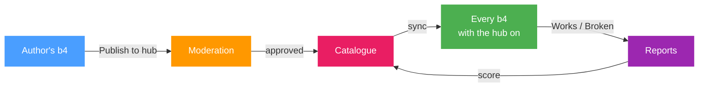

# Community Hub

The Community Hub is a catalogue of sets published by b4 users, served by `https://hub.b4core.app`. A set goes there from the set editor as a [shared set](../sets/sharing.md): the strategy, the targets and the payload files, nothing tied to the router it came from. A moderator approves it, the hub adds it to the catalogue, and every b4 with the hub switched on receives it at the next sync. The **Community** page lists the catalogue, applies a set in one step, and collects reports on whether an applied set works. The reports form the score the page sorts by.

- [Browsing the catalogue](./browsing.md): the Community page, the search, the set card, the score
- [Applying a set](./applying.md): what applying changes, updates, the test, the Discovery option
- [Reports and complaints](./feedback.md): works and broken reports, the score formula, complaints to the moderators
- [Publishing a set](./publishing.md): the Share section, moderation, versions, the author key
- [Running a hub](./hosting.md): a hub of one's own, a mirror of another, what each one needs
- [The moderation console](./moderation.md): the pages of the hub's own web interface

## The catalogue

The hub publishes one catalogue: the newest approved version of every set, with the aggregated reports for each. The catalogue is signed with the hub's key. The key of `hub.b4core.app` is built into b4, and a catalogue signed with any other key is refused.

Reports are kept against the fingerprint of the strategy, not against the set. Two sets carrying the same strategy share one score, a new version that changes only the targets keeps the score of the previous one, and a new version that changes the strategy starts with none.

The router keeps a copy of the catalogue and refreshes it on its own:

| When | What happens |
| --- | --- |
| 20 seconds after b4 starts | First sync |
| Every hour | Regular sync |
| 5 minutes after a sync that no hub answered | Retry |
| **Sync now** on the Community page or in the settings | Immediate sync |
| Before a Discovery run with **Try community sets first** | Sync, when the copy is older than 10 minutes |

Reports that could not be delivered go out with the next sync.

The search on the Community page runs against the local copy. A domain typed there is matched on the router and is not sent to the hub.

A catalogue is valid for two weeks from its build date. The hub rebuilds it much earlier than that, so the date passes only when the router has had no answer from any hub for two weeks. The Community page then shows a warning and keeps the last catalogue it received. Applied sets are ordinary sets in the configuration and keep working.

## What leaves the router

| Action | What the hub receives |
| --- | --- |
| Sync | An HTTPS request for the catalogue. The hub sees the router's public address and the b4 version, and answers with the network it sees the router on: ASN, country, ISP name. |
| Works or broken report | The hub set id and version, the strategy fingerprint, the kind of report, the domain the list was filtered by at the time (if any), the ASN and country the router knows for itself, the capture engine, the b4 version. Signed with the author key. |
| Complaint | The hub set id and version, the reason typed in. Signed with the author key. |
| Publish | The [shared set](../sets/sharing.md). Signed with the author key. |

Set names, targets of other sets and the devices behind the router are not part of any request.

The hub knows a router by its author key, not by an account. The key is generated on first use and kept under `.hub/` in the configuration directory; [Author identity](./publishing.md#author-identity) describes how it is carried to another router.

## Switching it on

**Settings, Integrations, Community Hub** holds the switch and the connection details.

| Field | Meaning |
| --- | --- |
| **Enable Community Hub** | Adds the **Community** page to the navigation, starts the hourly sync and shows the **Share** section in the set editor. A shared set pasted into **Import** is accepted with the switch off as well. |
| **Hub mirrors** | Addresses of the same hub, one per line, tried in order until one answers. Empty means `https://hub.b4core.app`. Mirrors the hub has approved are learned from its signed manifest and appended automatically; see [Running a hub](./hosting.md#a-mirror-of-another-hub). |
| **Hub public key** | For a [self-hosted hub](./hosting.md#a-hub-of-its-own) with its own key. The key of `hub.b4core.app` is built in and needs no entry here. With a key in this field b4 trusts that key alone, and stops contacting `hub.b4core.app` only when **Hub mirrors** also carries the address of that hub. While the mirrors field is empty the sync still reaches `hub.b4core.app` and then refuses its catalogue for the wrong signature. |

**Hub status** under the fields shows the catalogue and its build number, the date it is valid until, the last sync and its error, the hub addresses as chips in the order they are tried, learned mirrors outlined and the address that answered the last sync marked, the key the catalogue was verified with, the network reported by the hub, and the number of reports waiting to be sent. **Author identity** next to it shows the key id, the recovery code and the restore action.

:::tip
**Last error** in the status block names the cause of a failed sync. The next successful sync clears it.
:::

A **Matched by set** row lists the enabled sets whose targets cover the hub addresses. b4's requests to the hub pass through its own packet processing like any other traffic, so such a set applies its strategy to b4's own connection as well; a set that matches everything, such as a `regexp:.*` entry, is the usual case. A set for the hub addresses with no strategy, placed in front of it, takes the hub out of that strategy.

An **Own traffic** row appears when the hub answered only over a connection that b4's own rules leave alone. On some routers the strategy of a matching set stalls b4's own TLS handshake; when a sync fails that way, b4 retries it over the exempt path, keeps using whichever path worked, and logs the switch. The sync works either way, but the row means that set breaks b4's own connections on that router and is worth reporting.

## Applied sets on the Sets page

A set applied from the Community page is a normal set with a **Community set** chip on its card. The chip opens the set on the Community page. Once the strategy differs from the published one, the chip reads **Community set, edited**; see [Applied and edited](./applying.md#applied-and-edited).
