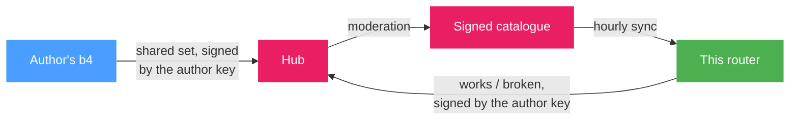

# Community Hub

A set that works on one network is often the set someone else on the same ISP is still searching for. The Community Hub is the way b4 installations exchange them: a set is published to a hub, `https://hub.b4core.app`, as a [shared set](../sets/sharing.md) with everything private left out, a moderator approves it, and every b4 that has the Community Hub on receives it in the next catalogue. From the **Community** page a published set is applied in one step, and the people running it report whether it works on their network, which is what the page ranks the sets by.

The pages in this section:

- [Browsing the catalogue](./browsing.md) - the Community page, the search, what a set card shows and how the reports score is read
- [Applying a set](./applying.md) - what applying does to the local configuration, updates, the test, and how Discovery uses the catalogue
- [Reports and complaints](./feedback.md) - the works and broken reports, how they turn into the score, and complaints to the moderators
- [Publishing a set](./publishing.md) - the Share section of the set editor, moderation, versions and the author identity

## How the catalogue reaches the router

The hub publishes one catalogue: the newest approved version of every set, with the aggregated reports for each. The catalogue is signed with the hub's key, and the key of `hub.b4core.app` is built into b4. A catalogue that is not signed with the trusted key is refused, so a mirror or a compromised connection cannot slip a set in.

b4 fetches the catalogue itself, 20 seconds after start, then every hour, and again after 5 minutes when no hub answered. **Sync now**, on the Community page and in the settings, fetches it at once. The copy lives on the router and is searched there: a domain typed into the Community page is matched against the local copy and never sent anywhere. Reports that could not be delivered go out with the next sync.

Each catalogue carries an expiry date, two weeks after it was built. The hub rebuilds it long before that, so the date passes only when no hub has answered for two weeks. The Community page then shows a warning and keeps showing the last catalogue it received; every applied set keeps working, because an applied set is an ordinary set in the configuration and does not depend on the hub.

## What leaves the router

- **On sync**: a plain HTTPS request for the catalogue. The hub sees the router's public address and the b4 version, and answers with the network it sees the router on: the ASN, the country and the ISP name. That is how the Community page knows which reports are from "your ISP".
- **On a works or broken report**: the hub set id and version, the strategy fingerprint, the kind of report, the domain that was searched when the report was made, the ASN and country the router believes it is on, the capture engine and the b4 version. Signed with the author key.
- **On a complaint**: the hub set id and version and the reason typed in.
- **On publish**: the [shared set](../sets/sharing.md), which is built from an allow-list of settings. Routing, device filters, escalation and the DNS server address never leave.

Nothing else does. The set names on this router, the domains its sets target, and the devices behind it are not part of any request.

:::info
The hub knows every router by its author key, not by an account. The key is generated on first use and stored under `.hub/` in the configuration directory; the [publishing page](./publishing.md#author-identity) describes how it is carried to another router.
:::

## Switching it on

**Settings, Integrations, Community Hub** holds the switch and the connection details.

| Field | Meaning |
| --- | --- |
| **Enable Community Hub** | Adds the **Community** page to the navigation, starts the hourly sync and shows the **Share** section in the set editor. Off, a shared set pasted into **Import** is still accepted; only the hub connection is off. |
| **Hub mirrors** | Addresses of the same hub, one per line, tried in order until one answers. Empty means `https://hub.b4core.app`. Mirrors the hub itself approves are learned from the catalogue and appended to the list automatically. |
| **Hub public key** | Only for a self-hosted hub with its own key. The key of `hub.b4core.app` is built in, and this field is left empty to use it. With a key set here, b4 trusts that key alone and never talks to `hub.b4core.app`. |

The **Hub status** block under the fields shows what the router holds: the catalogue and its build, the date it stays fresh until, the last sync and its error if it failed, the hub addresses in the order they are tried, the key the catalogue was verified with, the network the hub reported, and the number of reports waiting in the outbox. The **Author identity** block beside it shows the key id and the recovery code controls.

:::tip
The status block is where a sync problem shows first. **Last error** names the cause; the next successful sync clears it.
:::

## Where an applied set shows up

A set applied from the Community page is a normal set on the **Sets** page, with a **Community set** chip on its card. The chip opens the set on the Community page. The chip turns into **Community set, edited** once the strategy differs from the published one, which is described under [Applying a set](./applying.md#applied-and-edited).
