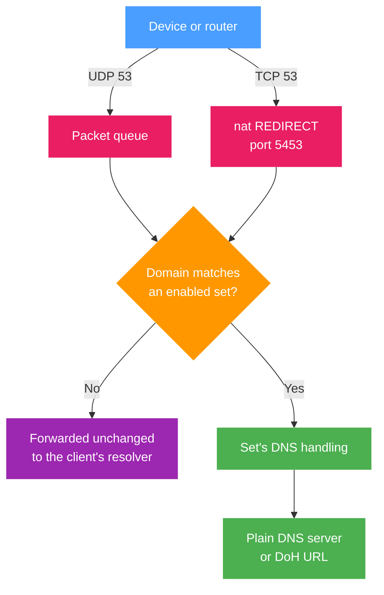

A set decides which resolver answers the domains it targets. Everything else keeps going to the resolver the client already chose. This page describes what b4 intercepts, what a set does with a query it matched, and the global DNS settings that apply to every set.

## What b4 intercepts

| Transport | How it reaches b4 | When |
| --- | --- | --- |
| UDP port 53 | Queue rules in `PREROUTING` and `OUTPUT`, for requests (`dport 53`) and for replies (`sport 53`) | Always, while b4 is running |
| TCP port 53 | A `nat` `REDIRECT` into a local listener, port 5453 by default | Only while at least one enabled set has a DNS server or a DoH URL, and **Intercept DNS over TCP** is on |

Both cases cover traffic forwarded from the network and queries the router makes for itself. b4's own lookups carry a firewall mark that skips these rules, so a query b4 sends on a client's behalf never re-enters the queue.



:::warning b4 only sees DNS that is not encrypted
Everything on this page works on DNS to port 53. When a device resolves over DoH, DoT or DoQ by itself, the query leaves as TLS or QUIC to port 443 or 853, and b4 cannot read it: the set's resolver, its pins and its blocking never apply to that name, and a routing set learns no addresses from those answers.

The usual sources are a browser with its own secure DNS turned on (Firefox, Chrome), Android Private DNS, and a resolver configured as DoH on the device itself. To work with DNS through b4, switch encrypted DNS off on those devices and let them use the router.

An encrypted forwarder on the router is a different matter and does not get in the way. Devices still ask the router on plain port 53, b4 intercepts there, and only what b4 passes through reaches the forwarder.
:::

## How a set handles a query

The query name is matched against the set targets exactly like an SNI is, so a domain entry covers its subdomains and `regexp:` entries are supported. Literal entries are tried before regular expressions: a domain listed in one set is not taken over by a `regexp:.*` catch-all in another.

For a matched query b4 works through these steps in order:

1. **Blocking.** If the set's routing mode is `block`, the query is answered with NXDOMAIN or dropped, according to the block action. See [Blocking](./sets/blocking.md).
2. **Pinned addresses.** If the name has a pin, b4 answers from the pin and stops. This happens whether or not the redirect below is enabled.
3. **Resolver.** If the redirect is enabled and a resolver is configured, b4 resolves the name itself and answers the client directly. Otherwise the query is forwarded unchanged.
4. **The answer.** Addresses from the answer are remembered for the client, and written into the set's IP set when [routing](./sets/routing.md) is on.

### Resolver types

Set the resolver on **Sets → a set → DNS & Routing → DNS Redirect**.

| Mode | Config field | What b4 does |
| --- | --- | --- |
| Plain DNS (UDP) | `dns.target_dns` | Sends the query to that IP itself, optionally fragmented (**Fragment DNS Queries**) to get past DPI that reads domain names out of queries |
| DNS-over-HTTPS | `dns.doh_url` | Sends the query as an encrypted HTTPS request, POST first and GET if the server rejects POST |

A DoH URL takes precedence: when both fields are filled, the DoH URL is used and the IP is ignored. The URL has to start with `https://`, which is checked when the configuration is saved.


### Sending one service to a resolver of its own

A common reason to redirect a single set is a service that refuses to work from your region. Two different things hide behind that, and only one of them is DNS.

**The name resolves to the wrong place.** Which address you get for a name depends on who asked: geo-aware DNS hands out the front end nearest to the resolver, and a resolver elsewhere gets a different answer. Some public resolvers go further and run their own front ends for a fixed list of services, answering with the address of a relay they operate, which reads the SNI and forwards the connection on. Either way the connection ends up on a path the service accepts, and pointing one set at such a resolver changes nothing for the rest of your DNS.

**The service checks the address you connect from.** Nothing a resolver returns changes your own address, so a check that happens after the connection is up (an account, a payment, an API key tied to a region) is unaffected by DNS. That needs a different exit: see [traffic routing](./sets/routing.md).

For the first case, make a set that targets only that service's domains, enable the redirect, and enter the resolver's DoH URL. Keep those domains out of a network-wide catch-all set, since the point is that only that service is treated differently.

:::note
A resolver that answers with its own relay addresses sees which of those names you look up and carries the traffic for them afterwards. That is a real trust decision. Point only the domains that need it at such a resolver, and keep general browsing on a resolver you would pick on its own merits.
:::

### Pinned addresses

A pin replaces what DNS hands out for a name, without a hosts file on every device. The field takes hosts file order, one line per address:

```text
157.240.0.174 www.instagram.com
157.240.205.63 scontent.cdninstagram.com scontent-a.cdninstagram.com
```

- The address comes first, then the names it should answer for.
- A pin covers each name and its subdomains, and the longest matching entry wins.
- **A pin only applies to a name the set already targets.** Pinning a name that no target of the set covers does nothing, and the interface warns about it and offers to add the name to the set's domains.
- Only A and AAAA queries are answered from pins, and only with addresses of the matching family. An AAAA query against a name pinned to one IPv4 address falls through to the resolver.
- Pinned answers are handed out with a 60 second TTL.
- Pins are read even when **Enable DNS Redirect** is off, so a set can pin a few names and leave everything else with the client's resolver.

In the configuration file the same data is stored the other way round, as `dns.pins`, a name mapped to its addresses.

### When the resolver fails

A resolver that times out or errors does not end the lookup. b4 answers from the last good reply it holds for that name, and when it holds none, it puts the query to the resolver the client was already addressing and answers with what comes back. Three failures in a row take the configured resolver out of the path for 30 seconds, so a resolver that has gone away costs one timeout rather than one per query.

A set can ask for the opposite with **Fail closed when the resolver is unreachable** (`dns.strict`). With it on, a resolver that does not answer produces SERVFAIL, b4 does not fall back to plain DNS, and a name b4 took over either resolves through the configured resolver or does not resolve at all.

:::warning
Fail closed and an unreachable resolver together mean nothing in the set resolves. On a censored connection the DoH server itself is a target, so a resolver that answered when the set was built can stop answering later, and every domain the set covers goes down with it while the bypass strategy underneath is still working.
:::

## The IPv4 fallback

b4 processes IPv4 only until **IPv6 support** is turned on in [Settings -> Core](./settings/core#protocols). A dual-stack site that a set targets would otherwise be reached over IPv6, where b4 has no rules at all, and the set would be bypassed without anything looking wrong.

To close the common path into that, b4 removes IPv6 addresses from DNS answers for domains a set matched, leaving the client with the IPv4 addresses b4 does protect. The answer is rewritten rather than refused: A records stay, AAAA records are dropped, and the client falls back to IPv4 on its own.

- It applies only to names a set matched. Every other name keeps its full answer, and IPv6 on the network is untouched.
- It stops on its own once IPv6 support is on, since there is then nothing to bypass.
- A set whose targets are pinned to IPv6 with `targets.ip_version` set to `6` keeps its IPv6 answers, since IPv6 is what that set exists for.
- Rewritten answers appear as `dns-ipv6-stripped` in [the result](#reading-the-result).

The switch is **Force IPv4 for matched domains**, under **Settings -> Core -> DNS**, and it is on by default. Turning it off is the same as setting `system.dns.keep_ipv6_answers` to `true`: AAAA records pass through untouched. It is greyed out while IPv6 support is on, because there is then nothing to fall back from.

:::warning It only reaches DNS that b4 can see
This carries the same limit as everything else on this page. A client that resolves through its own DoH, DoT or DoQ never shows b4 the answer, so it keeps the IPv6 addresses and reaches the site over IPv6 anyway. The same goes for an address already in the client's cache or written into a hosts file. The fallback narrows the gap, it does not close it: the complete fix is turning IPv6 support on so that b4 has rules on both families.
:::

## Global DNS settings

**Settings → Core → DNS** holds what applies to every set: the DNS-over-TCP transport, and the timeouts.


### Why DNS over TCP is here

DNS normally travels over UDP. A resolver that cannot fit an answer into a UDP packet marks it truncated, and the client asks again over TCP, which is what happens with long address lists, DNSSEC records and some zone transfers. A few stub resolvers prefer TCP outright, and a client that wants to get around something watching UDP can go to TCP on purpose.

Those queries are ordinary DNS, and without interception they reach the resolver the client chose, so the set's resolver, its pins and its blocking are all skipped for them. **Intercept DNS over TCP** closes that path by redirecting TCP port 53 into b4, which then applies the same set handling as it does for UDP.

| Setting | Config field | Default | Meaning |
| --- | --- | --- | --- |
| Intercept DNS over TCP | `system.dns.tcp_disabled` | on (`false`) | With this off, a client that falls back to TCP reaches the upstream resolver and the set's DNS server is skipped |
| Listener port | `system.dns.tcp_port` | `5453` | b4 listens for DNS over TCP on this local port, and a firewall rule sends connections aimed at port 53 to it. Nothing outside the router uses this port, clients keep addressing port 53 as before. Change it only if another program already holds 5453 |
| Query timeout | `system.dns.query_timeout_sec` | `5` | How long to wait for the set's resolver before falling back, or before answering SERVFAIL when the set is set to fail closed. Applies to UDP and TCP alike |
| Idle timeout | `system.dns.tcp_idle_sec` | `30` | How long an idle DNS-over-TCP connection is held open for further queries |
| Read/write timeout | `system.dns.tcp_io_sec` | `10` | Deadline for a single query or answer on an established connection |
| Forward timeout | `system.dns.tcp_dial_sec` | `5` | How long to wait when forwarding an unmatched TCP query to the resolver the client chose |
| Force IPv4 for matched domains | `system.dns.keep_ipv6_answers` | on (`false`) | The switch and the field are inverted: the switch on means `keep_ipv6_answers` is `false` and IPv6 addresses are stripped from answers for matched domains. Off leaves the AAAA records in place. See [The IPv4 fallback](#the-ipv4-fallback) |

The configuration file only stores values that differ from the defaults, so a `system.dns` block is usually absent until one of these is changed.

:::note
TCP interception needs `REDIRECT` in the `nat` table. Where the kernel does not provide it, b4 logs a warning and DNS over TCP stays with the client's resolver for that address family. UDP interception is unaffected.
:::

## Sending every DNS query to DoH

A set that targets every domain turns the per-set redirect into a network-wide one. Import this on **Sets → Import/Export**:

```json
{
  "b4_version": "dev",
  "name": "all DOH",
  "tcp": { "dport_filter": "53" },
  "udp": { "dport_filter": "53" },
  "fragmentation": { "strategy": "none" },
  "faking": { "sni": false },
  "targets": { "sni_domains": ["regexp:.*"] },
  "enabled": true,
  "dns": {
    "enabled": true,
    "doh_url": "https://wikimedia-dns.org/dns-query"
  }
}
```

`regexp:.*` matches every name, so every query that no other set claims is resolved over DoH, for every device on the network and for the router itself. The bypass strategies are all turned off, because this set exists to answer DNS and not to modify traffic.

Domains listed literally in another set keep going to that set's resolver, since literal entries are matched before regular expressions. Order the catch-all set last so it is easy to see which sets take precedence over it.

:::info About the two `dport_filter` fields
They do limit the set: with `udp.dport_filter` at `53`, the set is not applied to QUIC on port 443, and every port any set lists is also added to what b4 pulls into the queue.

What they do not do is switch DNS handling on. Port 53 is dispatched before any port filter is read, so the redirect works with both fields empty. Keeping them here is still sensible, since it stops a `regexp:.*` set from claiming every TLS connection as well. The one cost is that `tcp.dport_filter` at `53` also pulls TCP port 53 into the queue for the bypass strategies, which this set does not use.
:::

### What to expect

- **Local names stop resolving.** Router hostnames, `.lan` names and anything else the router's own resolver serves are answered by the public resolver instead, which does not know them. Pin the few names that matter, or target the catch-all at a narrower expression.
- **One resolver carries the whole catch-all.** While the DoH server is unreachable, every name the set covers is answered from cache or by the client's own resolver instead, which is not what the set was built to do. Set to fail closed, the same outage stops those names resolving at all. A resolver reachable from your connection matters more than its feature list.
- **DNS over TCP follows along.** As soon as this set exists, TCP port 53 is redirected into b4 too, so a client that retries over TCP gets the same answer rather than slipping past.

## Reading the result

Every decision b4 makes about a query is recorded on the [Traffic](./connections.md) page and in the [logs](./logs.md), with the protocol, the set, the domain and the client.

| Result | Meaning |
| --- | --- |
| `dns-doh-><host>` | Resolved over DoH through that server |
| `dns-forward-><ip>` | Resolved by b4 against that plain DNS server |
| `dns-passthrough` | Matched a set, but the set has no resolver configured, so the query was forwarded unchanged |
| `dns-pin` | Answered from a pinned address |
| `dns-heal` | An answer had unreachable addresses replaced, by the set's IP block detection |
| `dns-sinkhole` | Answered with NXDOMAIN by a blocking set |
| `dns-block` | Dropped by a blocking set |
| `dns-servfail` | The set's resolver did not answer and nothing else could either, or the set is set to fail closed |
| `dns-fallback-cache` | The set's resolver did not answer, so the last good addresses for that name were replayed |
| `dns-fallback-upstream` | The set's resolver did not answer and nothing was cached, so the query went to the resolver the client was addressing |
| `dns-bad-target` | The set's DNS server field does not hold a valid IP address, so the query was forwarded unchanged |
| `dns-ipv6-disabled` | A query that arrived over IPv6 matched a set while IPv6 support is off, so it was forwarded unchanged instead of being handled by the set |
| `dns-ipv6-stripped` | The IPv6 addresses were removed from the answer, leaving the client the IPv4 path b4 protects. See [The IPv4 fallback](#the-ipv4-fallback) |
| `dns-heal+ipv6-stripped` | Both of the above happened to the same answer: unreachable addresses were replaced and the IPv6 addresses were removed |

:::note
In TUN mode, requests to port 53 are captured, but replies are only seen when b4 carries the whole default route. Redirects and pins work either way, since b4 produces those answers itself.
:::
