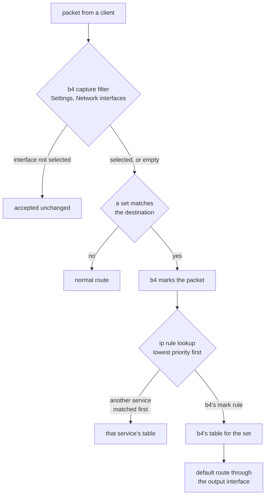

Xray with a TUN inbound and b4 with an output interface both work by putting a route in
front of the kernel's normal one. Run together, they interact in three places, and only one
of those is visible from b4's web interface. This page describes the whole path.

Everything here applies to any service that terminates connections behind a TUN device:
sing-box, a `tun2socks` client, or Xray driven by hand rather than by XrayUI.

## What each service is doing

Xray's TUN inbound creates a network device, `xray0` below, and reads packets out of it.
It does not forward them. It terminates the connection, opens **its own** to the same
destination, and copies bytes between the two. The outbound side is where the proxy
protocol lives.

```json
{
  "protocol": "tun",
  "tag": "ibd-tun",
  "settings": { "name": "xray0", "address": ["192.168.10.1/24"] },
  "sniffing": { "enabled": true, "routeOnly": true, "destOverride": ["http", "tls", "quic"] }
}
```

The device on its own carries nothing. Something has to route traffic into it, and that
something is an `ip rule` plus a routing table. XrayUI installs its own; b4 in output
interface mode installs its own. Which one applies is decided by rule priority, not by
which service configured it last.

## The three layers



1. **b4's capture filter.** `Settings > Core > Network interfaces` decides which packets
   the engine looks at. For forwarded traffic it compares the interface the packet
   **leaves by**, which is `xray0` as soon as anything routes into the tunnel. A list
   naming the uplink therefore excludes everything the tunnel carries. See
   [Which interface is which](/docs/guides/interfaces).

2. **b4's marking.** A set with routing enabled marks packets whose destination it
   matches. This is the part the web interface shows, and it is the part that usually works.

3. **The `ip rule` table.** The kernel walks rules from the lowest priority number up and
   stops at the first one that produces a route. b4 installs its rule at priority
   `10000 + table number`. XrayUI installs one at priority 51 that matches the whole local
   subnet:

   ```
   51:    from 192.168.1.0/24 lookup 250
   10169: from all fwmark 0x4d05/0x27fff lookup 169
   ```

   51 comes first, table 250 has a default route, so every packet from the local network
   ends there. b4's rule is never reached, whatever mark the packet carries. Nothing in
   b4's interface reports this, because b4's own rules are all correct.

:::warning
Two services that both do policy routing do not merge. The one with the lower priority
number wins outright for any traffic its selector matches. Check with `ip rule` on the
router, not in either web interface.
:::

## Deciding which service routes

The two arrangements below are both reasonable. Mixing them is what produces a set that
marks traffic and changes nothing.

### Xray routes everything, b4 only bypasses DPI

XrayUI's blanket rule stays. Every client's traffic goes through the tunnel, and b4's job
is the DPI bypass on whatever is left going out directly.

- `Settings > Core > Network interfaces`: **empty**. Selecting the uplink here is the
  configuration that switches b4 off for the whole local network, because none of that
  traffic leaves by the uplink any more.
- Routing on b4's sets: **off**. There is nothing for it to steer, and its rule would not
  be reached anyway.
- Note that packet manipulation is of limited use on traffic that Xray terminates on the
  router: the segment b4 would alter is the inner one, which never reaches the network as
  b4 wrote it.

### b4 decides what goes into the tunnel

b4's sets pick the destinations, and the tunnel carries only those. This is the
arrangement the output interface setting exists for.

- Remove the blanket rule on the Xray side. In XrayUI that means turning off its
  transparent routing for the subnet; by hand it means not installing a
  `from <subnet> lookup <table>` rule. Leaving it in place preempts b4 for every client.
- `Settings > Core > Network interfaces`: **empty**.
- On the set, `Routing > Output interface`: the TUN device, `xray0`.
- `Routing > Source interfaces`: **empty**, unless the set is meant for one segment. It is
  an ingress match, so naming the uplink there matches nothing from the local network.
- Keep `Routing > Router's own traffic` on **Automatic**. See below.

Xray still needs a route to its own server that does not go back through the tunnel. That
is the `/32` exception XrayUI writes into its table, and it has to survive whatever
arrangement is chosen.

## Why the router's own traffic is held back

A proxy behind a TUN answers a connection by opening its own from the same host. If b4
routed the router's own connections into the tunnel, that new connection, addressed to
something in the set, would be marked and sent straight back into the tunnel Xray is
reading. Xray would answer it the same way. Every turn is a fresh source port, so nothing
in the kernel sees a repeat, and each turn costs another session and another socket.

b4 recognises a TUN device by `/sys/class/net/<iface>/tun_flags` and leaves the router's
own traffic on the normal route by default. The setting is per set, under
[Router's own traffic](/docs/sets/routing#routers-own-traffic). Forcing it on is allowed,
and rate limited, but on a TUN whose reader dials the destination directly it is the loop
above.

:::danger
The same loop happens without b4 if Xray's own routing sends some of those destinations to
a `freedom` or `direct` outbound while the TUN is still being fed them. Check the outbound
rules on the Xray side before forcing router traffic into a tunnel.
:::

## Packet manipulation is off for a tunnel egress

A set routed into a TUN, TAP or WireGuard interface stops running its bypass strategy: no
faking, fragmentation or desync, and no SYN health check, dead IP escalation, IP block
detection or TCP duplication. The segment those work on is the inner one, which is wrapped
or terminated on the router before the network sees it, so the work changes nothing and
costs CPU on every connection. Such connections appear in `Connections` tagged
`routed-><iface>`.

The strategy tabs still show their settings; they are simply not applied while the set
routes into a tunnel.

## Checking the result

Run these on the router, in this order. Each one answers a different layer.

```sh
# 3. which table actually decides, for a client address
ip rule
ip route get 1.1.1.1 from 192.168.1.100 iif br0

# 2. is b4 marking anything (packet counters on the set's chain)
iptables -t mangle -L -n -v | grep b4r_        # iptables
nft list table inet b4_route                   # nftables

# 1. is b4 seeing anything at all
#    Connections in the web interface: if every source is the router's
#    own address, the network interface filter is excluding the rest
```

A destination outside every set that still resolves to the tunnel device means another
service is routing it, and any b4 test against that destination is measuring the other
service.

:::info
`ip route get` is the fastest way to settle an argument about which layer is in charge. It
walks the real rules, so a destination that comes back with a table b4 did not create is
proof that b4's rule is not being reached.
:::
