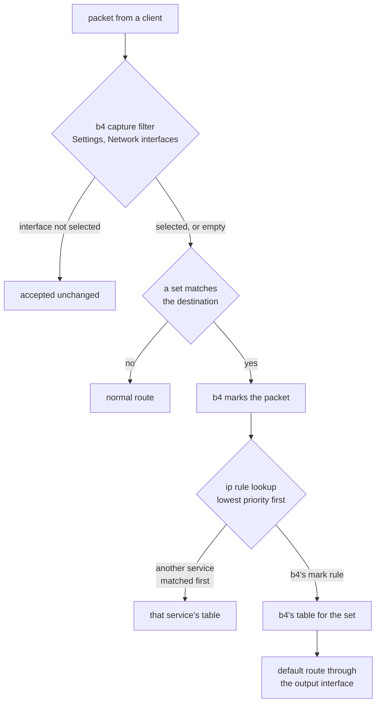

Xray with a TUN inbound and b4 with an output interface both work by putting a route in
front of the kernel's normal one. Run together they interact in three places, and b4's web
interface shows only one of them. This page describes the whole path.

The same applies to any service that terminates connections behind a TUN device: sing-box,
a `tun2socks` client, or Xray driven by hand rather than by [XrayUI](https://daniellavrushin.github.io/asuswrt-merlin-xrayui/en/install).

## What each service does

Xray's TUN inbound creates a network device, `xray0` below, and reads packets out of it. It
does not forward them. It terminates the connection, opens its own to the same destination
from the same host, and copies bytes between the two. The proxy protocol lives on the
outbound side.

```json
{
  "protocol": "tun",
  "tag": "ibd-tun",
  "settings": { "name": "xray0", "address": ["192.168.10.1/24"] },
  "sniffing": { "enabled": true, "routeOnly": true, "destOverride": ["http", "tls", "quic"] }
}
```

The device on its own carries nothing. Traffic reaches it through an `ip rule` and a routing
table. [XrayUI](https://daniellavrushin.github.io/asuswrt-merlin-xrayui/en/install) installs its own; b4 in output interface mode installs its own. Rule priority
decides which applies, not the order the services were configured in.

## The three layers



1. **b4's capture filter.** `Settings > Core > Network interfaces` selects which packets the
   engine looks at. For forwarded traffic it compares the interface the packet leaves by,
   which is `xray0` once anything routes into the tunnel, so a list naming the uplink
   excludes everything the tunnel carries. See
   [Which interface is which](/docs/guides/interfaces).

2. **b4's marking.** A set with routing enabled marks packets whose destination it matches.
   This is the part the web interface shows.

3. **The `ip rule` table.** The kernel walks rules from the lowest priority number up and
   stops at the first one that produces a route. b4 installs its rule at priority
   `10000 + table number`. XrayUI installs one at priority 51 matching the whole local
   subnet:

   ```
   51:    from 192.168.1.0/24 lookup 250
   10169: from all fwmark 0x4d05/0x27fff lookup 169
   ```

   51 comes first and table 250 has a default route, so every packet from the local network
   ends there. b4's rule is never reached, whatever mark the packet carries. b4's interface
   reports nothing, because b4's own rules are correct.

:::warning
Two services that both do policy routing do not merge. The one with the lower priority
number takes every packet its selector matches. `ip rule` on the router shows the real
order; neither web interface does.
:::

## Deciding which service routes

Both arrangements below work. A mixture of the two produces a set that marks traffic and
changes nothing.

### Xray routes everything, b4 only bypasses DPI

XrayUI's blanket rule stays. Every client's traffic goes through the tunnel, and b4 handles
the DPI bypass on whatever still goes out directly.

- `Settings > Core > Network interfaces`: **empty**. Naming the uplink here switches b4 off
  for the whole local network, because none of that traffic leaves by the uplink any more.
- Routing on b4's sets: **off**. There is nothing for it to steer, and its rule would not be
  reached.
- Packet manipulation does little on traffic Xray terminates on the router: the segment b4
  would alter is the inner one, which never reaches the network as b4 wrote it.

### b4 decides what goes into the tunnel

b4's sets pick the destinations and the tunnel carries only those. This is what the output
interface setting is for.

- The blanket rule on the Xray side has to go. In XrayUI that means turning off its
  transparent routing for the subnet; by hand, not installing a
  `from <subnet> lookup <table>` rule. Left in place it preempts b4 for every client.
- `Settings > Core > Network interfaces`: **empty**.
- On the set, `Routing > Output interface`: the TUN device, `xray0`.
- `Routing > Source interfaces`: **empty**, unless the set covers one segment. It is an
  ingress match, so the uplink there matches nothing from the local network.
- `Routing > Router's own traffic`: **Automatic**, for the reason below.

Xray still needs a route to its own server that does not go back through the tunnel. That is
the `/32` exception [XrayUI](https://daniellavrushin.github.io/asuswrt-merlin-xrayui/en/install) writes into its table, and it has to survive either arrangement.

## Why the router's own traffic is held back

A proxy behind a TUN answers a connection by opening its own from the same host. If b4
routed the router's own connections into the tunnel, that new connection, addressed to
something in the set, would be marked and sent back into the tunnel Xray is reading. Xray
would answer it the same way. Every turn carries a fresh source port, so the kernel sees no
repeat, and each turn costs another session and another socket.

b4 recognises a TUN device by `/sys/class/net/<iface>/tun_flags` and leaves the router's own
traffic on the normal route by default. The setting is per set, under
[Router's own traffic](/docs/sets/routing#routers-own-traffic). Forcing it on is allowed and
rate limited, but on a TUN whose reader dials the destination directly it is the loop above.

:::danger
The same loop happens without b4 when Xray's own routing sends some of those destinations to
a `freedom` or `direct` outbound while the TUN is still being fed them. Forcing router
traffic into a tunnel is safe only when the Xray side sends none of the set's destinations
to a direct outbound.
:::

## Packet manipulation with a tunnel egress

A set routed into a TUN, TAP or WireGuard interface stops running its bypass strategy: no
faking, fragmentation or desync, and no SYN health check, dead IP escalation, IP block
detection or TCP duplication. Those work on the inner segment, which is wrapped or
terminated on the router before the network sees it. Such connections appear in
`Connections` tagged `routed-><iface>`.

The strategy tabs still show their settings. They are not applied while the set routes into
a tunnel.

## Checking the result

The commands below run on the router. Each one answers a different layer.

```sh
# 3. which table decides, for a client address
ip rule
ip route get 1.1.1.1 from 192.168.1.100 iif br0

# 2. whether b4 is marking anything (packet counters on the set's chain)
iptables -t mangle -L -n -v | grep b4r_        # iptables
nft list table inet b4_route                   # nftables

# 1. whether b4 sees anything at all
#    Connections in the web interface: when every source is the router's
#    own address, the network interface filter is excluding the rest
```

A destination outside every set that still resolves to the tunnel device is being routed by
another service, and a b4 test against that destination measures the other service.

:::info
`ip route get` walks the real rules. A destination that comes back with a table b4 did not
create is not reaching b4's rule.
:::
