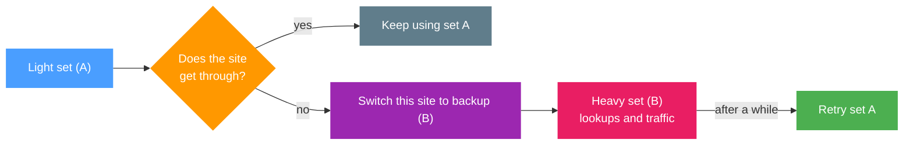
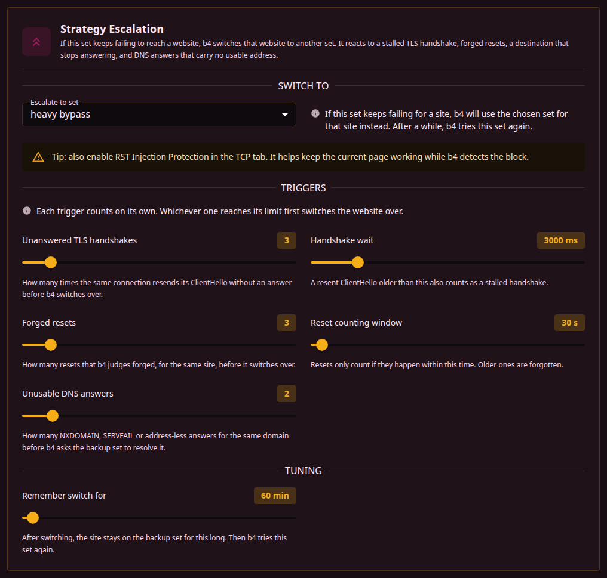

When a set in b4 keeps failing to reach a site, b4 quietly switches that site to a backup set you choose. Name lookups and connections for the site both go through the backup from then on. After some time, b4 retries the original set in case the problem has cleared up.



## When you'd use it

If you have a "light" set that works for most sites and a "heavy" one that's slower but more reliable, escalation lets b4 use the light set most of the time and only fall back to the heavy one for sites that need it. Without escalation, sites that hit a block keep failing until you move them by hand.

The backup does not have to be another bypass strategy. It can be a set that [routes through a proxy or an interface](./routing), or one that carries a [pinned address or a different DNS server](../dns) for the site. That makes escalation a way to say "try the cheap thing first, fall back to the expensive thing only where it is needed".

## Setting it up

Open the set's **Escalation** tab. Under **Switch to** pick the backup set. Leave the other options at their defaults unless you want to fine-tune.

You can chain sets: A -> B -> C. b4 walks the chain as each one fails for a given site, up to eight steps.



## What sets it off

Four things count as the set failing for a site. They are counted separately, and whichever reaches its limit first switches the site over.

| Trigger | What b4 saw |
| --- | --- |
| **Unanswered TLS handshakes** | The same connection resent its ClientHello and never got an answer. This is the classic "the strategy did not fool the filter" case. |
| **Forged resets** | Connection resets arrived that b4 judges to be injected rather than sent by the server. |
| **Destination does not answer** | Connection attempts to the address went unanswered, and the address did not answer the router either when b4 probed it directly. This covers an address that is dropped outright, where no bypass strategy can help. |
| **Unusable DNS answers** | Lookups for the name came back NXDOMAIN, SERVFAIL, or with no address at all. |

The DNS trigger is what makes a site with no usable address reachable through a backup that pins one. Because nothing else happens until a name resolves, this is the only trigger that can fire for such a site.

:::info The lookup that trips it is answered too
For the other three triggers, escalation helps the **next** request; the connection that just failed is already lost. The DNS trigger is different: the lookup that trips the switch is handed to the backup set straight away, so it is answered rather than passed on as a failure.
:::

## Tuning options

- **Unanswered TLS handshakes** - how many times the same connection resends its ClientHello without an answer before b4 switches over.
- **Handshake wait** - a resent ClientHello older than this also counts as a stalled handshake.
- **Forged resets** - how many resets that b4 judges forged, for the same site, before it switches over.
- **Reset counting window** - resets only count if they happen within this time. Older ones are forgotten.
- **Unusable DNS answers** - how many NXDOMAIN, SERVFAIL or address-less answers for the same domain before b4 asks the backup set to resolve it.
- **Remember switch for** - how long the site stays on the backup before b4 retries the original.

IPv4 and IPv6 lookups are counted separately, and an empty AAAA answer does not count as a failure at all, because a site with no IPv6 address answers that way normally. A site that resolves over IPv6 but not IPv4 still switches over on its IPv4 lookups, which is what a browser needs to reach it. Question types other than A and AAAA are ignored entirely.

:::info Per-site tracking
The switch is remembered per-site (per-hostname). A problem with one site does not affect other sites that happen to share the same server.
:::

:::tip Pair with RST Injection Protection
Enable **RST Injection Protection** in the [TCP](./tcp/) tab of the original set. It helps existing connections survive while b4 detects the block.
:::

## What the backup set contributes

Once a site is switched over, the backup set governs it end to end:

- **Name lookups** use the backup's pinned addresses, DoH server or forwarding target. A pin on the backup only takes effect after the switch, so a lookup that already works is never redirected.
- **Connections** use the backup's bypass strategy, including the settings that apply to the very first packet.
- **Routing** applies if the backup routes through a proxy or an interface. The addresses b4 knows for the site are written into that set's routing, so the traffic leaves the way that set says it should.

If the backup set is narrowed to particular devices, it is only used for those devices. Other devices keep using the original set.

## Watching it work

The **Active Escalations** panel on the Dashboard shows currently-switched sites with the backup set name and time until retry. Use **Reset Stats** to clear all switches manually.

The log records each switch with the reason, for example:

```text
escalation: ntc.party is not getting through with ntc.party (no usable DNS answer), switching it to ntc.party backup
```

## What it does not do

- It only reacts to sites that fail. It does not test sites in advance, so the first failure is still a failure.
- Turning the backup set off does not delete the link to it. The link stays and sits idle until the set is enabled again.
- It is not a substitute for [Discovery](../discovery). Discovery proactively finds a working strategy per site; escalation is a reactive safety net.
