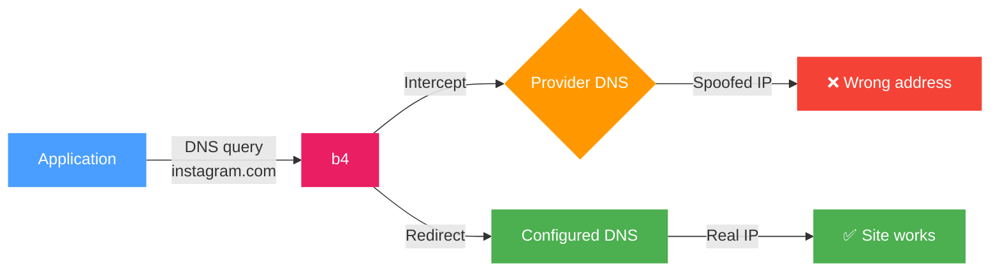
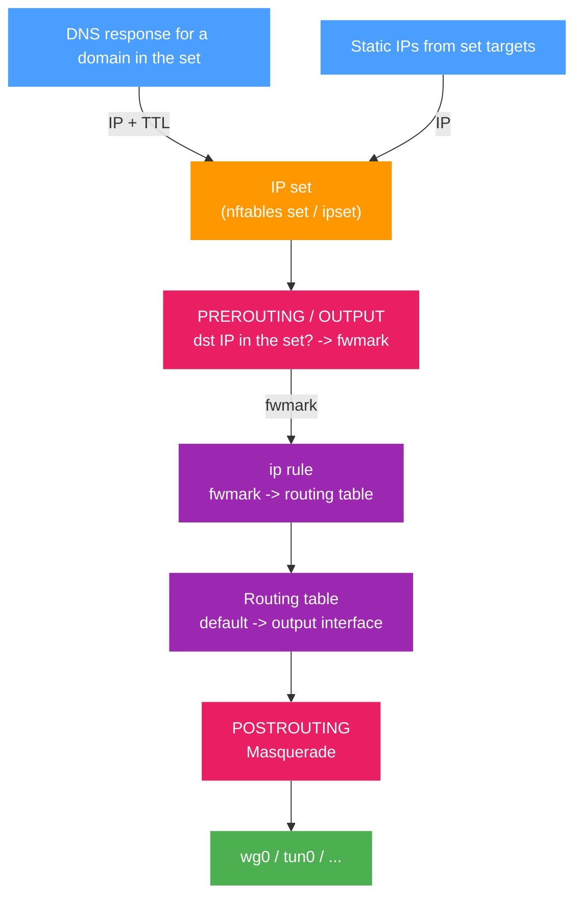
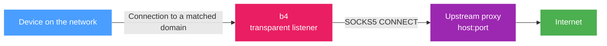

The routing tab controls how DNS queries are handled and where traffic matched by the set is sent. It has two sections: **DNS redirect** and **Traffic routing**.

## DNS redirect

Redirects DNS queries for domains in the set to a specified DNS server.

Some providers intercept DNS responses and substitute IP addresses (DNS poisoning). The connection ends up going to the wrong address even if the domain itself is not blocked directly. DNS redirect sends the query to an alternative server, bypassing the interception.

:::info
This section covers the plain DNS server. For encrypted DNS (DoH), pinned addresses, DNS over TCP and the global DNS settings, see [DNS](../dns.md).
:::



### Configuration

1. Enable **DNS redirect**
2. Pick a DNS server from the list or enter an IP manually

:::tip
If you do not know which DNS to pick, start with any server from the list other than Google DNS (8.8.8.8). Google DNS is often one of the first to be blocked by providers.
:::

### Server list

Picking a server fills the IP into the field automatically. You can also enter any other IP manually.

:::warning
If the DNS server field is empty, the redirect will not work, even when it is turned on.
:::

### DNS query fragmentation

The **Fragment query** toggle splits the DNS packet into several parts before sending.

Used when the provider inspects the contents of DNS packets, even those to third-party servers, and blocks queries based on their contents.

:::info
Fragmentation only affects DNS queries for domains in the current set. Other DNS traffic is not modified.
:::

---

## Traffic routing

Routes traffic matched by the set through a specific network interface - for example, a VPN, WireGuard, or another tunnel.

Routing always steers by **destination**: every rule b4 installs matches the addresses the set has collected, from its
IP targets and from the addresses its domains resolve to. Source devices and source interfaces narrow *whose* traffic is
offered to that rule; they do not select traffic on their own. A set with routing enabled and no domain or IP target
therefore steers nothing, and b4 installs no rule for it and says so in the log.

To route everything from a device, keep the device selected under [Source devices](./targets.md#source-devices) and turn
on **Match any IP address** on the Targets, IP addresses tab.

**Routing mode** selects what happens to matched traffic:

| Mode | Description |
| --- | --- |
| Output interface | Sends matched traffic out a network interface. Described below. |
| Upstream SOCKS5 proxy | Hands matched traffic to a SOCKS5 proxy. See [Upstream SOCKS5 proxy](#upstream-socks5-proxy). |
| Telegram over WebSocket (built-in) | Intercepts matched Telegram traffic and relays it over Telegram's WebSocket edge. See [Telegram over WebSocket](../telegram/websocket-bridge.md). |
| Block | Drops or rejects matched traffic. See [Blocking](./blocking.md). |

### General diagram



### How it works (in detail)

Routing uses policy-based routing - routing decisions based on packet marks:

1. **Collecting IPs.** When b4 sees a DNS response for a domain in the set, it extracts the IP addresses and adds them to an internal IP set (nftables set or ipset). IPs entered manually in the [set targets](./targets.md) are added when the configuration is loaded.

2. **Marking packets.** b4 creates firewall chains for each set:
   - **PREROUTING** (mangle) - marks forwarded traffic (from devices on the network) when the destination IP is in the set. If source interfaces are set, only traffic from those interfaces is marked.
   - **OUTPUT** (mangle) - re-marks the packets b4 injects itself, which are locally generated and would otherwise leave by the router's normal uplink. It also marks other traffic the router originates, unless [Router's own traffic](#routers-own-traffic) says not to.

3. **Policy routing.** For marked packets an `ip rule` is created: packets with a specific `fwmark` are sent to a separate routing table where the default route points at the output interface.

4. **Masquerade.** In the **POSTROUTING** (nat) chain, masquerade is applied to all marked traffic leaving through the target interface - the packet's source IP is replaced with the output interface's IP. This is required so that reply packets return through the same tunnel.

5. **Pre-resolution.** When routing is enabled, b4 immediately resolves all domains in the set targets and adds their IPs to the set. This enables routing from the first request without waiting for DNS traffic to pass through NFQUEUE.

### Routing setup

1. Enable **Routing**
2. Pick **Source interfaces** - which interfaces to intercept traffic from
3. Pick the **Output interface** - where to send the traffic


Once enabled, a flow diagram appears at the top of the section:

```text
[Source interfaces] -> B4 -> [Output interface] -> Internet
```

The diagram updates as settings change.

### Source interfaces

Define which network interfaces traffic is intercepted from for routing. Shown as clickable badges - click to toggle.

:::info
This is an ingress filter, and it is not the same setting as `Settings > Core > Network
interfaces`, which filters what the engine inspects and compares the interface a packet
leaves by. [Which interface is which](/docs/guides/interfaces) puts the three side by side.
:::

:::info
If no source interface is selected, routing applies to all traffic arriving from anywhere, and - subject to
[Router's own traffic](#routers-own-traffic) - to traffic the router originates itself.
Selecting a source interface, or a source device, restricts the set to traffic arriving from it and leaves the router's
own traffic on the normal route, since that traffic arrives from no interface and from no device.
:::

If a previously chosen interface has disappeared from the system (for example, the VPN connection dropped), it is shown in red with a "stale" marker.

### Output interface

The network interface that marked traffic is sent through:

| Interface | Description |
| --- | --- |
| `wg0`, `wg1` | WireGuard tunnel |
| `tun0`, `tun1` | OpenVPN tunnel |
| `ppp0` | PPP connection |

:::warning
If the chosen output interface becomes unavailable, a warning appears. Routing will not work until the interface is back.
See [Kill switch](#kill-switch) for what happens to the set's traffic in the meantime.
:::

:::info
When the output interface is a tunnel that is up - a TUN/TAP device or WireGuard - b4 leaves that set's packets alone,
the same way it does in proxy mode: no faking, fragmentation or desync, and no SYN health check, dead-IP escalation, IP
block detection or TCP duplication. The segment it would mangle is the inner one, which is wrapped or terminated before
it ever reaches the network, so the work buys nothing and costs CPU on every connection. The connection still appears in
the connection log, tagged `routed-><iface>`. Three cases keep their bypass strategy: a set routed to a plain interface
such as a second uplink, a set whose output interface exists but is down and so cannot carry the traffic at all, and a
domain-only set with no IP targets, which never routes anything either. A set limited to a source interface or a source
device hands off like any other, because b4's engine matches on the destination alone and cannot tell an in-scope client
from one the routing rules never touch.
:::

### Router's own traffic

Whether connections the router opens itself - a package update, a health check, the DNS resolver, another program running
on the box - also go out the output interface when they are addressed to something in the set. Traffic forwarded from the
network is unaffected by this setting.

| Value | What happens |
| --- | --- |
| Automatic (default) | Routes the router's own traffic, except when the output interface is a TUN/TAP device a userspace program reads. There it is left on the normal route. |
| Route it too | Always routes it. |
| Leave it alone | Never routes it. |

The exception exists because of a loop. A proxy with a TUN inbound - Xray, sing-box, a `tun2socks`-style client - does not
forward packets; it terminates the connection and opens **its own** to the destination, from this same router. That new
connection is addressed to something in the set, so b4 marks it and routes it back into the very TUN the proxy is reading.
The proxy answers it the same way, and so on. Every turn is a fresh source port, so nothing in the kernel recognises it as
a repeat, and each turn costs the proxy another session and another socket. In practice the box runs out of memory in
minutes.

b4 recognises such an interface by `/sys/class/net/<iface>/tun_flags`, which the kernel creates for every device opened
through `/dev/net/tun`. WireGuard, PPP, VLANs and physical interfaces are not affected: they cannot re-dial a connection,
so the router's own traffic keeps following the set on **Automatic**.

Choosing **Route it too** on a TUN interface is allowed - a TUN whose reader never dials the destination directly is
harmless - but b4 logs a warning and installs a rate limit ahead of the marking, so a loop that does start is capped at
200 new router-originated connections per second per destination list instead of growing without bound. The limit counts
only connections to addresses the set matches, so ordinary router traffic cannot use up its budget. It goes in wherever
the egress could re-dial: a TUN or TAP device, or an interface b4 cannot classify yet because it does not exist when the
rules are built. A plain interface and a WireGuard tunnel never get one. On iptables it needs the `xt_hashlimit` module;
b4 loads it itself, and warns if the kernel does not have it.

:::tip
A set that already has a source interface, or an *included* source-device list, never routes the router's own traffic,
whatever this is set to, so the setting is shown greyed out. An exclude list does not scope the set that way, so the
choice still applies there.
:::

:::warning
A set routed into a proxy's TUN, where the proxy reaches some of those destinations **directly** (a `freedom`/`direct`
outbound, a bypass rule, its own DNS), is the loop above. **Automatic** is the setting for that case.
:::

### Kill switch

Off by default. When the output interface disappears - the tunnel drops, the VPN client restarts - the kernel removes the
default route b4 put in the set's routing table. The mark rule then finds an empty table, the lookup falls through to the
main table, and the set's traffic quietly leaves through the normal uplink with the router's real address. Nothing in the
rules looks wrong, which is what makes it easy to miss.

With the kill switch on, b4 also puts a `blackhole default` route in the set's table at a worse metric than the real one.
While the interface is up the real route wins and nothing changes. When it goes away the blackhole is all that is left and
the set's traffic is dropped instead of leaking. Only this set's traffic is affected; everything else keeps using the main
table as usual. Sets that share an output interface normally share one routing table, so a set with the kill switch on is
given a table of its own rather than blackholing its neighbours. That applies to the tables b4 assigns itself; two sets
pinned by hand to the same `routing.table` still share it, and then the switch is on for both if it is on for either.

b4 puts the real route back as soon as the interface returns, so the kill switch does not need to be turned off and on
again after a reconnect.

### Egress IP

Optional. Rewrites the source address of this set's traffic on the way out, instead of leaving the output interface's own address in place. In firewall terms it swaps the set's `MASQUERADE` rule for `SNAT --to-source`.

The point of this is to delegate the routing decision to a device b4 does not control. If the tunnels live on an upstream router, that router can already pick a path by source address; b4 only has to stamp the right source. No tunnel interface and no extra routing table are needed on b4's own host, and unlike an upstream SOCKS5 proxy the rewrite happens in the kernel, so it costs no per-packet CPU.

An egress IP requires an output interface: the rule is pinned to that interface so a multi-WAN failover cannot send packets out a second uplink still carrying the first one's source address.

For this to work end to end:

- b4 puts the address on the output interface itself and takes it back when the set stops using it, so there is nothing to add by hand and nothing to persist across reboots. If the interface loses the address, for example on a DHCP renewal or a link flap, b4 notices and puts it back. Before claiming an address b4 sends an ARP probe; if another host on the segment answers for it, or the address cannot be added, b4 logs a warning and falls back to masquerading rather than breaking that host or sending traffic that can never be answered. An address you configured yourself is used as it stands, and b4 removes only addresses it added.
- The upstream device must route that source into the path you want, for example `ip rule add from 192.168.1.51 lookup 100` on Linux, or a `mangle` rule with `src-address` plus `action=mark-routing` on RouterOS.
- The upstream must not drop the packets on reverse-path checks. A router with strict `rp_filter` and no route back to b4's box for that address discards them before any policy rule is consulted. This is the most common reason a correct-looking setup moves no traffic.

The address family has to match. An IPv4 egress IP rewrites IPv4 only. What happens to the set's IPv6 traffic then depends on **IPv6 support** in [Settings -> Core](../settings/core#protocols):

- **IPv6 support on.** The set's IPv6 traffic is still diverted to the output interface, keeps masquerading, and leaves with the interface's own IPv6 address. A set carries one egress IP, so an IPv6 address entered in its place moves the rewrite to IPv6 and returns IPv4 to masquerading.
- **IPv6 support off.** The set has no IPv6 rules at all. Its IPv6 traffic is not marked, not diverted and not masqueraded: it follows the router's normal route, which for a dual-stack destination means the set is bypassed rather than routed with the wrong source address.

:::warning
An egress IP that nothing answers for is a silent failure: packets leave, replies never come back, and the set's rules still look correct. Check the address exists on the interface before blaming the set.
:::

:::note
Not available in TUN engine mode with whole-default capture. There b4 reinjects packets on a path that bypasses this rule, so the setting has no effect.
:::

### IP TTL (entry lifetime)

How long, in seconds, an IP obtained from a DNS response is kept in the routing IP set. When the TTL expires, the entry is removed automatically.

Default: **3600** seconds (1 hour).

IPs listed in the set targets are permanent members: they are written on every configuration sync and taken out of the kernel set when they are removed from the targets.

:::tip
For stable services with constant IPs you can raise the TTL. For CDN services where IPs change frequently, lower it.
:::

### Firewall backend

b4 detects the available backend automatically:

| Backend | Requirements | Description |
| --- | --- | --- |
| **nftables** | `nft` binary | Creates the `b4_route` table with `prerouting`, `output`, `postrouting` chains. IP sets support `interval` and `timeout`. |
| **iptables + ipset** | `iptables`, `ipset` binaries | Uses the `mangle` and `nat` tables. Creates an ipset of type `hash:net` to store IPs. Also checks for `iptables-legacy`. |

:::info
The backend is chosen automatically. Systems with nftables use nftables, older systems use iptables. No manual setup is required.
:::

### FWMark and routing table

Each output interface gets assigned automatically:

- **fwmark** - packet mark (range `0x100` to `0x7EFF`)
- **routing table** - routing table number (range `100` to `249`)

Values are computed from the interface name, the egress IP and the kill-switch setting, and stay stable across reboots. Sets that agree on all three share a `fwmark` and a table; a set that differs in any of them, including one with the kill switch on beside one without, gets its own.

Before claiming a table b4 checks whether it already holds routes it did not put there - the tables Asuswrt-Merlin uses for
its VPN clients live in the same range, and b4 flushes the table it owns on cleanup. If the table is taken, b4 moves to the
next candidate and says so in the log.

:::info
Manual `fwmark` and `table` values can be set in the configuration file. In that case automatic assignment is not used.
:::

### Cleanup

When routing is turned off or a set is removed, b4 fully removes every rule it created:

- Removes the `ip rule` and entries in the routing table
- Removes jump rules from the base chains
- Clears and removes the chains and IP sets that were created

When b4 fully stops, both backends (nftables and iptables) are cleaned to remove any leftover rules.

---

## Upstream SOCKS5 proxy

Instead of sending matched traffic out an interface, b4 can hand it to a SOCKS5 proxy. Set **Routing mode** to *Upstream SOCKS5 proxy*.

Use this to chain b4 into Xray, sing-box or a similar client, running either on the router itself or on another host on the network. It is also useful where blocking is whitelist-based and direct connections to addresses outside the whitelist are dropped.



### How it works

1. **Collecting IPs.** Same sources as interface mode: DNS responses b4 observes, static IPs from the set targets, and pre-resolution of the set's domains. In addition, a hostname that matches the set by domain suffix is resolved in full, so every address it answers with enters the set rather than being learned one connection at a time.

2. **Transparent listener.** b4 opens a listener on a port derived from the set and marks it transparent, so it can accept connections addressed to someone else.

3. **Diversion.** TPROXY rules in **PREROUTING** send TCP, and UDP when **Route UDP through upstream** is on, with a destination in the set to that listener, together with an `ip rule` and a local route so the packet is delivered locally instead of being forwarded. Destinations that are the router's own addresses, broadcast or multicast are never diverted, so a set that matches every address leaves the router's DNS, DHCP and web interface reachable for the device it is bound to.

4. **Relay.** For each accepted connection b4 opens a SOCKS5 CONNECT to the upstream and relays bytes in both directions.

:::info
In proxy mode, packet manipulation (faking, fragmentation, desync) is disabled for matched traffic. The upstream proxy is responsible for reaching the destination.
:::

### Requirements

Transparent diversion needs kernel modules that are not part of a default OpenWrt install:

```sh
opkg install kmod-nft-tproxy kmod-nft-socket
```

On builds using `apk`:

```sh
apk add kmod-nft-tproxy kmod-nft-socket
```

On an iptables system the equivalents are `kmod-ipt-tproxy` and `kmod-ipt-socket`, plus `iptables-mod-tproxy` for the iptables extension itself. On Keenetic the firmware ships these modules under `/lib/modules` and the service loads them itself; nothing needs to be installed.

The rule that keeps the router's own addresses out of the diversion uses the address-type match: `kmod-ipt-extra` with `iptables-mod-extra` on an iptables system, `kmod-nft-fib` on nftables. Where that match is rejected, the service writes an explicit list of the router's addresses instead, refreshed the next time the set is rebuilt, and the log says so.

:::tip
**Settings -> Diagnostics** reports whether TPROXY is usable and names any missing modules and the packages that provide them.
:::

### Settings

| Setting | Description |
| --- | --- |
| Upstream SOCKS5 host | Hostname or IP of the proxy. Use `127.0.0.1` when it runs on the same router, or the address of another host on the network. |
| Upstream SOCKS5 port | Port the proxy listens on. |
| Username / Password | Filled in only if the proxy requires authentication. |
| Send domain name to upstream | Passes the domain instead of the address when b4 knows it, so the upstream resolves the name itself and can pick a geographically appropriate address. |
| Route UDP through upstream | Tunnels matched UDP through the proxy using UDP ASSOCIATE. See [QUIC and HTTP/3](#quic-and-http3) below. |
| Fall back to direct on upstream failure | Opens a plain direct connection to the original destination when the proxy is unreachable, instead of failing. Leave it off if a direct connection is worse than none. |

### QUIC and HTTP/3

Most SOCKS5 proxies carry TCP only. Xray and sing-box need UDP enabled explicitly on the inbound.

With **Route UDP through upstream** off, b4 refuses matched UDP on port 443 with an ICMP port-unreachable. Browsers read that as a signal to fall back to TCP, which the proxy carries. Without it, any site advertising HTTP/3 through the `alt-svc` header would be reached over QUIC directly, bypassing the proxy entirely, and a browser remembers that preference for as long as the header's lifetime says.

That refusal is written per address family. The IPv6 half of it exists only while **IPv6 support** is on in [Settings -> Core](../settings/core#protocols). With IPv6 support off, only the IPv4 rule is created, so a destination the set matches that also answers over IPv6 is still reachable over QUIC there, and the connection does not go through the proxy.

With the option on, matched UDP goes to the proxy through UDP ASSOCIATE. Turn it on only if the upstream implements it. If it does not, matched UDP is dropped and b4 logs a warning naming the set and the upstream.

### Verifying that it works

Do not judge by whether a web page renders. A page usually pulls assets from other hostnames on different addresses, so a page whose main document is routed and whose assets are not can look broken while routing is working correctly.

Request a single endpoint instead:

```sh
curl -s https://ipinfo.io/ip
```

Then check the connection log for the matched connection. Traffic that went through the proxy is tagged `[proxy]`:

```text
TCP 192.168.1.37:20854 → 34.117.59.81:443 sni-set=ipinfo.io [proxy]
```

If there is no `[proxy]` line, the connection was never diverted. The usual cause is that the address it connected to is not in the set.

### When the upstream itself is down

A `[proxy]` line only says the connection reached b4, not that the proxy answered. If the upstream is refusing or silently dropping connections, every diverted connection is accepted, held for the length of the dial timeout and then closed, which from a browser looks like the site hanging and failing.

b4 reports it in the log:

```text
tproxy: set "TMDB" cannot reach its upstream 10.8.0.1:1080 (1 consecutive failures),
traffic matched by this set is not getting through: dial upstream: dial tcp 10.8.0.1:1080: i/o timeout
```

The message repeats at most once a minute while the upstream stays down, and a matching line is logged once it answers again. The same state is carried in **Settings -> Diagnostics** under `upstreams`, so a diagnostics bundle shows whether the proxy was reachable at the time it was taken:

```json
{
  "set_name": "TMDB",
  "upstream": "10.8.0.1:1080",
  "reachable": false,
  "consecutive_failures": 12,
  "last_error": "dial upstream: dial tcp 10.8.0.1:1080: i/o timeout"
}
```

:::warning
Note that this affects **every** address in the set, on every TCP port - including addresses learned from a shared CDN that other sites also resolve to. A dead upstream can therefore break sites that were never the point of the set.
:::

:::warning
If a client resolves through DNS-over-HTTPS or DNS-over-TLS, b4 never sees its DNS queries, and the set fills only from pre-resolution and from domains observed in TLS handshakes. Turn encrypted DNS off on the client, or add the domains to the set so they are pre-resolved.
:::
