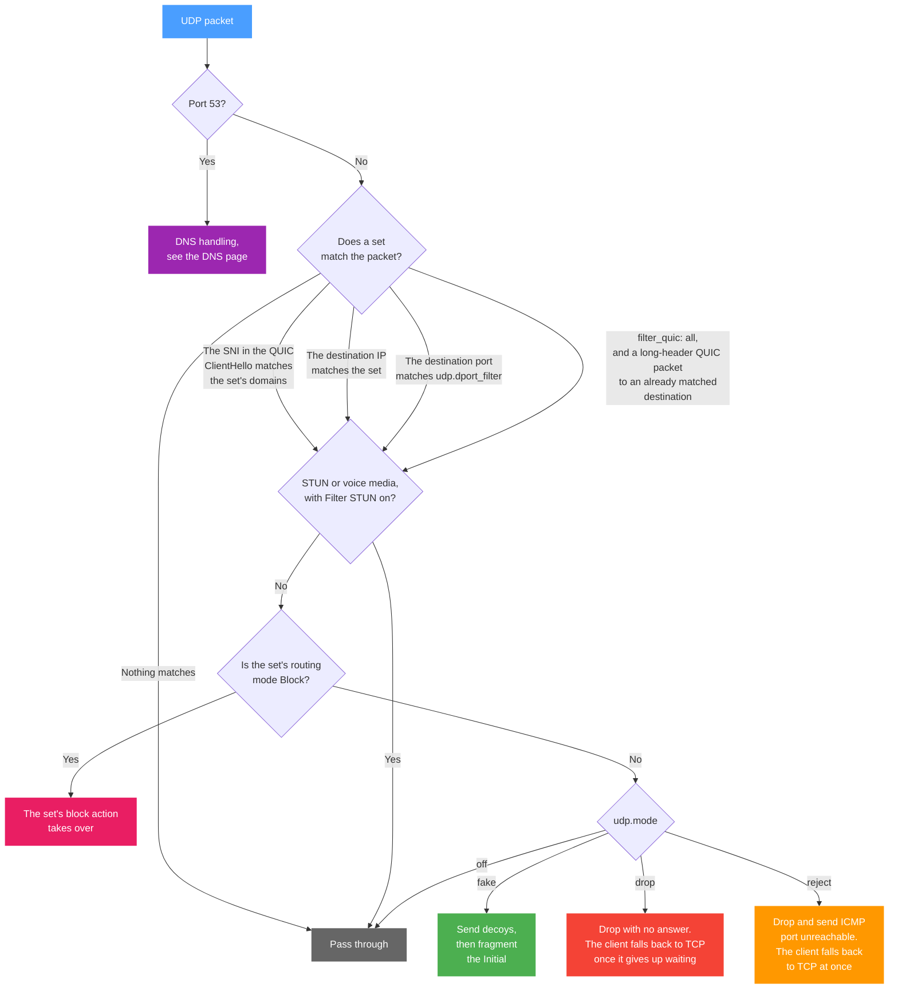

The UDP tab holds two separate controls, and they answer two different questions:

- **QUIC filter** (`udp.filter_quic`) and **Port filter** (`udp.dport_filter`) decide **which** UDP the set matches.
- **Action mode** (`udp.mode`) decides **what** b4 does with a packet the set matched.

The most common use of this tab is not bypassing DPI on UDP but refusing QUIC, so the browser falls back to TCP where the set's TCP strategies apply. See [Why refusing QUIC is often the right choice](#why-refusing-quic-is-often-the-right-choice).

## How b4 handles UDP



Two things in that chart are worth spelling out.

**The ClientHello is always read.** Whenever a packet looks like a QUIC long-header packet, b4 parses it for an SNI, no matter how `filter_quic` is set. That is how a set that targets domains matches QUIC at all, and it is also how b4 learns which addresses belong to a domain: an SNI seen in a QUIC Initial is recorded against the destination IP, so a routing set can pick that address up later.

**Block mode comes first.** When the set's [Routing](./routing.md) mode is **Block**, the block action decides the packet's fate and `udp.mode` is not consulted.

## Which UDP a set matches

### QUIC filter

QUIC is a transport over UDP, used by browsers for HTTP/3 (YouTube, Google, Discord and others). It is encrypted differently from TCP with TLS, so the TCP strategies do not carry over to it.

| Value | Config | What it matches |
| --- | --- | --- |
| **By SNI** (default) | `sni` | The SNI is read out of the QUIC ClientHello and the packet matches when that domain is one of the set's targets |
| **By SNI or matched destination** | `all` | Everything the SNI match covers, plus any long-header QUIC packet sent to a destination the set already matches by IP or by port, with no SNI needed |

`all` is what to use when the set has no domain targets to match against, or when the destination was learned from earlier traffic rather than listed by hand, and you still want QUIC to that destination acted on.

:::info Older configurations
`filter_quic` used to take `disabled` and `parse`. Both behaved as `sni` does now, since SNI parsing was never actually switched off, and both are migrated to `sni` when the configuration is loaded. Nothing needs to be changed by hand.
:::

:::warning Matching by SNI needs domains
With `sni` and no domains in [Targets](./targets), the only QUIC the set matches is QUIC to addresses or ports it matches by other means.
:::

### Port filter

Match specific UDP ports, which is what VoIP, games and other UDP applications need. Format: `5000-6000,8000`. Leave it empty to match any port.

The port filter also scopes the rest of the set: a set whose `udp.dport_filter` is `8443` does not act on UDP port 443, however its domains and addresses match.

### Filter STUN packets

Let STUN and voice-media packets through without processing. STUN is what WebRTC uses for NAT traversal in voice and video calls.

:::info
Keep this on if you use voice or video calls (Discord, Telegram, WhatsApp). Interfering with STUN breaks them.
:::

---

## Why refusing QUIC is often the right choice

b4 has far less to work with on QUIC than on TCP, and it is worth understanding why before spending time on the fake settings.

- **Only the Initial is readable.** The ClientHello travels in the QUIC Initial packet. Everything after it is AEAD-protected under keys derived from that handshake, so b4 cannot rewrite, split or reorder later packets in a way both ends still accept.
- **QUIC cannot be desynced the way TCP can.** The TCP strategies work by making the DPI and the server read the same bytes differently, using TTLs, bad checksums, overlapping segments and record boundaries. QUIC packets are authenticated, so a packet that has been tampered with is discarded rather than interpreted differently. What is left is sending decoys and fragmenting the Initial, and those are weak levers.
- **A censor that blackholes UDP/443 sends nothing back.** There is no reset and no ICMP error, so the client has no reason to stop trying QUIC. To the user that looks like a video that never starts, rather than a page that fails and retries over another protocol.

Refusing QUIC on the router supplies the refusal the censor withheld. The client gets an ICMP port unreachable, drops HTTP/3 for that host, and connects over TCP, where the set's [TCP](./tcp/) strategies do apply. Browsers also remember an `alt-svc` advertisement for as long as its lifetime says, so without a refusal a host that once answered over QUIC keeps being tried over QUIC.

For video sites and anything else where HTTP/3 is the default, the combination to use is:

```json
"udp": { "filter_quic": "all", "mode": "reject" }
```

The **Block QUIC** switch on this tab sets both of those at once, so the usual case takes one click and the individual controls stay available for everything else.

---

## What b4 does with matched traffic

### Per-connection packet limit

How many packets at the start of a UDP connection are analysed. It cannot exceed the global limit in [Settings -> Core -> Queue](../settings/core#queue-and-packet-processing).

### Action mode

| Mode | Config | What happens |
| --- | --- | --- |
| **Off** | `off` | Matched UDP passes through unchanged. Use it when a set matches UDP only so that b4 learns addresses from QUIC, or so a routing set carries the traffic, and nothing should be done to the packets themselves |
| **Fake & Fragment** (default) | `fake` | Decoy packets are sent before the real one and the Initial is fragmented |
| **Drop** | `drop` | The packet is dropped with no answer. The client falls back to TCP once it gives up waiting, usually after several seconds |
| **Reject** | `reject` | The packet is dropped and an ICMP port unreachable, or its ICMPv6 equivalent, goes back to the client, which switches to TCP without waiting for a timeout |

:::tip Drop against Reject
Both end up on TCP. **Drop** makes the client wait out its own timeout first, which the user sees as a stall. **Reject** answers immediately, so the switch is not noticeable. Prefer **Reject** unless something on the network reacts badly to ICMP errors.
:::

:::note IPv6
The ICMPv6 reject and everything else on this page apply to IPv6 only while **IPv6 support** is on in [Settings -> Core](../settings/core). With it off, b4 sees no IPv6 packets at all, so a destination that answers over IPv6 keeps working over QUIC there. See [Core settings](../settings/core#protocols).
:::

---

## Fake & Fragment settings

Available in **Fake & Fragment** mode.

### Fake strategy

How the fake packet is made unusable to the server:

| Strategy | Description |
| --- | --- |
| **None** | No strategy, fake packets are sent as they are |
| **TTL** | Low TTL, so fake packets expire at an intermediate hop and never reach the server |
| **Checksum** | Broken UDP checksum, so the server drops the packet as corrupt |

### Parameters

| Parameter | Description | Range |
| --- | --- | --- |
| Fake packet count | How many fake packets to send before the real one | 1-20 |
| Fake packet size | Payload size of each fake UDP packet, in bytes | 32-1500 |
| Segment delay | Delay between the fakes and the real packet. Given as a min-max range, and each connection picks a random value from it | 0-1000 ms |
