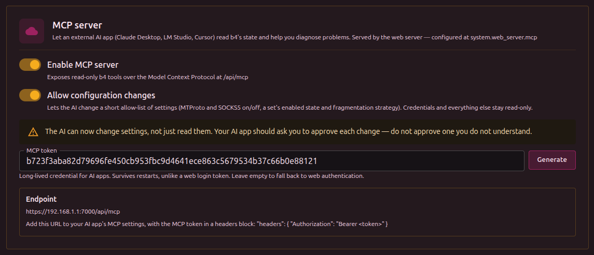

An external AI application reads b4's state over the [Model Context Protocol](https://modelcontextprotocol.io/) and answers questions about it: which set matches a domain, whether traffic reached b4, what the log says. Claude Desktop, LM Studio, Cursor and Jan all speak it.

The model runs inside that application. b4 contacts no AI provider and needs no API key.

Configured in **Settings -> Integrations -> MCP server**.

## Fields



| Field | Description |
| --- | --- |
| **Enable MCP server** | The switch in the card header. Serves the endpoint at `/api/mcp`. Off by default. |
| **Allow configuration changes** | Lets the AI change settings as well as read them. Off by default. See [Changing settings](#changing-settings). |
| **Allow active probes** | Lets the AI fetch a domain from the router to see whether it loads, and run a discovery search for a working bypass strategy. Off by default, and separate from configuration changes: emitting traffic is a different permission from writing settings. |
| **Access token** | The credential AI applications present. **Generate** creates one, **Regenerate** replaces it. |
| **Client configuration** | The endpoint URL and header block to paste into the AI application. **Copy** puts the whole block, with the full token, on the clipboard. |

:::info Served by the web server
The endpoint uses the web server's port, TLS certificate and bind address. With the web server disabled (port 0) it is unreachable, and b4 logs a warning at startup.
:::

## Token

**Generate** produces a 64-character token. It is not stored until the configuration is saved.

While a token is set it is the only credential accepted at `/api/mcp`. It grants nothing else: presented on any other API route it is rejected.

:::tip Set a token rather than relying on the web login
Leaving the field empty makes the endpoint fall back to web-interface authentication. A web login token expires after a day and is discarded on every restart, so an AI application configured with one stops connecting without notice. The MCP token survives restarts.
:::

:::danger Plain HTTP exposes the token
The token is sent in a header on every request. Without HTTPS anyone on the network path can read it and reuse it. Configure HTTPS under [Security](./security) before the port is reachable outside a trusted network.
:::

:::warning Empty token and no web login
With the token field empty and no username and password set under [Security](./security), anything that can reach the port can read b4's status, configuration and diagnostics.
:::

## Connecting an application

Two values are needed: the endpoint URL and an `Authorization: Bearer <token>` header.

**VS Code** reads `.vscode/mcp.json` in the workspace, or the user-level `mcp.json`:

```json
{
  "inputs": [
    {
      "id": "b4-token",
      "type": "promptString",
      "description": "b4 MCP token",
      "password": true
    }
  ],
  "servers": {
    "b4-asuswrt": {
      "type": "http",
      "url": "https://192.168.1.1:7000/api/mcp",
      "headers": {
        "Authorization": "Bearer ${input:b4-token}"
      }
    }
  }
}
```

**LM Studio** uses the same file with a different top-level key and no `type`:

```json
{
  "mcpServers": {
    "b4-asuswrt": {
      "url": "https://192.168.1.1:7000/api/mcp",
      "headers": {
        "Authorization": "Bearer <token>"
      }
    },
    "b4-local": {
      "url": "http://localhost:7000/api/mcp",
      "headers": {
        "Authorization": "Bearer <token>"
      }
    }
  }
}
```

Each entry appears in the **Integrations** panel as `mcp/<name>` with a toggle beside it. Several entries can be defined at once, for example a router and a local instance, and enabled independently.

:::tip Keep the token out of the file
The VS Code `inputs` block makes the editor prompt for the token instead of storing it. Applications without an equivalent hold the token in plain text, so the file should not be committed.
:::

Only `POST` is served. `GET` and `DELETE` return 405, which is normal for this transport and not a fault.

## Tools

| Tool | Answers | Example prompt |
| --- | --- | --- |
| `b4_status` | Version, capture engine, firewall backend, how many sets exist and are enabled, uptime | "Is b4 running, and which capture engine is active?" |
| `b4_get_topic` | What a setting does, its unit, its real default, and what a zero or empty value means | "What does the strict switch on a set's DNS actually do?" |
| `b4_geo_lookup` | Which geosite or geoip categories exist, what one holds, and which of them cover a domain or an address | "Which geosite category covers rutracker.org?" |
| `b4_edit_set_targets` | Adds or removes domains, addresses, geo categories or source devices on one set | "Add rutracker.org to the video set." |
| `b4_test_domain_now` | Fetches a domain through b4 and again with b4 bypassed, and says which of the two works | "Is rutracker.org actually loading right now?" |
| `b4_watchdog` | The last verdict for every watched domain, and add/remove/enable/check | "Which of the sites you are watching are failing?" |
| `b4_manage_set` | Creates, duplicates, moves, enables, deletes or resets a strategy set | "Make a new set for rutracker.org and put it last." |
| `b4_find_bypass_strategy` | Runs discovery against a domain and turns the winning strategy into a set | "Find something that makes rutracker.org load." |
| `b4_check_domain` | Which sets target a domain, how the match was made, whether that set is enabled | "Is rutracker.org covered by any set?" |
| `b4_list_sets` | Every set in priority order, with domain counts and primary strategy | "List the sets and how many domains each targets." |
| `b4_get_set` | One set in full | "Show the full configuration of the set named video." |
| `b4_get_config` | The configuration, or one section of it | "Show the DNS section of the configuration." |
| `b4_recent_connections` | Connections b4 processed, with the set that matched each | "Has any traffic for youtube.com reached b4?" |
| `b4_logs_tail` | The tail of `errors.log`, or of `update.log` with `file=update` | "Did b4 write anything to the error log?" / "The update broke it - what did the installer say?" |
| `b4_metrics` | Packet-engine counters | "What is the current connection rate and memory use?" |
| `b4_diagnostics` | OS, kernel, interfaces, firewall backend and the rule groups b4 installed | "Are b4's firewall rules actually installed?" |
| `b4_list_writable_paths` | Which settings can be changed, with types and accepted values | "What can you change about the video set?" |
| `b4_set_config_value` | Changes one setting and applies it live | "Switch the video set to the extsplit strategy." |
| `b4_revert_last_change` | Restores the configuration from before the last change | "That made it worse, put it back." |

A ready-made prompt named `diagnose_domain` is published alongside the tools. Applications that support prompts list it separately. It takes a domain and walks the model through status, coverage, configuration and firewall checks in order.

## What is served depends on what is permitted

The tool list is built from the two permission switches and rebuilt whenever they change, with no restart. With both off, the AI is offered the reading tools alone; the tools that write settings or run a search are not advertised at all, so a model cannot attempt something it has not been permitted to do, and their descriptions cost nothing.

| Permitted | Tools served |
| --- | --- |
| Nothing (default) | 13 |
| Allow configuration changes | 17 |
| Allow active probes | 15 |
| Both | 19 |

`b4_watchdog` is the one tool served at every level, because reading the watchdog's verdicts emits no traffic and changes nothing. Its actions are permitted separately: `status` always works, `remove` and `disable` need **Allow configuration changes**, and `add`, `enable` and `check` need **Allow active probes** as well, because each of them makes the router fetch a site.

The server also tells the AI which of the two it has, so it says "here is what I would change" rather than offering to change it. That message names the setting to turn on, which is how a model can answer "why can't you?".

## What b4 records about MCP

Every tool call writes one line to b4's log, visible under **Logs** in the web interface: the tool, the caller's address and how long it took. A call that is refused is logged at warning level instead, so a model reaching for something it has not been permitted to do stands out from ordinary use.

A request turned away at the endpoint is also logged: the server being off, a wrong or missing token, or a browser page whose origin is not allowed. The token itself is never written, presented or configured. Repeated refusals are collapsed into one line every 30 seconds with a count, so a client guessing at the token cannot push everything else out of the log.

These lines go to the log stream the interface shows and to the console. They are not written to `errors.log`, which holds errors only.

## Grounding

Several b4 settings have names that read as something other than what they do, and a zero usually means "use the fixed value" rather than "off". b4 ships a written description of each one, and the model is told to read it before explaining or changing anything.

The same descriptions are published twice. `b4_get_topic` is a tool: pass `topic` for an exact key, `path` for a setting a `b4_set_config_value` path names - `sets[video].tcp.win.mode` works, the set is ignored - or `query` to search. Calling it with no arguments lists every documented key. The `b4://topics/<key>` resources hold the identical text.

The duplication is deliberate. Resources are the tidier fit, but most applications never show them to the model - LM Studio and the OpenAI-compatible bridges list resources for the user, not the assistant. A description reachable only as a resource is a description the model never reads, so it is a tool as well.

Asking about a setting that has no description yet returns a note saying so, along with the documented settings nearby. That answer is deliberate too: it tells the model to say it is unsure rather than guess a unit from the field name.

:::info Two different questions about a domain
`b4_check_domain` answers whether a domain is *configured* in a set. `b4_recent_connections` answers whether traffic for it *arrived* and which set matched. A domain can be configured and still see no traffic, which is what separates a targeting mistake from a routing one.
:::

b4 also publishes a resource per documented setting describing what that setting does. Several b4 settings do not mean what their name suggests, so answers from a model that reads these are more reliable than answers reasoned from field names alone.

## What is stripped

Tool output may be forwarded to a third-party model, so credentials are removed from anything returned: the web password and username, SOCKS5 credentials, MTProto secrets, the ipinfo token, the MCP token itself, and the proxy username and password a set carries for its upstream.

:::warning Diagnostics identify the network
`b4_diagnostics` contains no credentials, but it reports the hostname, every interface address and the live firewall ruleset. That is enough to identify the network it came from.
:::

## Changing settings

With **Allow configuration changes** off, nothing the AI does can alter b4. With it on, two areas become writable:

- every setting inside a strategy set: targets, fragmentation, faking, TCP and UDP, DNS, escalation and routing
- the MTProto and SOCKS5 subsystems
- the logging settings, so the AI can raise the log level, reproduce a problem and read the result back

`b4_list_writable_paths` reports the exact paths with their types, current values and accepted values, so a model does not have to guess one.

Refused whatever this setting is on:

| Refused | Reason |
| --- | --- |
| All credentials | Web, SOCKS5, MTProto, a set's upstream proxy |
| Web server settings | Moving or locking the interface removes the way to undo the change |
| The MCP settings themselves | The AI cannot widen its own permissions |
| Packet capture engine and TUN | Switching it underneath a live network can cut the machine off |
| Firewall backend | A wrong value leaves the machine with no rules at all |
| Packet marks, routing tables | Load-bearing for b4's own traffic |
| A set's id | Escalation targets refer to it |
| The log directory and the geo file locations | Filesystem locations, not contents: a wrong log directory silently stops file logging, and a wrong geo path empties every geosite category at once |

:::info Refusing a path is not the same as refusing access
Only the *locations* are refused, never the contents. `b4_logs_tail` reads both log files whatever the directory is set to, without being able to move either somewhere it cannot find. Note that `system.logging.level` does not change what reaches `errors.log`: only errors are ever written there, at any level. Raising the level adds detail to the console and the web interface's live log view, which MCP does not read.
:::

:::info The dividing line is recoverability, not sensitivity
A wrong value inside a set breaks some sites, which is visible and reversible. A wrong web server port or capture engine can leave the machine unreachable with no way back in. Anything in the second group stays refused however useful it looks.
:::

The writable areas are named as whole subtrees in the binary and the exclusions inside them are marked on the fields themselves, so a setting added to b4 later is unwritable until someone opts it in.

A change goes through the same validation and live-apply path as the web interface. An invalid result is rejected and nothing is saved. An accepted change takes effect at once, including the firewall rules when enabling a set alters which ports b4 intercepts. The tool reports the previous and the new value.

:::warning List settings are replaced, not appended to
Writing a set's domains replaces the whole list. A model should read the current value and send it back in full, and the previous value is reported so the change can be undone.
:::

## Undoing a change

`b4_revert_last_change` restores the configuration as it stood before the most recent change and applies it live. Repeating it walks further back, one change at a time.

The history is held in memory and covers only changes made through MCP since b4 last started. Edits made in the web interface are not part of it, and a restart clears it.

:::tip Ask for the undo in the same conversation
The model has the previous value in the tool's reply, so "that made it worse, put it back" is enough.
:::

## Browser origins

Requests carrying an `Origin` header are accepted only when that origin is b4's own address written as an IP address or `localhost`. This stops a visited web page from reaching b4 through the browser. AI applications send no `Origin` header and are unaffected.

:::info Why a hostname is not enough
Matching the origin against the address the request was sent to would not help. Under DNS rebinding the attacker owns the name: a page loaded from `evil.example` keeps working while the attacker re-answers that name with b4's address, so the browser sends `Origin: http://evil.example` alongside `Host: evil.example` and the two agree. What the attacker cannot do is serve a page whose origin is an address they do not control, which is why only literal addresses are accepted automatically.
:::

Reaching b4 from a browser by hostname therefore needs that hostname listed in `allowed_origins`, which has no field in the web interface and is edited in the configuration file. A single `*` accepts any origin and disables the check.
