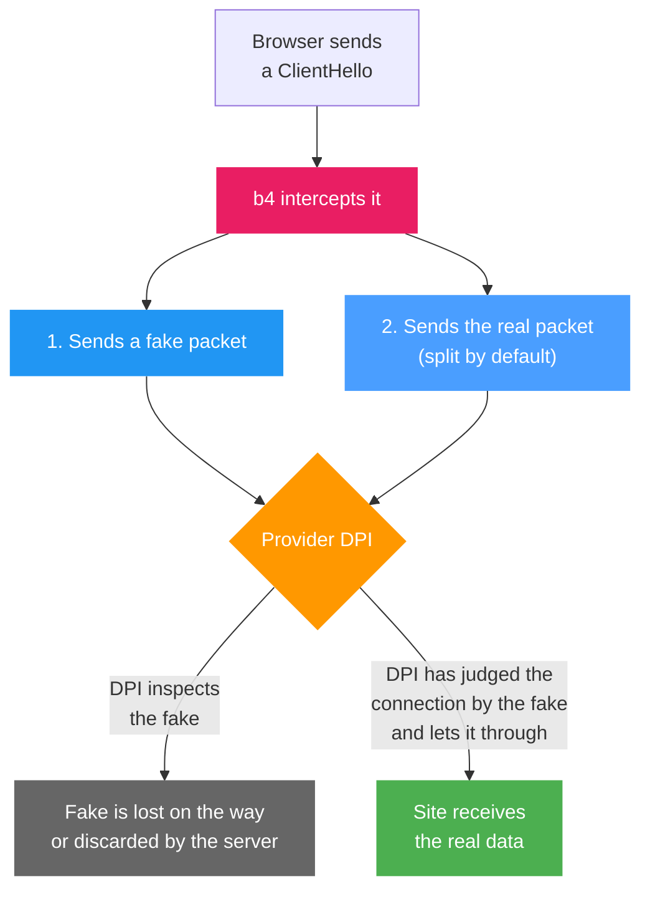

The **Settings, Payloads** tab keeps the files that fake packets can carry instead of a built-in payload. A payload is generated from a domain name or uploaded as a file, and is stored under a name and a protocol. TLS payloads serve the fakes a set sends over TCP, QUIC payloads the fakes it sends over UDP. Generating, uploading and deleting act on the router at once, without **Save Changes**.

## Why payloads exist

One way past DPI is a **fake packet** sent ahead of the real one. The DPI inspects the fake, and the set's fake strategy keeps the server from accepting it. The data the fake carries is the **payload**.

How the fake is kept from the server depends on the set's **Fake Strategy**. With **TTL** it expires on an intermediate hop; with the other strategies it reaches the server and is discarded there, for example for an unexpected sequence number or a broken checksum. A new set uses **Past Sequence**. The strategies are described under [Faking](../sets/tcp/faking.md#fake-strategy).

## Payload types

The **Fake Payload Type** field of a set, under **TCP, Faking, Fake SNI Packets**, picks what the fake carries:

| Type | Contents |
| --- | --- |
| **Random** | 1200 random bytes, new for every connection |
| **Preset: Google (classic)** | A recorded TLS ClientHello for `www.google.com`, 1235 bytes. A new set starts with this type |
| **Preset: DuckDuckGo** | A recorded TLS ClientHello for `staticcdn.duckduckgo.com`, 517 bytes |
| **Preset: STUN** | A 100-byte STUN Binding Request, with no TLS in it |
| **My own Payload File** | A payload from this tab, picked in the **Generated Payload** field that appears with this type |
| **All Zeros** | 1200 zero bytes |
| **Inverted Original** | The data of the real packet with every bit inverted, the same length as the original |
| **Generated from Domain** | A ClientHello from the same generator as the **Generate** button on this tab, for the name in the set's **Domain** field. It is built anew at start-up and on every save of the configuration |

:::note Fallback to the Google preset
With **My own Payload File**, the fake carries **Preset: Google (classic)** while no payload is picked or the picked file cannot be read. The same applies to **Generated from Domain** with an empty **Domain**.
:::

:::tip Which to pick
The payload type in a Discovery result is the one to start from. DPI behaviour depends on the provider and can change over time.
:::

## Generating a payload

**Generate Payload** builds a TLS ClientHello for the name in **Domain**:

1. Type the name in **Domain**, for example `youtube.com`.
2. Click **Generate** or press Enter.

The ClientHello is built on the router. No connection is made, and the name is neither resolved nor checked, so any name is accepted. An `http://` or `https://` prefix and a path are dropped (`https://youtube.com/watch` becomes `youtube.com`), and the name is lowercased. The payload is 648 bytes plus the length of the name, 659 bytes for `example.com`.

Generation makes TLS payloads only. Each name holds at most one payload per protocol: when the name already has a TLS payload, generated or uploaded, that payload is kept and the tab reports that it exists.

### Why SNI-first

Every generated ClientHello has SNI as its first extension. Among the extensions after it are `supported_versions` with TLS 1.3 and 1.2, ALPN with `h2` and `http/1.1`, `key_share` for X25519 and P-256, and an `encrypted_client_hello` extension with random contents. The Random, the session ID and the key shares are random in every payload.

The generator is built around a TSPU shortcut: when SNI is the first extension, the name is checked against an allow-list, and an allowed name takes a fast path. Whether the shortcut applies depends on the provider's equipment.

## Uploading a payload

**Upload Custom Payload** adds a payload from a file:

| Field | Description |
| --- | --- |
| **Name/Domain** | The name the payload is listed under in sets and in Discovery, lowercased. Nothing ties it to the contents of the file. When the field is empty, choosing a file fills it from the file name, dropping `.bin` and a leading `tls_` or `quic_` and turning underscores into dots, so `tls_youtube_com.bin` gives `youtube.com` |
| **Protocol** | **TLS (for TCP fakes)** or **QUIC (for UDP fakes)**, TLS by default. Choosing a file sets it from the first bytes. A TLS handshake record (`16 03`) means TLS, and a QUIC long-header Initial (first byte `0xC0` to `0xCF`) means QUIC. Failing both, a `tls_` or `quic_` prefix of the file name decides, and without one the field keeps its value |
| **Choose File...** | Opens the file picker, filtered to `.bin` files. Once a file is chosen, the button shows its name and the size appears next to it |
| **Upload** | Sends the file. Available once a file is chosen and a name is set. After an upload the card is cleared and **Protocol** returns to TLS |

The upload request as a whole is capped at 64 KB (65536 bytes), so the file itself has to stay slightly under that. An empty file is refused. The contents are stored as they are, without any check. An upload under a name and protocol that already exist replaces that payload without asking.

:::info Payloads in shared sets
A [shared set](../sets/sharing.md#payload-files) carries its payload file only when the file parses. The payload of a TCP fake has to be a TLS ClientHello with a server name, the payload of a UDP fake a QUIC Initial with a readable ClientHello, and either one at most 16 KB. An uploaded file that does not parse is left out of the shared set. Payloads installed from a shared set appear on this tab.
:::

## Using in sets

The set stores the path of the payload's file, such as `captures/tls_youtube_com.bin`, in `faking.payload_file` for TCP fakes and in `udp.fake_payload_file` for UDP fakes.

### TCP fakes

1. Open the set, its **TCP** tab and the **Faking** sub-tab.
2. In **Fake SNI Packets**, with **Enable Fake SNI** on, set **Fake Payload Type** to **My own Payload File**.
3. Pick the payload in **Generated Payload**.

The list shows every payload on this tab by name and size, QUIC payloads included, without the protocol. A link to this tab sits next to the list. While the tab holds no payloads, the list is hidden and a notice with the link is shown in its place.

### UDP fakes

In the set's **UDP** tab, with **Action Mode** set to **Fake & Fragment**, **Fake Packet Payload** sets the body of the fake UDP packets:

| Option | Body |
| --- | --- |
| **(zero fill)** | Zeros. A new set uses this option |
| **(auto: QUIC Initial)** | A new QUIC Initial with random connection IDs and random contents for every fake |
| **QUIC preset 1**, **QUIC preset 2** | Built-in QUIC Initials of 1200 and 1357 bytes |
| A payload from this tab | Listed as `[quic] example.org (1250 bytes)`, QUIC payloads first |

Whatever the option, the body is exactly **Fake Packet Size** long; a longer payload is cut and a shorter one is padded with zeros. A new set sends 64 bytes, so a full QUIC Initial goes out whole only once the size is raised to its length. The other UDP fake settings are described under [UDP](../sets/udp.md#fake--fragment-settings).

## Using in Discovery

The **Options** panel on the **Discovery** page has a **Captured ClientHello as the fake payload** field. It offers the TLS payloads from this tab by name; QUIC payloads are not offered, and the choice is cleared when the page is left. Discovery tries the picked payloads before its built-in ones (the STUN, Google and DuckDuckGo presets) and keeps using the fastest payload that has worked so far. A strategy found with a picked payload refers to its file, and a set that takes the strategy uses **My own Payload File** with that payload. The other options are described under [Discovery](../discovery.md#options).

:::info
A run that finds nothing with the built-in payloads can be repeated with payloads generated for several names. The outcome depends on how the provider's DPI treats the contents of the fake.
:::

## Management

**Generated Payloads** lists every payload on the router, whether generated, uploaded or installed from a shared set. Each card shows the name, the size in bytes, the protocol (TLS or QUIC) and the time the payload was added. While there are none, the tab shows **No generated payloads yet** instead.

The buttons are icons; the names below are their tooltips.

| Button | Action |
| --- | --- |
| **View/Copy hex** (card) | Opens **Payload Hex Data** with the payload in hex. **Copy & Close** copies it to the clipboard and closes the dialog |
| **Download .bin** (card) | Saves the payload as `<protocol>_<name>.bin`, with the dots in the name replaced by underscores |
| **Delete** (card) | Deletes the payload at once, without confirmation |
| **Refresh list** (next to **Generate**) | Reloads the list from the router |
| **Clear all captures** (next to **Generate**, while the list is not empty) | Deletes every payload after a confirmation |

:::warning Deleting a payload a set uses
Deleting a payload does not change the sets that refer to it. b4 reads the payload files of the sets at start-up and on every save of the configuration. A file that is gone by then is logged as an error, and the fakes fall back to **Preset: Google (classic)** over TCP and to zero fill over UDP. A payload replaced by an upload reaches the sets at the same moments.
:::

## Where payloads are stored

Payloads are kept in the `captures/` directory next to the configuration file, `/etc/b4/captures/` or `/opt/etc/b4/captures/` depending on the platform (see [Configuration file](../advanced/config.md#where-it-lives)). Each payload is a file named `<protocol>_<name>.bin`, with the dots in the name turned into underscores and any character other than a Latin letter, a digit or a hyphen left out. `payloads.json` in the same directory records the name, protocol, size and time of each payload.

The tab lists what `payloads.json` records, and b4 reads that file once per run. A `.bin` file copied into the directory by hand does not appear on the tab; uploading it is the way to add it.
