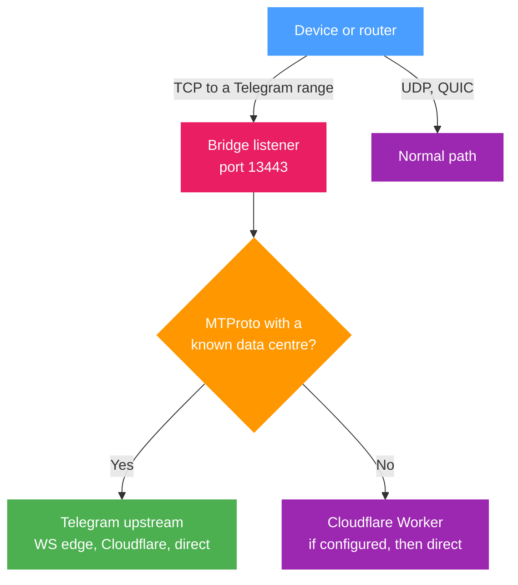

# Telegram over WebSocket

b4 takes the TCP connections that devices behind it open to Telegram's data centres, reads the MTProto session and relays it over Telegram's WebSocket edge, with the Cloudflare routes behind it. Nothing is configured inside Telegram on the device, and no VPS is involved.

The bridge is switched on for the whole network from Settings, Telegram. A per-set routing mode feeds the same bridge for chosen devices or interfaces only, and is described [at the end of this page](#limiting-the-bridge-to-some-devices-or-interfaces). Neither needs the MTProto proxy server to be enabled.

## Turning it on

Settings, **Telegram**, card **Telegram over WebSocket**, switch **Enable Telegram over WebSocket**. It is stored as `system.mtproto.bridge.enabled` and is off by default. The card shows **Save to apply** until the page's **Save Changes** button is pressed, and the switch then takes effect without a service restart. No set is involved, and no GeoIP or GeoSite file is needed.


While the switch is on, b4 diverts TCP connections addressed to Telegram's [address ranges](#address-list) into its bridge listener on port 13443. The port is fixed. The diversion covers:

- every device behind b4;
- connections the router opens itself, such as Telegram Desktop running on the same machine.

[Device filtering](../settings/core.md#device-filtering) on Settings, Core applies: with an allow list only the selected devices are diverted and the router's own connections keep the normal path, and with a deny list the selected devices keep the normal path. The switch has no source-interface or per-device scoping of its own; that remains the job of the [per-set mode](#limiting-the-bridge-to-some-devices-or-interfaces).

The diversion rules exist only while the listener is running. When port 13443 cannot be bound, b4 keeps retrying, and until it succeeds Telegram connections take the normal path instead of being diverted to a closed port. When only the IPv6 socket fails to open, IPv4 is bridged, Telegram over IPv6 takes the normal path, and the card shows a note; the IPv6 socket is tried again only when the listener restarts.



## Requirements

The bridge rides the TPROXY path, which needs the `tproxy` and `socket` kernel modules. On OpenWrt they are `kmod-nft-tproxy` and `kmod-nft-socket`, and the full list for other firewalls and systems is under [Routing, requirements](../sets/routing.md#requirements). Without them b4 installs no diversion rule for the switch, Telegram takes the normal path, and the card reads **Not working** and names the packages that provide what is missing. After the packages are installed, **Check again** on the card re-runs the kernel check and installs the rule. The **System Info** button on Settings, Core shows the same result under **Kernel Capabilities**, in the **Transparent proxy (TPROXY)** row.

The diversion is a firewall rule, so b4 has to be managing the firewall. With **Skip IPTables/NFTables setup** on in [Settings, Core](../settings/core#firewall) (`system.tables.skip_setup`, the `--skip-tables` flag) no rule is installed at start-up. Saving the settings still installs the routing rules, and they stay until the next restart.

The bridge has not been verified with the TUN engine, and the card says so while b4 runs in that mode.

IPv6 ranges are diverted only while **IPv6 support** is on in [Settings, Core](../settings/core#protocols). With it off, Telegram over IPv6 takes the normal path.

## Address list

b4 keeps a list of Telegram's address ranges. The built-in list compiled into b4 is always part of it. On top of the built-in list b4 uses one of these sources, in order of preference:

1. The list Telegram publishes at `https://core.telegram.org/resources/cidr.txt`.
2. The same file from the b4 mirrors, `proxy.b4core.app` and then `proxy2.b4core.app`, when telegram.org cannot be reached.
3. The last downloaded copy, saved as `telegram_cidr.txt` next to the configuration file.
4. The `telegram` category of the configured GeoIP file.

The list is downloaded in the background once the switch is turned on and at start-up while it is on, then once a day. A failed download keeps the list already in use; the next attempt follows after 30 seconds, and the wait doubles after each further failure up to an hour, until a download succeeds and the daily schedule resumes. **Refresh addresses** on the card downloads it again straight away. An entry broader than /12 for IPv4 or /24 for IPv6 is discarded from a downloaded list, so a damaged file cannot pull a large part of the address space into the bridge.

GeoIP and GeoSite files are therefore not required for the switch. GeoSite plays no part in the bridge at all.

## Checking that it works

With the switch on and saved, the card reads **Working** when the diversion rule is installed and the bridge listener is running, and **Not working** otherwise; hovering the status names what is missing. Below it are the listener port, the active connections, how many Telegram ranges are in use and where they came from, and the number of relayed sessions with the time of the last one. The card's fields are listed under [Settings, Telegram](../settings/mtproto.md#telegram-over-websocket), and each of its warnings is explained under [Troubleshooting](./troubleshooting.md#the-telegram-over-websocket-card-shows-a-warning).

A relayed session logs one line at info level:

```text
[tg-bridge c=5] bridge relay 149.154.167.51:443 -> DC2 via ws://kws2.web.telegram.org@149.154.167.220 [dc-from=ip]
```

Bridged connections appear in the [logs](../logs.md) and on the [Traffic](../connections.md) page under the set name **Telegram bridge**, and on the Traffic page they carry the **Telegram bridge** label. No set of that name exists in the set list; the name only labels what the switch diverted.

Over [MCP](../settings/mcp.md), `b4_status` reports the bridge state, and with configuration changes allowed the switch is writable as `system.mtproto.bridge.enabled`.

## Order among sets

The switch's rules come first among the routing sets that are not limited to devices or interfaces. An ordinary routing set that also covers Telegram addresses, such as a catch-all sending everything through a VPN, does not take Telegram connections away from the bridge.

A set limited to specific devices, by an included or an excluded source-device list, or to source interfaces still handles its devices first when it also matches Telegram addresses. That is the way to keep one device's Telegram traffic on a different route while the switch covers everyone else.

With device filtering on Settings, Core in allow-list mode, every routing set is limited to the selected devices, and the switch comes before all of them.

:::warning A block set blocks the bridge too
A block set that is not limited to source interfaces or an included source-device list, and whose targets cover Telegram addresses, still blocks the router's own connections to those addresses. The bridge's own upstream connections are among them, so such a set cuts the bridge off from every address it covers.
:::

## DPI processing

Connections from devices and from the router itself are handed to the bridge untouched by b4's packet processing, so no faking, fragmentation or desync is applied to them. The bridge ends the client's TCP connection at its listener and opens connections of its own.

The bridge's outgoing connections are treated by route, and the MTProto proxy server's upstream connections the same way:

| Route | Packet processing |
| --- | --- |
| Telegram's WebSocket edge, with or without a fronting name | Passes through; an ordinary set whose targets match applies its DPI settings |
| Direct TCP to a data centre | Passes through; an ordinary set whose targets match applies its DPI settings |
| Cloudflare-proxied domains, a Cloudflare Worker, a custom WebSocket domain | Left out; no set applies faking, fragmentation or desync to them |

The Cloudflare routes are relays that reach Telegram without touching its addresses, and a set that covers Cloudflare for other sites, such as one with the `cloudflare` GeoIP or GeoSite category, would otherwise apply its strategy to them as well. On a network where that strategy breaks connections to Cloudflare, every one of these routes would then fail at once.

A set in the per-set **Telegram over WebSocket** routing mode behaves differently. When it is not limited by an included source-device list, it matches the bridge's own connections to addresses in its targets, which are Telegram's WebSocket edge and direct data-centre connections, and leaves them unmodified. The set's own TCP DPI settings never apply to Telegram TCP.

## What the bridge uses upstream

The [Telegram upstream](./upstream.md) settings apply, with two overrides the bridge makes for every session it carries, whichever way it was switched on:

- The transport mode is forced to **Auto**, whatever the dropdown says.
- The **DC Relay** is cleared. A relay configured for the proxy server is not used here, so a network where the WebSocket transport is blocked cannot be rescued by a relay in this mode.

While the proxy server runs in Auto or WebSocket only mode, the bridge draws warm WebSocket connections from the proxy server's pool. Otherwise it keeps a pool of its own, filled after the first bridged session to each data centre, so a data centre that has carried no bridged session within the last few minutes starts cold.

A [Cloudflare Worker domain](./cloudflare-worker.md) is the setting to add when media fails to load: the data centres Telegram's own edge does not serve are reached through the Cloudflare routes.

## Boundaries

Only TCP MTProto sessions are bridged.

- A connection b4 cannot decode or cannot map to a data centre is offered to the configured Cloudflare Worker first, and only then dialled directly.
- Voice calls are not diverted. They travel over UDP, no UDP listener is started, and calls take the ordinary path.
- No QUIC rejection rule is installed, so a client that prefers QUIC to a Telegram address bypasses the bridge without a log line saying so.
- The diversion carries no destination-port filter. Every TCP connection to a Telegram range enters the listener, including plain HTTPS to Telegram's web hosts inside those ranges, such as `web.telegram.org` or `t.me`. Such a connection is read, recognised as not MTProto and passed on: to the Cloudflare Worker first when one is configured, then directly.

A connection that reaches the listener and then sends nothing occupies the listener for the **Bridge Handshake Wait**, 180 seconds by default, set under **Fallback sources** on the Telegram upstream (shared) card. Setting that field to `-1` means waiting indefinitely, not disabling the wait.

## Limiting the bridge to some devices or interfaces

The routing mode **Telegram over WebSocket (built-in)** on a set feeds the same bridge, with the scoping and the position in the set list that a set has. It is the way to bridge only some devices or some interfaces. While the switch is on, a set in this mode is redundant, and the card warns about it.

1. Create a set and give it the `telegram` **GeoIP** category. The interception rule matches addresses, so the GeoIP category is what does the steering. The GeoIP database has to be configured: a set that names a category while the database path is empty is rejected when the configuration is saved.
2. On the set's **DNS & Routing** tab, enable routing and set **Routing mode** to *Telegram over WebSocket (built-in)*.
3. Choose the **source interfaces** on the same tab, or [source devices](../sets/targets.md#source-devices) on the **Targets** tab, to limit whose traffic is bridged. With both empty the set covers every device.

```json
{
  "name": "telegram-ws",
  "targets": {
    "geoip_categories": ["telegram"]
  },
  "enabled": true,
  "routing": { "enabled": true, "mode": "mtproto-ws" }
}
```

A set that also names the `telegram` GeoSite category, as earlier versions of this example did, keeps working. The GeoSite category only adds Telegram's web hosts to the diversion, which the bridge recognises as not MTProto and passes on, and does nothing for MTProto itself.

:::warning Source scoping does more than narrow the LAN side
The rules that send the router's own Telegram traffic into the bridge are installed only while the set is not scoped to source interfaces or devices. Selecting a source interface therefore excludes the router itself, not just the devices on other interfaces. Device filtering in allow-list mode has the same effect.
:::

Connections a set in this mode carries appear in the logs and on the Traffic page under the set's own name, with the same **Telegram bridge** label.
