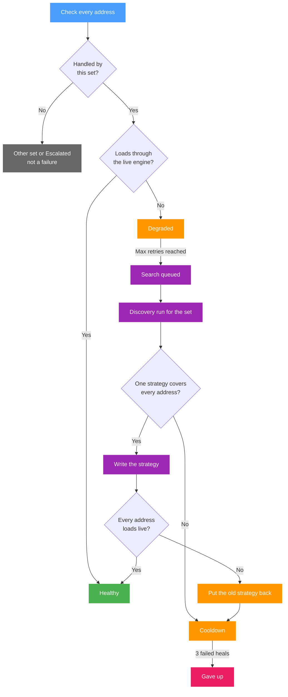

# Watchdog

The watchdog fetches pages on a schedule and, when they keep failing, runs [Discovery](./discovery) to find a strategy that loads them again. It works on two kinds of targets:

- **watched sets**: sets whose own watchdog is switched on in their [Discovery tab](./sets/discovery#watchdog). All Discovery addresses of the set are checked together, and a heal keeps that set's own strategy working;
- **the older per-domain list**: domains checked one by one, each healed through whichever set lists it at the time.

The **Watchdog** page shows both, in the sections **Watched sets** and **Older domain list**. The global switch and the timings are under **Settings, Discovery** and apply to both. The reactive detection approach is inspired by the [belotserkovtsev/ladon](https://github.com/belotserkovtsev/ladon) project.

## Watching a set

A set is watched while its switch **Keep this set working with the watchdog** is on and the set is enabled, has Discovery addresses, has routing off, is not limited to specific devices by an include list, and has domain or GeoSite targets. The [Discovery tab](./sets/discovery#watchdog) lists these conditions and what happens to the switch when one of them fails.

### Checks

A set is checked as soon as it becomes watched, then on every **Check Interval**, and on the **Failure Re-check Interval** while it is degraded. Each address goes through two steps.

**Ownership.** The engine is asked which set it uses for the address's host name, from the router's view. An address handled by another set, or by no set, is marked **Other set**; an address that an [escalation](./sets/escalation) currently sends to another set is marked **Escalated**. Neither counts as a failure, because a strategy written into this set would not affect it.

**Fetch.** An address this set handles is fetched through the live engine, the way a device behind the router reaches it:

| Rule | Result |
| --- | --- |
| TLS certificate verification is on | A certificate error makes the address **Unusable**. |
| The server requires a client certificate | **Unusable**. |
| Private and local destinations are refused on every hop, redirects included | **Unusable**. |
| Up to 3 redirects are followed | More fail; a redirect to a known block page fails. |
| HTTP 400, 451 and any 5xx | Fail. |
| At most 100 KB of the body is read, and the first 4 KB are scanned for a block page | A block page fails. |
| Fewer than 1 KB read | Fails. |
| A body cut off before its end: less than 90% of the announced length without a closing `</html>`, or a read error | Fails. |
| IPv6 | Used only while the capture engine handles IPv6; otherwise the fetch is IPv4 only. |

The whole fetch is limited by **Check Timeout**. An **Unusable** address points at a problem no strategy changes, so it is never healed and is left out of heals.

When every checked address loads, the set is **Healthy**. When one fails, the check counts as failed and the set is **Degraded**. When no address can be checked at all, because each is handled by another set, escalated or unusable, the set is **Cannot verify** with the reason shown, and it is never healed while that lasts.

### Heal queue and budget

After **Max Retries** failed checks in a row the set is queued for a heal (**Search queued**). Heals run one at a time, in the order they were queued, and share the Discovery runtime with runs started by hand: while a Discovery run started on the Discovery page or through MCP is in progress, the heal waits, and a manual run cannot start while a heal is running. A set edited while it waits in the queue is taken out of it and checked again first, and a change to its addresses sends it back to **Queued** for a fresh check.

A heal is a [Discovery run for the set](./discovery#a-run-for-a-set) on the addresses the set handles and can use:

- the DNS check is skipped;
- the set's current strategy is tested first;
- each strategy has to pass three fetches in a row during the search;
- the search stops at the first strategy confirmed on every address together.

The run shows on the Discovery page like any other but cannot be stopped from there. After 15 minutes the search is stopped and what has been found so far is confirmed. After 20 minutes the run is canceled, nothing is written, and the heal counts as failed.

### What is written

Only the verdict **one strategy covers every address** is written, and only the strategy, by the same rules as [writing into an existing set](./discovery#writing-into-an-existing-set) from Discovery:

| Part of the set | After a heal |
| --- | --- |
| TCP | From the result, except the port filter and RST protection, which the set keeps. IP block detection stays as it was, unless the result turns it on. |
| Fragmentation and fake packets | From the result. |
| DNS | Changed only when the result uses a DNS redirect; the set's pins are kept. |
| UDP, targets, routing, escalation, Discovery addresses | Unchanged. |

Nothing is written when the set was edited while the heal ran. Every other verdict writes nothing and counts as a failed heal, with the reason shown.

### Verification and rollback

After the write, the escalations b4 holds for the set's hosts are cleared, so the addresses reach this set again, and every address the heal ran on is fetched through the live engine with the same rules as a check, up to two tries each. When all of them load, the heal is done: the set is **Healthy**, and the strategy it wrote is shown as the last heal.

When any address still fails, the strategy sections of this set (TCP, UDP, fragmentation, fake packets and DNS) are put back as they were before the heal, and the heal counts as failed. The put-back is skipped when the set was edited after the heal wrote it, so a hand edit is never overwritten; the last error then says the set was not restored. No other set is touched.

### Cooldown and giving up

After every heal attempt, successful or not, the set waits for the **Healing Cooldown** before it is checked again. After three failed heals in a row the watchdog gives up on the set (**Gave up**): checks go on at the normal interval, but no heal is queued until one of these happens:

- a check finds every address loading;
- **Check now** is pressed for the set on the Watchdog page;
- the set's watchdog is switched off and on again.

### Statuses

A watched set shows one of these statuses, on the Watchdog page, in its Discovery tab, and as the colour of the **Watchdog** badge on its card:

| Status | Meaning |
| --- | --- |
| **Queued** | Not checked yet, or waiting for a fresh check after a change. |
| **Healthy** | Every address the set handles loaded on the last check. |
| **Degraded** | At least one address failed; the number of failed checks in a row is shown. Checked again on the failure interval. |
| **Search queued** | **Max Retries** was reached and the heal waits for its turn. |
| **Searching** | The heal's Discovery run is in progress. |
| **Cooldown** | A heal attempt failed or was not written; the next check waits for the cooldown to end. |
| **Cannot verify** | None of the set's addresses can be checked: each is handled by another set, escalated or unusable. |
| **Gave up** | Three heals failed in a row. Checks continue, heals do not. |

Each address of the set shows one of these:

| Status | Meaning |
| --- | --- |
| **Queued** | Not checked yet. |
| **OK** | Loaded through the live engine. |
| **Failed** | Did not load by the rules under [Checks](#checks). Counts as a failure. |
| **Other set** | From the router's view another set, or none, handles the host. The set it names is shown. Not a failure. |
| **Escalated** | An escalation sends the host to another set. Not a failure. |
| **Unusable** | A certificate error, a required client certificate, or a private or local destination. Never healed. |

The reason under a set's status explains why it is in that state or how the last heal ended. The code in the second column is what the [MCP](./settings/mcp) tool and the API report:

| In short | Code | Meaning |
| --- | --- | --- |
| Handled by another set | `not_owned` | The set's addresses are handled by another set or by none, so a strategy written into this set does not affect them. |
| Escalated | `escalated` | An escalation sends the addresses to another set. |
| Cannot be healed | `unusable` | A certificate error, a required client certificate, or a private or local destination. |
| Current strategy works | `current_works` | Tested alone, the set's own strategy loads the addresses, yet the live check fails. Something outside the strategy is in the way: another set, DNS or IPv6. Nothing was changed. |
| No bypass needed | `not_needed` | Tested alone, the addresses load without a bypass, yet the live check fails. Same causes as above. Nothing was changed. |
| Partial | `partial` | The search found a strategy for only some of the addresses, so nothing was written. |
| Nothing found | `none` | The search found no working strategy. |
| Not finished | `incomplete` | The search ended without a confirmed result. |
| Over budget | `budget` | The search ran longer than 20 minutes and was canceled. It is tried again after the cooldown. |
| Could not start | `start_failed` | The Discovery run could not start. |
| Verification failed | `verify_failed` | The strategy written did not pass the live check and was undone. |
| Edited | `edited` | The set was changed during a check, while it waited in the queue or while the search ran. Nothing was written, and the set is checked again, after the cooldown when a search had run. |
| Busy | `busy` | Another Discovery run holds the runtime. The heal waits. |

### The Watched sets section

Each row of **Watched sets** links to the set's Discovery tab and shows its status, the reason with the failed checks in a row and the last error, when it was last checked, the last heal with the strategy it wrote, the number of failed heals, and the end of the cooldown. The row expands to the set's addresses, with their status, the other set that handles them, the HTTP response with the bytes read and the speed, the last check and the last error.

**Check now** schedules an immediate check of every address and clears the cooldown, the failed-heal count and a give-up; it is unavailable while a heal is queued or running. **Stop watching this set** switches the set's watchdog off.

## Parameters

Configured under **Settings, Discovery**, in the [Watchdog section](./settings/discovery#watchdog). The switch **Enable Watchdog** turns all watching on or off, for sets and for the older list alike, and the timings apply to both.

| Parameter | Description | Range | Default |
| --- | --- | --- | --- |
| **Check Interval** | How often each watched set or domain is checked while healthy | 60-1800 sec | `300` sec (5 min) |
| **Failure Re-check Interval** | How often a degraded set or domain is checked again | 10-300 sec | `60` sec |
| **Healing Cooldown** | Pause after a heal attempt before the next check of that set or domain | 60-3600 sec | `900` sec (15 min) |
| **Check Timeout** | Maximum time for one fetch | 3-30 sec | `15` sec |
| **Max Retries** | Failed checks in a row that queue a heal | 1-10 | `3` |

Two more values exist only in the configuration file, under `system.checker.watchdog`: `heal_validation_tries` (default `3`), the number of fetches in a row a strategy has to pass during a heal's search, and `verify_tries` (default `2`), the number of tries each address gets in the check after a heal writes a strategy.

## Older per-domain list

The list predates per-set watching and keeps working beside it. It is edited under **Settings, Discovery** (**Older per-domain list**) and in the **Older domain list** section of the Watchdog page. An entry is a domain or a full URL: a URL is checked as given, a domain as `https://<domain>/`.

Each entry is checked on its own, on the same intervals. After **Max Retries** failed checks in a row, Discovery runs for that domain with the DNS check skipped. A result is written only when it was confirmed and the domain needed a bypass, and it goes:

- into the first enabled set without routing that lists the domain, or a parent domain of it, in its domain list; a match through a GeoSite category does not count;
- otherwise into a new set named `watchdog-<domain>`, created at the top of the list.

Only the strategy is written, by the same rules as for a watched set: the port filter, RST protection and the UDP settings of an existing set are kept. When the set matched through a parent domain, the domain itself is also added to its domain list. When the write changes which ports b4 intercepts, as a newly created set can, the firewall rules are refreshed.

:::warning Routing sets are never touched
A domain on the list is never written into a set with routing enabled (block, proxy, interface or the Telegram bridge). A match through a GeoSite category, for example the sub-domain `ads.youtube.com` inside `category-ads-all`, does not count either; only a domain listed in a set's domain list does. This keeps a monitored site from being written into a blocking set.
:::

Per-set watching avoids the extra `watchdog-<domain>` set: its heal always writes into the set being watched, and it checks all of that set's addresses together.

An entry whose host a watched set already checks, or whose set is itself watched, is not checked from the list; the table shows it as **Checked through set &lt;name&gt;**.

| Status | Meaning |
| --- | --- |
| **Healthy** | The domain loaded on the last check. |
| **Degraded** | Failures were recorded, but **Max Retries** has not been reached yet. |
| **Healing** | Discovery is running for the domain. |
| **Queued** | The domain waits for its next check. |

### Watch through a set

When the engine hands an entry's host to a set, the entry offers **Watch through &lt;set&gt;**. It adds the entry's address to that set's Discovery addresses, switches the set's watchdog on, removes the entry from the list and schedules a check of the set. The button is disabled, with the reason in its tooltip, when the set cannot be watched or already holds five addresses on other hosts.

## Pages opened before a heal

A heal changes the configuration on its own, possibly while a page is open on an older copy. The **Settings** page and the set editor send the revision of the configuration or of the set they loaded with every save. When the configuration was changed on the router since then, for example by a heal, the save is refused with a message offering a reload. Reloading shows the current state and discards the unsaved changes on that page, so a heal is never silently undone by a page opened before it.

:::info
The `b4_watchdog` tool of the [MCP server](./settings/mcp) reads and changes both the watched sets and the older list, and `b4_find_bypass_strategy` runs Discovery for a set with its current strategy tested first and the search stopped at the first confirmed cover, as a heal does; unlike a heal, it keeps the DNS check unless `skip_dns` is set.
:::
