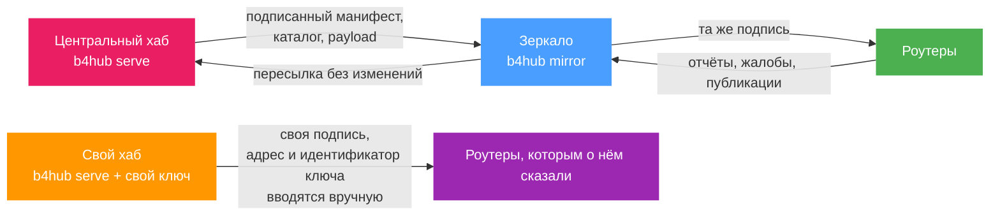

# Запуск хаба

`b4hub` - это сервис, который стоит за `hub.b4core.app`. Он хранит каталог, принимает общие сеты, отчёты и жалобы от роутеров, подписывает то, что публикует, и раздаёт [консоль модерации](./moderation.md). Это отдельный от b4 бинарник со своей нумерацией версий, и на роутере он не запускается.

Работать он может в одном из двух режимов.

| | Свой хаб | Зеркало |
| --- | --- | --- |
| Команда | `b4hub serve` | `b4hub mirror` |
| Каталог | Собирается из сетов, которыми поделились с ним | Копируется у вышестоящего хаба |
| Ключ подписи | Свой, из `b4hub keygen` | Для каталога нет, подпись остаётся чужой; объявляющее себя зеркало держит ключ только для подписи объявления |
| Модерация | Свои модераторы и своя консоль | Нет |
| Записи от роутеров | Сохраняет и обрабатывает | Пересылает наверх без изменений |
| База данных | SQLite в каталоге данных | Нет |
| Что нужно сообщить роутеру | Адрес и идентификатор ключа | Ничего, после одобрения вышестоящим хабом |

Свой хаб - это второй каталог. В нём лежат сеты, одобренные его собственными модераторами, отчёты считаются отдельно, и роутер попадает на него только после того, как в настройках вручную указаны и адрес, и идентификатор ключа. Зеркало - это тот же самый каталог по второму адресу: оно проверяет подпись вышестоящего хаба, копирует файлы и пересылает ему всё, что отправляют роутеры.



:::info
Поле **Зеркала хаба**, описанное в разделе [Хаб сообщества](./index.md#включение), не имеет отношения к [зеркалам обновления](../advanced/update-mirrors.md) - хостам, с которых b4 скачивает свои собственные релизы.
:::

## Сервис

Один статический бинарник со встроенной консолью. Каждая команда принимает `--data` - каталог, в котором лежит всё, что принадлежит сервису.

| Команда | Что делает |
| --- | --- |
| `b4hub keygen` | Создаёт ключ подписи и печатает его идентификатор. Существующий ключ перезаписать отказывается. |
| `b4hub serve` | Запускает хаб: сборщик каталога, точки входа для роутеров и консоль. |
| `b4hub mirror` | Запускает зеркало другого хаба. |
| `b4hub build` | Один раз собирает и подписывает каталог и завершается. Флаги `--new-epoch` и `--revoke` делают то же, что страница «Каталог» в консоли. |
| `b4hub moderate` | Одобряет, отклоняет, скрывает, блокирует и управляет зеркалами из командной строки, без консоли. |
| `b4hub version` | Печатает версию хаба и дерево исходников b4, из которого он собран. |

У флагов ниже есть переменная окружения, и обычно её и задают в unit-файле или в контейнере. Флаги отдельных команд - `--new-epoch`, `--revoke`, `--announce` и `--refresh` - задаются только в командной строке.

| Флаг | Переменная | По умолчанию |
| --- | --- | --- |
| `--data` | `B4HUB_DATA` | `data` |
| `--listen` | `B4HUB_LISTEN` | `127.0.0.1:7100` |
| `--public-url` | `B4HUB_PUBLIC_URL` | пусто |
| `--geosite-url` | `B4HUB_GEOSITE_URL` | релиз v2ray-rules-dat |
| `--geoip-url` | `B4HUB_GEOIP_URL` | релиз b4geoip |
| `--upstream` | `B4HUB_UPSTREAM` | пусто, обязателен для `mirror` |
| `--upstream-key` | `B4HUB_UPSTREAM_KEY` | пусто, то есть встроенный ключ |
| `--trusted-proxies` | `B4HUB_TRUSTED_PROXIES` | пусто |
| флага нет | `B4HUB_ADMIN_PASSWORD` | пусто, и тогда консоль закрыта |

В каталоге данных лежат `hub.key` (seed ключа подписи), `hub.db` (хранилище SQLite), `secret` (создаётся при первом запуске), `blobs/` (файлы payload по хешу), `public/` (подписанные файлы, которые скачивают роутеры) и `geo/`.

:::warning
b4hub говорит только по обычному HTTP и сам TLS не терминирует. Адрес по умолчанию - локальный, потому что предполагается обратный прокси перед ним. Комплект для развёртывания с vhost для nginx, unit-файлом systemd и файлом Compose опубликован в [репозитории b4hub](https://github.com/DanielLavrushin/b4hub) вместе с релизами.
:::

### Что запрашивают роутеры

| Путь | Ответ |
| --- | --- |
| `/b4/health` | `ok` |
| `/b4/hub/manifest.json` | Подписанный манифест: файл каталога, его размер и хеш, список зеркал, отозванные ключи, срок действия |
| `/b4/hub/catalogue-<epoch>-<seq>.json.gz` | Сам каталог |
| `/b4/hub/blob/<sha256>` | Один файл payload |
| `/b4/hub/v1/msg` | Куда отправляются общий сет, отчёт и жалоба |
| `/b4/hub/v1/network` | ASN, страна и название провайдера, в которых хаб видит обратившегося |

Зеркало раздаёт всё это, кроме `/b4/hub/v1/network`: для этого нужен собственный взгляд хаба на сеть.

## Свой хаб

```sh
b4hub keygen --data /var/lib/b4hub
```

Команда печатает одну строку - идентификатор ключа. Только он и опознаёт этот хаб для роутера, и создаётся он один раз: команды смены ключа нет, а `keygen` отказывается перезаписать существующий `hub.key`.

Пароль модерации читается из окружения и больше ниоткуда:

```sh
B4HUB_ADMIN_PASSWORD=... b4hub serve --data /var/lib/b4hub \
  --listen 127.0.0.1:7100 --public-url https://hub.example.org
```

`--public-url` - это адрес, который хаб объявляет для себя в манифесте, поэтому указывать стоит тот, по которому роутеры действительно к нему приходят, а не локальный.

:::warning
Без `B4HUB_ADMIN_PASSWORD` хаб раздаёт каталог как обычно, но консоль закрыта: страница входа сообщает, что модерация не настроена, а вход и любое действие модератора отклоняются. Тогда модерация возможна только через `b4hub moderate`, и он работает рядом с сервисом: хранилище - это SQLite в режиме WAL, поэтому запущенный хаб его не блокирует и подхватывает решение при следующей сборке.
:::

### Подключение роутера

В **Настройки, Интеграции, Хаб сообщества** вводятся два значения: базовый адрес в поле **Зеркала хаба** и идентификатор ключа в поле **Публичный ключ хаба**.

:::warning
Нужны оба поля. Один только ключ заменяет тот, которому доверяет b4, но `hub.b4core.app` исчезает из перебираемых адресов лишь после того, как в поле **Зеркала хаба** указан собственный хаб. С заданным ключом и пустым полем адресов каждая синхронизация всё равно доходит до `hub.b4core.app` и отклоняет его каталог из-за чужой подписи.
:::

Адрес должен начинаться с `https://`, без учётных данных, параметров запроса и якоря. Обычный `http://` принимается только для `localhost`, петлевого, частного или link-local адреса, то есть для хаба в той же сети, но не для публичного имени. Адрес, который b4 не принимает, отбрасывается молча.

Ключ, не совпадающий с тем, которым подписывает хаб, проваливает каждую синхронизацию с ошибкой «manifest is not signed by a trusted key», а сохранённый каталог отбрасывается, как только ключ, которым он подписан, перестаёт быть доверенным; страница Сообщество остаётся пустой до первой удачной синхронизации.

### Каталог, который он публикует

Пока модератор не одобрит версию, не публикуется ничего, поэтому новый хаб начинает с пустого каталога.

| | |
| --- | --- |
| Сборка | Проверяется при запуске и затем каждые 5 минут; сборка идёт, когда ещё ничего не опубликовано, когда что-то изменилось или когда последней уже сутки |
| После действия модератора | Сборка идёт внутри запроса, поэтому одобрение публикуется сразу |
| Файл | `public/catalogue-<epoch>-<seq>.json.gz`, хранятся три последних |
| Манифест | Подписан, действителен 14 дней с момента сборки |
| Payload | Раз в час удаляются файлы, на которые не ссылается ни одна сохранённая версия и которые записаны больше часа назад |

Роутер принимает манифест, только если он новее имеющегося: больше эпоха или та же эпоха с большим порядковым номером. Более старый отклоняется, и роутер переходит к следующему адресу.

:::info
Хаб, который перестал собирать каталог, деградирует, а не ломается. Роутеры сохраняют последний полученный каталог, помечают его истёкшим через две недели, в течение которых действителен манифест, и продолжают работать с уже применёнными сетами.
:::

### Сеть, к которой относят вклад

Хаб определяет ASN и страну адреса, с которого пришла запись, и именно к ним относится отчёт. За обратным прокси хаб видит адрес прокси, если только прокси не находится на петлевом адресе или не указан в `--trusted-proxies` адресом или подсетью.

:::warning
Недоверенный прокси схлопывает весь хаб в одну сеть. Любой вклад относится к прокси, сетевые лимиты делятся между всеми сразу, а при частном адресе прокси ASN не записывается вовсе, и отчёты теряют оценки по провайдеру и по стране.
:::

ASN определяется DNS-запросом, а не по локальной базе, поэтому хосту хаба нужен работающий исходящий DNS. Файлы `geosite.dat` и `geoip.dat`, которые сервис скачивает раз в сутки, объявляются в манифесте и показываются в консоли, но для определения сети не используются.

## Зеркало чужого хаба

Зеркало раздаёт каталог хаба, которым не управляет. Раз в пять минут оно проверяет манифест вышестоящего хаба и, когда появляется более новый, скачивает каталог и те файлы payload, которых у него ещё нет, проверяет каждый из них, складывает payload в свой `blobs/`, а каталог и манифест записывает в `public/`, чтобы раздавать как есть.

```sh
b4hub mirror --data /var/lib/b4hub-mirror \
  --upstream https://hub.b4core.app \
  --listen 127.0.0.1:7101
```

`--upstream` - единственный обязательный флаг. Зеркалу собственного хаба нужен ещё `--upstream-key` с идентификатором ключа того хаба; без него единственный ключ, которому зеркало доверяет, - встроенный ключ `hub.b4core.app`.

Что проверяется до того, как что-либо скопировано: манифест подписан доверенным ключом, имя файла каталога имеет ожидаемый вид, манифест новее уже имеющейся копии, скачанный файл точно того размера и с тем SHA256, которые названы в манифесте, он разбирается, и каждый файл payload совпадает с хешем из каталога. Сбой на любом шаге оставляет прежнюю копию на месте, и попытка повторяется при следующей проверке.

:::info
Зеркало продолжает работать при недоступном вышестоящем хабе. При запуске оно загружает то, что скопировало последним, поэтому даже перезапуск во время сбоя не мешает ему раздавать последний полученный каталог.
:::

Корень зеркала, `/`, - страница для браузера: какой хаб оно зеркалирует, какой каталог хранит с номером сборки, датой сборки и сроком действия, когда вышестоящий хаб проверялся в последний раз и удалась ли проверка, и чем закончилось последнее объявление. Язык страницы - английский или русский по языку браузера. Тексты ошибок, запись объявления и ключ подписи на неё не попадают; они есть в журнале зеркала.

### Почему роутер оказывается на зеркале

Роутер перебирает адреса по порядку: сначала заданные вручную, затем выученные, затем встроенный. Ответить может любой из них, и ответ - один и тот же подписанный каталог, поэтому для успешной синхронизации достаточно, чтобы отозвался хоть один адрес. Зеркало - это второе место, откуда можно взять те же самые байты, для сети, в которой первое не отвечает.

Зеркала выучиваются сами. Каждый подписанный манифест несёт список зеркал, которые хаб одобрил; роутер, проверивший манифест, сохраняет этот список рядом с подписавшим ключом, не больше 32 адресов, и добавляет его к заданным вручную. Смена поля **Публичный ключ хаба** этот список отбрасывает: списку зеркал доверяют ровно настолько, насколько доверяют объявившему его ключу.

### Объявление зеркала

Зеркало, которое должно попасть в этот список, объявляет себя:

```sh
b4hub keygen --data /var/lib/b4hub-mirror

b4hub mirror --data /var/lib/b4hub-mirror \
  --upstream https://hub.b4core.app \
  --public-url https://mirror.example.org --announce
```

Для `--announce` нужны и собственный ключ, чтобы подписать объявление, и `--public-url` - объявляемый адрес. Объявление уходит при запуске зеркала и затем раз в сутки. Адрес должен быть `https://` или `http://` для localhost, петлевого, частного или link-local адреса, не длиннее 200 символов, без учётных данных, параметров запроса и якоря.

:::warning
Объявление ничего не публикует. На вышестоящем хабе оно появляется со статусом **ожидает** и не объявляется роутерам, пока модератор не одобрит его на [странице «Зеркала»](./moderation.md#зеркала) консоли того хаба. Повторное объявление обновляет время последнего появления и никогда не меняет уже принятое решение, поэтому отклонённое зеркало остаётся отклонённым.
:::

После одобрения зеркало проверяется при каждой сборке каталога: его `/b4/health` должен отвечать `ok`, а манифест - проходить проверку ключом самого хаба. Оно остаётся в манифесте, пока проверка удавалась в последние 24 часа, так что кратковременный сбой его не выбрасывает, а длительный выбрасывает.

### Записи, отправленные через зеркало

У зеркала нет базы данных, поэтому оно ничего не решает. Оно отправляет полученное вышестоящему хабу и возвращает его ответ без изменений, включая любой отказ.

| Когда вышестоящий хаб отвечает | Что получает роутер |
| --- | --- |
| Нормально, каким бы ни был вердикт | Собственный ответ хаба, без изменений |
| Не отвечает или отвечает 502, 503, 504 | Отчёт «работает» или «не работает» и жалоба сохраняются на диск, если их подпись проходит проверку, и повторяются; общий сет и объявление зеркала завершаются ошибкой |

Очередь на диске повторяется при каждой проверке и хранится 30 дней. Общий сет в очередь не ставится нигде, поэтому публикация через зеркало с недоступным вышестоящим хабом не проходит и её приходится повторять.

:::info
Вышестоящий хаб видит адрес зеркала, а не роутера, потому что запись пересылается как есть. Поэтому отчёты, пришедшие через зеркало, считаются в его сети, а роутеры за одним зеркалом делят его сетевые лимиты. На ASN, который роутер сообщает о себе внутри отчёта, это не влияет.
:::

Зеркало также не отвечает на `/b4/hub/v1/network`, поэтому роутер, синхронизирующийся только через зеркала, не узнаёт свою сеть от хаба и берёт её из последнего запуска [DPI Детектора](../detector.md).

### Почему зеркало не может подделать сет

Роутер доверяет ключу, а не адресу. Доверенный ключ - это встроенный в b4 или введённый в поле **Публичный ключ хаба**, за вычетом отозванных манифестом. Любой манифест, с какого бы адреса он ни пришёл, должен быть подписан этим ключом; манифест называет файл каталога с его размером и хешем; каталог называет каждый файл payload с его хешем. Закрытой части у зеркала нет, поэтому один изменённый байт заставляет роутер отвергнуть ответ: манифест или каталог, не прошедший проверку, отправляет его к следующему адресу, а файл payload с несовпавшим хешем просто не скачивается.

Та же проверка работает уровнем выше: прежде чем что-либо копировать, зеркало проверяет манифест вышестоящего хаба своим доверенным ключом.

## Хаб и зеркало на одном хосте

Это разные команды и разные процессы. Каталог одного хаба не сливается с хранилищем другого, а роутер доверяет одному ключу хаба за раз, поэтому свой хаб и зеркало центрального - это два развёртывания, а не две половины одного.

Чтобы запустить оба на одной машине, нужны два каталога данных и два адреса прослушивания; направленные на один каталог данных, они перезаписывали бы опубликованные файлы друг друга. Третий хаб, в свою очередь, может зеркалить собственный хаб, если передать его идентификатор ключа в `--upstream-key`.

## Сохранность данных

Каталог данных переносится целиком. `hub.key`, `hub.db`, `secret`, `blobs/` и `public/` принадлежат друг другу.

:::danger
Файл `secret` создаётся молча, если его нет. Он задаёт HMAC, которым везде заменён ключ участника, поэтому база, восстановленная без исходного `secret`, больше никого не узнаёт: блокировки, отметки доверия, авторство уже опубликованных сетов и устранение повторов в отчётах перестают работать.
:::

:::warning
Восстановление старой базы откатывает эпоху и порядковый номер назад, а роутеры отклоняют каталог старее имеющегося. Принять такой каталог их заставляет **Начать новую эпоху** - на странице «Каталог» в консоли или `b4hub build --new-epoch`.
:::

Потерю `hub.key` со стороны хаба исправить нечем. Пути смены ключа нет, поэтому новый идентификатор пришлось бы вручную вписать на каждом роутере, направленном на этот хаб.
