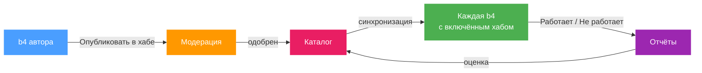

# Хаб сообщества

Хаб сообщества - это каталог сетов, опубликованных пользователями b4; его раздаёт `https://hub.b4core.app`. Сет попадает туда из редактора сета в виде [общего сета](../sets/sharing.md): стратегия, цели и файлы payload, без всего, что привязано к роутеру. Модератор одобряет сет, хаб добавляет его в каталог, и каждая b4 с включённым хабом получает его при следующей синхронизации. Страница **Сообщество** показывает каталог, применяет сет одним действием и собирает отчёты о том, работает ли применённый сет. Из отчётов складывается оценка, по которой страница сортирует сеты.

- [Просмотр каталога](./browsing.md): страница Сообщество, поиск, карточка сета, оценка
- [Применение сета](./applying.md): что меняет применение, обновления, проверка, параметр Дискавери
- [Отчёты и жалобы](./feedback.md): отметки «работает» и «не работает», формула оценки, жалобы модераторам
- [Публикация сета](./publishing.md): раздел «Поделиться», модерация, версии, авторский ключ

## Каталог

Хаб публикует один каталог: новейшую одобренную версию каждого сета и сводку отчётов по нему. Каталог подписан ключом хаба. Ключ `hub.b4core.app` встроен в b4; каталог с любой другой подписью отклоняется.

Роутер хранит копию каталога и обновляет её сам:

| Когда | Что происходит |
| --- | --- |
| Через 20 секунд после запуска b4 | Первая синхронизация |
| Каждый час | Плановая синхронизация |
| Через 5 минут после синхронизации, на которую не ответил ни один хаб | Повтор |
| Кнопка **Синхронизировать** на странице Сообщество или в настройках | Синхронизация сразу |
| Перед запуском Дискавери с параметром **Сначала пробовать сеты сообщества** | Синхронизация, если копия старше 10 минут |

Отчёты, которые не удалось доставить, уходят со следующей синхронизацией.

Поиск на странице Сообщество идёт по локальной копии. Введённый домен сопоставляется на роутере и в хаб не отправляется.

Каталог действителен две недели с даты сборки. Хаб пересобирает его намного раньше, поэтому срок истекает только если роутер две недели не получал ответа ни от одного хаба. Тогда страница Сообщество показывает предупреждение и продолжает показывать последний полученный каталог. Применённые сеты - обычные сеты в конфигурации и продолжают работать.

## Что покидает роутер

| Действие | Что получает хаб |
| --- | --- |
| Синхронизация | HTTPS-запрос каталога. Хаб видит публичный адрес роутера и версию b4 и отвечает сетью, в которой видит роутер: ASN, страна, название провайдера. |
| Отметка «работает» или «не работает» | Идентификатор и версия сета на хабе, отпечаток стратегии, вид отметки, домен, по которому в этот момент был отфильтрован список (если был), ASN и страна, известные роутеру о себе, движок захвата, версия b4. Подпись авторским ключом. |
| Жалоба | Идентификатор и версия сета на хабе, введённая причина. Подпись авторским ключом. |
| Публикация | [Общий сет](../sets/sharing.md). Подпись авторским ключом. |

Имена сетов, цели других сетов и устройства за роутером ни в один запрос не входят.

Хаб знает роутер по авторскому ключу, а не по учётной записи. Ключ создаётся при первом использовании и хранится в `.hub/` внутри каталога конфигурации; перенос ключа на другой роутер описан в разделе [Авторский ключ](./publishing.md#авторский-ключ).

## Включение

Переключатель и параметры подключения находятся в **Настройки, Интеграции, Хаб сообщества**.

| Поле | Значение |
| --- | --- |
| **Включить хаб сообщества** | Добавляет страницу **Сообщество** в навигацию, запускает ежечасную синхронизацию и показывает раздел **Поделиться** в редакторе сета. Общий сет, вставленный в **Импорт**, принимается и при выключенном переключателе. |
| **Зеркала хаба** | Адреса одного и того же хаба, по одному в строке; перебираются по порядку, пока один не ответит. Пустое поле означает `https://hub.b4core.app`. Зеркала, одобренные хабом, берутся из каталога и добавляются автоматически. |
| **Публичный ключ хаба** | Для собственного хаба со своим ключом. Ключ `hub.b4core.app` встроен, вводить его не нужно. С ключом в этом поле b4 доверяет только ему и к `hub.b4core.app` не обращается. |

**Состояние хаба** под полями показывает каталог и номер его сборки, дату, до которой он действителен, последнюю синхронизацию и её ошибку, адреса хаба в порядке перебора, ключ, которым проверен каталог, сеть по данным хаба и число отчётов, ждущих отправки. **Авторский ключ** рядом показывает идентификатор ключа, код восстановления и восстановление по коду.

:::tip
**Последняя ошибка** в блоке состояния называет причину неудачной синхронизации. Следующая успешная синхронизация её убирает.
:::

## Применённые сеты на странице Сеты

Сет, применённый со страницы Сообщество, - обычный сет с меткой **Сет сообщества** на карточке. Метка открывает сет на странице Сообщество. Когда стратегия отличается от опубликованной, метка меняется на **Сет сообщества, изменён**; см. [Применён и изменён](./applying.md#применён-и-изменён).
