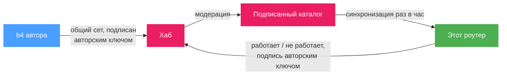

# Хаб сообщества

Сет, который работает в одной сети, часто оказывается тем самым сетом, который кто-то ещё у того же провайдера продолжает искать. Хаб сообщества - это способ обмена ими между установками b4: сет публикуется в хаб, `https://hub.b4core.app`, в виде [общего сета](../sets/sharing.md), без всего, что привязано к роутеру; модератор одобряет его, и каждая b4 с включённым хабом сообщества получает его со следующим каталогом. Со страницы **Сообщество** опубликованный сет применяется одним действием, а те, кто его использует, сообщают, работает ли он в их сети, - по этим отчётам страница и сортирует сеты.

Страницы раздела:

- [Просмотр каталога](./browsing.md) - страница Сообщество, поиск, что показывает карточка сета и как читать оценку по отчётам
- [Применение сета](./applying.md) - что применение делает с локальной конфигурацией, обновления, проверка и как Дискавери использует каталог
- [Отчёты и жалобы](./feedback.md) - отметки «работает» и «не работает», как из них складывается оценка, и жалобы модераторам
- [Публикация сета](./publishing.md) - раздел «Поделиться» в редакторе сета, модерация, версии и авторский ключ

## Как каталог попадает на роутер

Хаб публикует один каталог: новейшую одобренную версию каждого сета вместе со сводкой отчётов по нему. Каталог подписан ключом хаба, а ключ `hub.b4core.app` встроен в b4. Каталог, подписанный не доверенным ключом, отклоняется, поэтому ни зеркало, ни подменённое соединение не могут подсунуть в него сет.

b4 загружает каталог сам: через 20 секунд после старта, затем раз в час и повторно через 5 минут, если ни один хаб не ответил. Кнопка **Синхронизировать** на странице Сообщество и в настройках загружает его сразу. Копия хранится на роутере, и поиск идёт по ней: домен, введённый на странице Сообщество, сопоставляется с локальной копией и никуда не отправляется. Отчёты, которые не удалось доставить, уходят со следующей синхронизацией.

У каждого каталога есть срок действия - две недели с момента сборки. Хаб пересобирает его задолго до этой даты, так что срок истекает только когда ни один хаб не отвечал две недели. Тогда страница Сообщество показывает предупреждение и продолжает показывать последний полученный каталог; все применённые сеты продолжают работать, потому что применённый сет - это обычный сет в конфигурации, от хаба он не зависит.

## Что покидает роутер

- **При синхронизации**: обычный HTTPS-запрос каталога. Хаб видит публичный адрес роутера и версию b4 и отвечает сетью, в которой видит роутер: ASN, страну и название провайдера. Так страница Сообщество узнаёт, какие отчёты - «от вашего провайдера».
- **При отметке «работает» или «не работает»**: идентификатор и версия сета на хабе, отпечаток стратегии, вид отметки, домен, по которому был отфильтрован список в момент отметки, ASN и страна, в которых роутер считает себя находящимся, движок захвата и версия b4. Подписывается авторским ключом.
- **При жалобе**: идентификатор и версия сета на хабе и введённая причина.
- **При публикации**: [общий сет](../sets/sharing.md), который собирается по белому списку настроек. Маршрутизация, фильтры устройств, эскалация и адрес DNS-сервера не покидают роутер никогда.

Больше ничего. Имена сетов на этом роутере, домены, которые они нацеливают, и устройства за роутером не входят ни в один запрос.

:::info
Хаб знает каждый роутер по авторскому ключу, а не по учётной записи. Ключ создаётся при первом использовании и хранится в каталоге `.hub/` внутри каталога конфигурации; на [странице публикации](./publishing.md#авторский-ключ) описано, как перенести его на другой роутер.
:::

## Включение

Переключатель и параметры подключения находятся в **Настройки, Интеграции, Хаб сообщества**.

| Поле | Значение |
| --- | --- |
| **Включить хаб сообщества** | Добавляет страницу **Сообщество** в навигацию, запускает ежечасную синхронизацию и показывает раздел **Поделиться** в редакторе сета. В выключенном состоянии общий сет, вставленный в **Импорт**, по-прежнему принимается; выключено только подключение к хабу. |
| **Зеркала хаба** | Адреса одного и того же хаба, по одному в строке, перебираются по порядку, пока один не ответит. Пустое поле означает `https://hub.b4core.app`. Зеркала, одобренные самим хабом, узнаются из каталога и добавляются в список автоматически. |
| **Публичный ключ хаба** | Только для собственного хаба со своим ключом. Ключ `hub.b4core.app` встроен, и для него поле остаётся пустым. С указанным здесь ключом b4 доверяет только ему и к `hub.b4core.app` не обращается. |

Блок **Состояние хаба** под полями показывает, что хранит роутер: каталог и номер его сборки, дату, до которой он актуален, последнюю синхронизацию и её ошибку, если она не удалась, адреса хаба в порядке перебора, ключ, которым проверен каталог, сеть, о которой сообщил хаб, и число отчётов, ждущих в очереди отправки. Блок **Авторский ключ** рядом показывает идентификатор ключа и действия с кодом восстановления.

:::tip
Проблема с синхронизацией первой видна в блоке состояния. **Последняя ошибка** называет причину; следующая успешная синхронизация её убирает.
:::

## Где виден применённый сет

Сет, применённый со страницы Сообщество, - обычный сет на странице **Сеты** с меткой **Сет сообщества** на карточке. Метка открывает сет на странице Сообщество. Когда стратегия начинает отличаться от опубликованной, метка меняется на **Сет сообщества, изменён**; это описано в разделе [Применение сета](./applying.md#применён-и-изменён).
