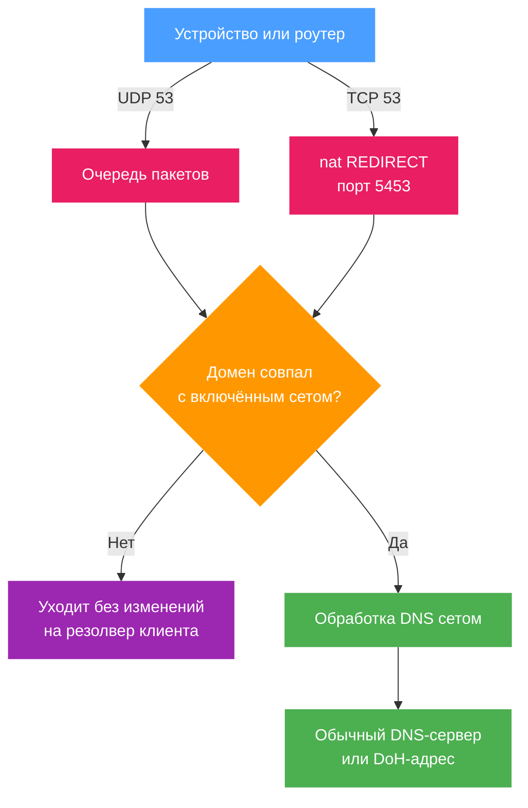

# DNS

Сет определяет, какой резолвер отвечает на домены, которые он нацеливает. Всё остальное продолжает уходить на тот резолвер, который выбрал клиент. На этой странице описано, что именно перехватывает b4, что сет делает с совпавшим запросом и какие общие настройки DNS действуют на все сеты.

## Что перехватывает b4

| Транспорт | Как попадает в b4 | Когда |
| --- | --- | --- |
| UDP порт 53 | Правила очереди в `PREROUTING` и `OUTPUT`, для запросов (`dport 53`) и для ответов (`sport 53`) | Всегда, пока b4 запущен |
| TCP порт 53 | `REDIRECT` в таблице `nat` на локальный слушатель, по умолчанию порт 5453 | Только пока хотя бы у одного включённого сета задан DNS-сервер или DoH-адрес и включён параметр **Перехватывать DNS поверх TCP** |

В обоих случаях это касается и трафика, идущего с устройств сети, и запросов, которые роутер делает для себя. Собственные запросы b4 несут метку файрвола, которая обходит эти правила, поэтому запрос, отправленный b4 за клиента, обратно в очередь не попадает.



:::warning b4 видит только незашифрованный DNS
Всё, что описано на этой странице, работает с DNS на порту 53. Если устройство само резолвит через DoH, DoT или DoQ, запрос уходит как TLS или QUIC на порт 443 или 853, и b4 его не прочитает: резолвер сета, его закрепления и его блокировки к этому имени не применяются, а маршрутизирующий сет не узнаёт из таких ответов ни одного адреса.

Обычные источники этого - браузер с включённым собственным защищённым DNS (Firefox, Chrome), Android Private DNS и резолвер, прописанный как DoH на самом устройстве. Чтобы работать с DNS через b4, выключите зашифрованный DNS на таких устройствах и оставьте им роутер.

Зашифрованный форвардер на самом роутере - это другое дело, и он не мешает. Устройства по-прежнему обращаются к роутеру на обычный порт 53, b4 перехватывает там, и до форвардера доходит только то, что b4 пропустил.
:::

## Как сет обрабатывает запрос

Имя из запроса сверяется с целями сета так же, как SNI: запись домена покрывает его поддомены, поддерживаются записи `regexp:`. Обычные записи проверяются раньше регулярных выражений, поэтому домен, указанный в одном сете, не перехватывается заглушкой `regexp:.*` из другого.

Совпавший запрос b4 проводит по шагам в таком порядке:

1. **Блокировка.** Если режим маршрутизации сета - `block`, запрос получает NXDOMAIN или отбрасывается, в зависимости от действия блокировки. См. [Блокировка](./sets/blocking.md).
2. **Закреплённые адреса.** Если для имени есть закрепление, b4 отвечает из него и на этом останавливается. Это работает независимо от того, включено ли перенаправление ниже.
3. **Резолвер.** Если перенаправление включено и резолвер задан, b4 разрешает имя сам и отвечает клиенту напрямую. Иначе запрос уходит без изменений.
4. **Ответ.** Адреса из ответа запоминаются для клиента и записываются в IP-сет сета, если включена [маршрутизация](./sets/routing.md).

### Типы резолверов

Резолвер задаётся в **Сеты → сет → DNS & Маршрутизация → Перенаправление DNS**.

| Режим | Поле в конфигурации | Что делает b4 |
| --- | --- | --- |
| Обычный DNS (UDP) | `dns.target_dns` | Сам отправляет запрос на этот IP, при необходимости фрагментируя его (**Фрагментировать DNS-запросы**), чтобы пройти DPI, который вычитывает доменные имена из запросов |
| DNS-over-HTTPS | `dns.doh_url` | Отправляет запрос зашифрованным HTTPS-запросом: сначала POST, а если сервер его не принимает - GET |

DoH-адрес имеет приоритет: если заполнены оба поля, используется DoH-адрес, а IP игнорируется. Адрес должен начинаться с `https://`, это проверяется при сохранении конфигурации.


### Отправить один сервис на отдельный резолвер

Частая причина перенаправить один сет - сервис, который отказывается работать из вашего региона. За этим стоят две разные вещи, и только одна из них про DNS.

**Имя разрешается не туда.** Какой адрес вы получите для имени, зависит от того, кто спросил: geo-DNS отдаёт ближайший к резолверу фронтенд, и резолвер из другого места получает другой ответ. Некоторые публичные резолверы идут дальше и держат собственные фронтенды для фиксированного списка сервисов: они отвечают адресом своего релея, который читает SNI и передаёт соединение дальше. И в том, и в другом случае соединение оказывается на пути, который сервис принимает, а остальной ваш DNS от такого сета не меняется.

**Сервис смотрит на адрес, с которого вы подключаетесь.** Ответ резолвера ваш собственный адрес не меняет, поэтому проверка, которая происходит уже после установки соединения (аккаунт, оплата, ключ API, привязанный к региону), от смены резолвера не зависит. Здесь нужен другой выход наружу: см. [маршрутизацию трафика](./sets/routing.md).

Для первого случая заведите сет, нацеленный только на домены этого сервиса, включите перенаправление и укажите DoH-адрес резолвера. Не добавляйте эти домены в сет-заглушку на всю сеть: смысл как раз в том, чтобы по-другому обрабатывался только этот сервис.

:::note
Резолвер, который отвечает адресами собственных релеев, видит, какие из этих имён вы запрашиваете, и дальше несёт этот трафик через себя. Это осознанное решение о доверии. Направляйте на такой резолвер только те домены, которым это нужно, а обычный просмотр оставьте резолверу, который выбрали бы сами по себе.
:::

### Закреплённые адреса

Закрепление подменяет то, что DNS выдаёт для имени, без правки hosts на каждом устройстве. Поле заполняется в порядке hosts-файла, по строке на адрес:

```text
157.240.0.174 www.instagram.com
157.240.205.63 scontent.cdninstagram.com scontent-a.cdninstagram.com
```

- Сначала адрес, затем имена, для которых им нужно отвечать.
- Закрепление действует на каждое имя и его поддомены, побеждает самая длинная подходящая запись.
- **Закрепление работает только для имени, которое сет уже нацеливает.** Закрепление имени, не покрытого целями сета, не даёт ничего: интерфейс предупреждает об этом и предлагает добавить имя в домены сета.
- Из закреплений отвечают только запросы A и AAAA, и только адресами соответствующего семейства. Запрос AAAA к имени, закреплённому за одним адресом IPv4, уходит дальше на резолвер.
- Закреплённые ответы отдаются с TTL 60 секунд.
- Закрепления читаются, даже когда **Включить перенаправление DNS** выключено, так что сет может закрепить несколько имён и оставить всё остальное резолверу клиента.

В файле конфигурации те же данные хранятся наоборот - как `dns.pins`, где имени сопоставлены его адреса.

### Когда резолвер не отвечает

Резолвер, который не ответил вовремя или вернул ошибку, даёт для этого запроса SERVFAIL. b4 не откатывается на обычный DNS и не пропускает исходный запрос дальше. Имя, которое b4 взял на себя, либо разрешается через заданный резолвер, либо не разрешается вовсе.

## Откат на IPv4

Пока в [Настройки → Основные](./settings/core#протоколы) не включена **Поддержка IPv6**, b4 обрабатывает только IPv4. Сайт с двойным стеком, на который нацелен сет, иначе открывался бы по IPv6, где у b4 нет никаких правил, и сет обходился бы стороной, при этом внешне ничего бы не сломалось.

Чтобы закрыть самый частый путь туда, b4 убирает IPv6-адреса из DNS-ответов для доменов, совпавших с сетом, оставляя клиенту IPv4-адреса, которые b4 действительно защищает. Ответ переписывается, а не отклоняется: записи A остаются, записи AAAA убираются, и клиент сам откатывается на IPv4.

- Это касается только имён, совпавших с сетом. Все остальные имена получают полный ответ, а IPv6 в сети никак не затрагивается.
- Как только поддержка IPv6 включена, переписывание прекращается само: обходить становится нечего.
- Сет, чьи цели закреплены за IPv6 через `targets.ip_version` со значением `6`, сохраняет свои IPv6-ответы: ради IPv6 такой сет и существует.
- Переписанные ответы видны как `dns-ipv6-stripped` в [результате](#как-посмотреть-результат).

Переключатель называется **Форсировать IPv4 для совпавших доменов** и находится в **Настройки → Основные → DNS**, по умолчанию он включён. Выключить его - то же самое, что поставить `system.dns.keep_ipv6_answers` в `true`: записи AAAA будут проходить как есть. При включённой поддержке IPv6 переключатель неактивен, потому что откатываться становится не с чего.

:::warning Достаёт только до того DNS, который b4 видит
Здесь то же ограничение, что и во всём остальном на этой странице. Клиент, который резолвит через собственный DoH, DoT или DoQ, ответа b4 не показывает, поэтому сохраняет IPv6-адреса и всё равно доходит до сайта по IPv6. То же касается адреса, который уже лежит в кеше клиента или прописан в hosts. Откат сужает щель, но не закрывает её: полное решение - включить поддержку IPv6, чтобы у b4 были правила в обоих семействах.
:::

## Общие настройки DNS

В **Настройки → Основные → DNS** собрано то, что действует на все сеты: транспорт DNS поверх TCP и таймауты.


### Зачем здесь DNS поверх TCP

Обычно DNS ходит по UDP. Резолвер, у которого ответ не влезает в UDP-пакет, помечает его усечённым, и клиент повторяет запрос по TCP - так бывает с длинными списками адресов, записями DNSSEC и передачей зон. Некоторые stub-резолверы предпочитают TCP сразу, а клиент, который хочет обойти то, что следит за UDP, может уйти в TCP намеренно.

Это обычные DNS-запросы, и без перехвата они доходят до резолвера, выбранного клиентом, то есть резолвер сета, его закрепления и его блокировки для них не работают. Параметр **Перехватывать DNS поверх TCP** закрывает этот путь: TCP-порт 53 заворачивается в b4, и дальше применяется та же обработка сетом, что и для UDP.

| Параметр | Поле в конфигурации | По умолчанию | Значение |
| --- | --- | --- | --- |
| Перехватывать DNS поверх TCP | `system.dns.tcp_disabled` | включено (`false`) | Если выключить, клиент, откатившийся на TCP, доходит до апстрим-резолвера, а DNS-сервер сета не используется |
| Порт слушателя | `system.dns.tcp_port` | `5453` | На этом локальном порту b4 слушает DNS поверх TCP, а правило файрвола отправляет туда соединения, идущие на порт 53. Снаружи роутера этот порт не используется, клиенты как обращались к порту 53, так и обращаются. Меняйте, только если 5453 уже занят другой программой |
| Таймаут запроса | `system.dns.query_timeout_sec` | `5` | Сколько ждать резолвер сета, прежде чем ответить SERVFAIL. Одинаково для UDP и TCP |
| Таймаут простоя | `system.dns.tcp_idle_sec` | `30` | Сколько держать открытым простаивающее TCP-соединение в ожидании следующих запросов |
| Таймаут чтения/записи | `system.dns.tcp_io_sec` | `10` | Предельное время на один запрос или ответ в установленном соединении |
| Таймаут пересылки | `system.dns.tcp_dial_sec` | `5` | Сколько ждать при пересылке несовпавшего TCP-запроса на резолвер, выбранный клиентом |
| Форсировать IPv4 для совпавших доменов | `system.dns.keep_ipv6_answers` | включено (`false`) | Переключатель и поле инвертированы: включённый переключатель означает, что `keep_ipv6_answers` равно `false` и IPv6-адреса вырезаются из ответов для совпавших доменов. Выключенный оставляет записи AAAA на месте. См. [Откат на IPv4](#откат-на-ipv4) |

В файле конфигурации хранятся только значения, отличающиеся от умолчаний, поэтому блок `system.dns` обычно отсутствует, пока ничего из этого не менялось.

:::note
Перехват TCP требует `REDIRECT` в таблице `nat`. Там, где ядро его не предоставляет, b4 пишет предупреждение, и DNS поверх TCP для этого семейства адресов остаётся на резолвере клиента. На перехват UDP это не влияет.
:::

## Отправить весь DNS в DoH

Сет, который нацелен на все домены, превращает перенаправление внутри сета в перенаправление для всей сети. Импортируйте его через **Сеты → Импорт/Экспорт**:

```json
{
  "b4_version": "dev",
  "name": "all DOH",
  "tcp": { "dport_filter": "53" },
  "udp": { "dport_filter": "53" },
  "fragmentation": { "strategy": "none" },
  "faking": { "sni": false },
  "targets": { "sni_domains": ["regexp:.*"] },
  "enabled": true,
  "dns": {
    "enabled": true,
    "doh_url": "https://wikimedia-dns.org/dns-query"
  }
}
```

`regexp:.*` совпадает с любым именем, поэтому каждый запрос, который не забрал другой сет, разрешается через DoH - для всех устройств сети и для самого роутера. Стратегии обхода здесь выключены: этот сет существует, чтобы отвечать на DNS, а не чтобы менять трафик.

Домены, перечисленные в другом сете явно, продолжают уходить на резолвер того сета, потому что обычные записи проверяются раньше регулярных выражений. Ставьте сет-заглушку последним, чтобы было видно, какие сеты имеют перед ним приоритет.

:::info Про два поля `dport_filter`
Они действительно ограничивают сет: с `udp.dport_filter` в значении `53` сет не применяется к QUIC на порту 443, а все порты, перечисленные в любом сете, дополнительно попадают в то, что b4 забирает в очередь.

Чего они не делают - так это не включают обработку DNS. Порт 53 разбирается раньше, чем читается любой фильтр портов, поэтому перенаправление работает и с двумя пустыми полями. Оставить их здесь всё же разумно: так сет с `regexp:.*` не забирает себе заодно все TLS-соединения. Единственная плата - `tcp.dport_filter` со значением `53` заводит TCP-порт 53 в очередь ради стратегий обхода, которыми этот сет не пользуется.
:::

### Что при этом меняется

- **Локальные имена перестают разрешаться.** Имена роутера, имена в `.lan` и всё прочее, что отдаёт собственный резолвер роутера, попадает на публичный резолвер, который про них не знает. Закрепите нужные имена или нацельте заглушку на более узкое выражение.
- **Один резолвер становится единственной точкой отказа.** Разрешение имён работает по принципу fail-closed, поэтому, пока DoH-сервер недоступен, имена не разрешаются по всей сети. Доступность резолвера с вашего подключения здесь важнее списка его возможностей.
- **DNS поверх TCP подтягивается следом.** Как только такой сет появляется, TCP-порт 53 тоже заворачивается в b4, и клиент, повторяющий запрос по TCP, получает тот же ответ, а не проскакивает мимо.

## Как посмотреть результат

Каждое решение b4 по запросу видно на странице [Трафик](./connections.md) и в [логах](./logs.md) - вместе с протоколом, сетом, доменом и клиентом.

| Результат | Значение |
| --- | --- |
| `dns-doh-><хост>` | Разрешено через DoH на этом сервере |
| `dns-forward-><ip>` | Разрешено самим b4 на этом обычном DNS-сервере |
| `dns-passthrough` | Совпало с сетом, но резолвер в сете не задан, поэтому запрос ушёл без изменений |
| `dns-pin` | Отвечено закреплённым адресом |
| `dns-heal` | В ответе заменены недоступные адреса, работой детектора блокировки IP в сете |
| `dns-sinkhole` | Отвечено NXDOMAIN блокирующим сетом |
| `dns-block` | Отброшено блокирующим сетом |
| `dns-servfail` | Резолвер сета не ответил вовремя |
| `dns-bad-target` | В поле DNS-сервера сета не корректный IP-адрес, поэтому запрос ушёл без изменений |
| `dns-ipv6-disabled` | Запрос, пришедший по IPv6, совпал с сетом при выключенной поддержке IPv6, поэтому ушёл без изменений, а не был обработан сетом |
| `dns-ipv6-stripped` | Из ответа убраны IPv6-адреса, клиенту оставлен IPv4-путь, который защищает b4. См. [Откат на IPv4](#откат-на-ipv4) |
| `dns-heal+ipv6-stripped` | С одним ответом произошло и то, и другое: недоступные адреса заменены, а IPv6-адреса убраны |

:::note
В режиме TUN запросы на порт 53 перехватываются, а ответы видны только тогда, когда b4 держит весь маршрут по умолчанию. Перенаправления и закрепления работают в любом случае, потому что эти ответы b4 формирует сам.
:::
