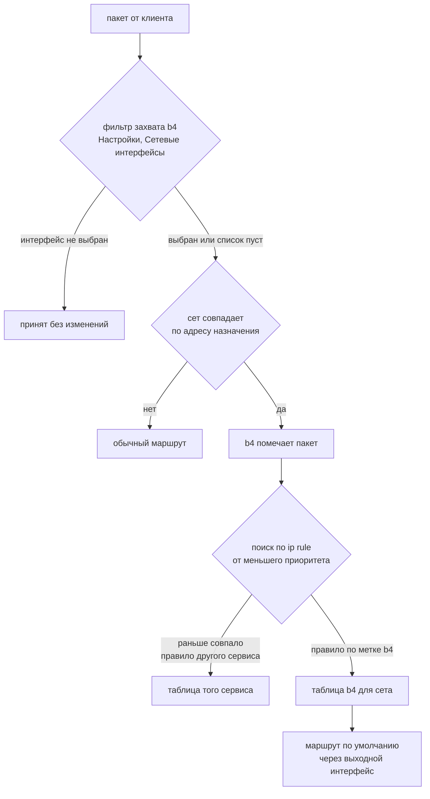

# b4 вместе с Xray или XrayUI

Xray с TUN-входом и b4 с выходным интерфейсом работают одинаково: оба ставят свой маршрут
перед обычным маршрутом ядра. Запущенные вместе, они пересекаются в трёх местах, и
веб-интерфейс b4 показывает только одно из них. Здесь описан весь путь.

То же самое относится к любому сервису, который обрывает соединения за TUN-устройством:
sing-box, клиент вида `tun2socks` или Xray, запущенный руками, а не через XrayUI.

## Что делает каждый сервис

TUN-вход Xray создаёт сетевое устройство, ниже это `xray0`, и вычитывает из него пакеты. Он
их не пересылает. Он обрывает соединение, открывает своё к тому же адресу с той же машины и
переливает байты между ними. Протокол прокси живёт на стороне outbound.

```json
{
  "protocol": "tun",
  "tag": "ibd-tun",
  "settings": { "name": "xray0", "address": ["192.168.10.1/24"] },
  "sniffing": { "enabled": true, "routeOnly": true, "destOverride": ["http", "tls", "quic"] }
}
```

Само устройство ничего не везёт. Трафик попадает в него через `ip rule` и таблицу
маршрутизации. XrayUI ставит свои, b4 в режиме выходного интерфейса ставит свои. Какие
сработают, решает приоритет правила, а не порядок настройки сервисов.

## Три слоя



1. **Фильтр захвата b4.** `Настройки > Основные > Сетевые интерфейсы` выбирает, какие пакеты
   смотрит движок. Для транзитного трафика сравнивается интерфейс, через который пакет
   уходит, а это `xray0`, как только что-нибудь направлено в туннель, поэтому список с
   аплинком исключает всё, что везёт туннель. См.
   [Какой интерфейс за что отвечает](/ru/docs/guides/interfaces).

2. **Маркировка b4.** Сет с включённой маршрутизацией помечает пакеты, чей адрес назначения
   он сопоставил. Эту часть и показывает веб-интерфейс.

3. **Таблица по `ip rule`.** Ядро идёт по правилам от меньшего номера приоритета и
   останавливается на первом, которое дало маршрут. b4 ставит своё правило с приоритетом
   `10000 + номер таблицы`. XrayUI ставит своё с приоритетом 51, и оно совпадает со всей
   локальной подсетью:

   ```
   51:    from 192.168.1.0/24 lookup 250
   10169: from all fwmark 0x4d05/0x27fff lookup 169
   ```

   51 идёт первым, в таблице 250 есть маршрут по умолчанию, поэтому каждый пакет из
   локальной сети заканчивает там. До правила b4 очередь не доходит, какую бы метку пакет ни
   нёс. Веб-интерфейс b4 об этом не сообщает, потому что собственные правила b4 верны.

:::warning
Два сервиса, которые оба занимаются policy-маршрутизацией, не складываются. Тот, у кого
номер приоритета меньше, забирает каждый пакет, подходящий под его селектор. Реальный
порядок показывает команда `ip rule` на роутере, а не веб-интерфейс любого из них.
:::

## Кто из сервисов маршрутизирует

Обе схемы ниже рабочие. Их смесь даёт сет, который помечает трафик и ничего не меняет.

### Xray везёт всё, b4 только обходит DPI

Сплошное правило XrayUI остаётся. Трафик всех клиентов идёт через туннель, а b4 занимается
обходом DPI на том, что по-прежнему уходит напрямую.

- `Настройки > Основные > Сетевые интерфейсы`: **пусто**. Указанный здесь аплинк выключает
  b4 для всей локальной сети, потому что этот трафик через аплинк больше не уходит.
- Маршрутизация в сетах b4: **выключена**. Уводить нечего, и до её правила очередь не дойдёт.
- Изменение пакетов мало что даёт на трафике, который Xray обрывает на роутере: b4 изменил
  бы внутренний пакет, а он не попадает в сеть в том виде, в каком b4 его записал.

### Что уходит в туннель, решает b4

Адреса выбирают сеты b4, и туннель везёт только их. Для этого настройка выходного интерфейса
и существует.

- Сплошное правило на стороне Xray придётся убрать. В XrayUI это отключение его прозрачной
  маршрутизации для подсети; руками - отказ от правила `from <подсеть> lookup <таблица>`.
  Оставленное на месте, оно перехватывает трафик всех клиентов раньше b4.
- `Настройки > Основные > Сетевые интерфейсы`: **пусто**.
- В сете, `Маршрутизация > Выходной интерфейс`: TUN-устройство, `xray0`.
- `Маршрутизация > Исходные интерфейсы`: **пусто**, если сет не покрывает один сегмент. Это
  сопоставление по приходу, поэтому аплинк там не совпадёт ни с чем из локальной сети.
- `Маршрутизация > Трафик самого роутера`: **Автоматически**, по причине ниже.

Xray по-прежнему нужен маршрут до собственного сервера, не уходящий обратно в туннель. Это
исключение `/32`, которое XrayUI пишет в свою таблицу, и оно должно пережить любую из схем.

## Почему трафик самого роутера остаётся снаружи

Прокси за TUN отвечает на соединение, открывая своё с той же машины. Если бы b4
маршрутизировал собственные соединения роутера в туннель, это новое соединение, адресованное
чему-то из сета, было бы помечено и отправлено обратно в туннель, который читает Xray. Xray
ответил бы на него так же. Каждый виток идёт с нового исходного порта, поэтому ядро не видит
в нём повтора, и каждый виток стоит ещё одной сессии и ещё одного сокета.

TUN-устройство b4 узнаёт по `/sys/class/net/<iface>/tun_flags` и по умолчанию оставляет
трафик самого роутера на обычном маршруте. Настройка задаётся для каждого сета в разделе
[Трафик самого роутера](/ru/docs/sets/routing#трафик-самого-роутера). Включить её
принудительно можно, и она ограничена по скорости, но на TUN, читатель которого ходит к
адресу назначения напрямую, это описанная выше петля.

:::danger
Та же петля возникает и без b4, когда собственная маршрутизация Xray отправляет часть этих
адресов в outbound `freedom` или `direct`, пока в TUN их продолжают подавать. Принудительно
направлять трафик роутера в туннель безопасно только там, где сторона Xray не отправляет ни
один адрес сета в прямой outbound.
:::

## Изменение пакетов при туннельном выходе

Сет, маршрутизированный в интерфейс TUN, TAP или WireGuard, перестаёт применять свою
стратегию обхода: ни подделок, ни фрагментации, ни рассинхронизации, а также ни проверки
SYN, ни эскалации по мёртвым IP, ни определения блокировки по IP, ни дублирования TCP. Всё
это работает над внутренним пакетом, который на роутере заворачивается или обрывается ещё до
того, как его увидит сеть. Такие соединения видны в `Соединениях` с пометкой
`routed-><iface>`.

Вкладки стратегии по-прежнему показывают свои настройки. Пока сет маршрутизируется в
туннель, они не применяются.

## Как проверить результат

Команды ниже выполняются на роутере. Каждая отвечает за свой слой.

```sh
# 3. какая таблица решает, для адреса клиента
ip rule
ip route get 1.1.1.1 from 192.168.1.100 iif br0

# 2. помечает ли b4 хоть что-то (счётчики пакетов на цепочке сета)
iptables -t mangle -L -n -v | grep b4r_        # iptables
nft list table inet b4_route                   # nftables

# 1. видит ли b4 вообще что-нибудь
#    Соединения в веб-интерфейсе: если источник в каждой строке -
#    собственный адрес роутера, остальное отсекает фильтр сетевых интерфейсов
```

Адрес, которого нет ни в одном сете, но который всё равно резолвится в туннельное
устройство, маршрутизирует другой сервис, и проверка b4 на таком адресе меряет чужую работу.

:::info
`ip route get` идёт по реальным правилам. Адрес, вернувшийся с таблицей, которую b4 не
создавал, до правила b4 не доходит.
:::
