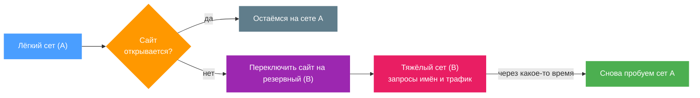
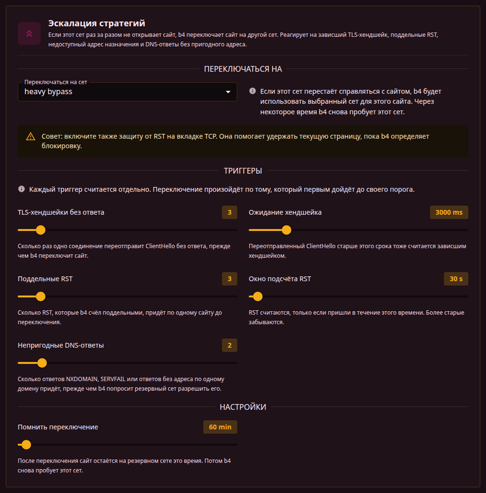

Если сет в b4 перестаёт справляться с открытием сайта, b4 переключает этот сайт на выбранный резервный сет. С этого момента через резервный сет идут и запросы имён, и соединения. Через некоторое время b4 снова пробует исходный сет - вдруг проблема уже исчезла.



## Когда это нужно

Если у вас есть "лёгкий" сет, который работает для большинства сайтов, и "тяжёлый" - помедленнее, но надёжнее, эскалация позволяет b4 использовать лёгкий по умолчанию и уходить на тяжёлый только для сайтов, которым он действительно нужен. Без эскалации сайты, которые попали под блокировку, продолжают не открываться, пока вы вручную не перенесёте их.

Резервным не обязательно должен быть другой сет со стратегией обхода. Это может быть сет, который [ходит через прокси или через интерфейс](./routing), или сет с [закреплённым адресом либо другим DNS-сервером](../dns) для этого сайта. Так эскалация становится способом сказать "сначала пробуем дешёвое, дорогое - только там, где без него никак".

## Как настроить

Откройте вкладку **Эскалация** в сете. В поле **Переключаться на** выберите резервный сет. Остальные параметры можно оставить со значениями по умолчанию.

Сеты можно объединять в цепочку: A -> B -> C. b4 идёт по цепочке по мере того, как каждый сет перестаёт справляться с конкретным сайтом, максимум восемь шагов.



## Что вызывает переключение

Признаков того, что сет не справляется с сайтом, четыре. Считаются они по отдельности, и переключение произойдёт по тому, который первым дойдёт до своего порога.

| Триггер | Что увидел b4 |
| --- | --- |
| **TLS-хендшейки без ответа** | Одно и то же соединение переотправляло ClientHello и так и не получило ответа. Классический случай "стратегия не обманула фильтр". |
| **Поддельные RST** | Пришли RST, которые b4 счёл вставленными по пути, а не отправленными сервером. |
| **Адрес назначения не отвечает** | Попытки соединения остались без ответа, и на пробу с самого роутера адрес тоже не ответил. Это случай адреса, который просто отбрасывают, и никакая стратегия обхода тут не поможет. |
| **Непригодные DNS-ответы** | На запросы имени приходили NXDOMAIN, SERVFAIL или ответы вообще без адреса. |

Именно DNS-триггер делает доступным сайт, у которого нет пригодного адреса, через резервный сет с закреплённым адресом. Пока имя не разрешится, ничего другого не происходит, поэтому для такого сайта это единственный триггер, который может сработать.

:::info Запрос, вызвавший переключение, тоже получает ответ
У остальных трёх триггеров эскалация помогает **следующему** запросу - то соединение, которое только что упало, уже потеряно. DNS-триггер устроен иначе: запрос имени, вызвавший переключение, сразу передаётся резервному сету, поэтому на него приходит ответ, а не отказ.
:::

## Параметры

- **TLS-хендшейки без ответа** - сколько раз одно соединение переотправит ClientHello без ответа, прежде чем b4 переключит сайт.
- **Ожидание хендшейка** - переотправленный ClientHello старше этого срока тоже считается зависшим хендшейком.
- **Поддельные RST** - сколько RST, которые b4 счёл поддельными, придёт по одному сайту до переключения.
- **Окно подсчёта RST** - RST считаются, только если пришли в течение этого времени. Более старые забываются.
- **Непригодные DNS-ответы** - сколько ответов NXDOMAIN, SERVFAIL или ответов без адреса по одному домену придёт, прежде чем b4 попросит резервный сет разрешить его.
- **Помнить переключение** - сколько времени сайт остаётся на резервном сете, прежде чем b4 снова пробует исходный.

Запросы IPv4 и IPv6 считаются отдельно, а пустой AAAA-ответ сбоем не считается вовсе: сайт без IPv6-адреса так отвечает штатно. Сайт, который разрешается по IPv6, но не по IPv4, всё равно переключится по своим IPv4-запросам - именно это и нужно браузеру, чтобы до него достучаться. Типы запросов, кроме A и AAAA, не учитываются совсем.

:::info Учёт по сайту
Переключение запоминается отдельно для каждого сайта (по hostname). Проблема с одним сайтом не затрагивает другие сайты, которые могут располагаться на том же сервере.
:::

:::tip Используйте вместе с RST Injection Protection
Включите **RST Injection Protection** во вкладке [TCP](./tcp/) исходного сета. Это поможет сохранить активные соединения, пока b4 распознаёт блокировку.
:::

## Что даёт резервный сет

После переключения сайт целиком переходит под управление резервного сета:

- **Запросы имён** идут через его закреплённые адреса, DoH-сервер или адрес пересылки. Закрепление на резервном сете вступает в силу только после переключения, поэтому работающий запрос никуда не перенаправляется.
- **Соединения** идут по его стратегии обхода, включая настройки, которые применяются к самому первому пакету.
- **Маршрутизация** применяется, если резервный сет ходит через прокси или через интерфейс. Известные b4 адреса сайта попадают в маршрутизацию этого сета, и трафик уходит так, как задано в нём.

Если резервный сет сужен до конкретных устройств, он используется только для них. Остальные устройства продолжают работать через исходный сет.

## Где смотреть результат

Панель **Активные переключения** на Дашборде показывает сайты, которые сейчас идут через резервные сеты, с именем резервного сета и временем до повторной попытки. Кнопка **Сброс статистики** очищает все переключения вручную.

Каждое переключение попадает в лог вместе с причиной, например:

```text
escalation: ntc.party is not getting through with ntc.party (no usable DNS answer), switching it to ntc.party backup
```

## Чего эта функция не делает

- Она только реагирует на сайты, которые уже упали. Заранее сайты она не проверяет, поэтому первый сбой остаётся сбоем.
- Выключение резервного сета не удаляет ссылку на него. Ссылка сохраняется и просто простаивает, пока сет снова не включат.
- Она не заменяет [Discovery](../discovery). Discovery заранее подбирает рабочую стратегию для сайта; эскалация - страховка постфактум.
