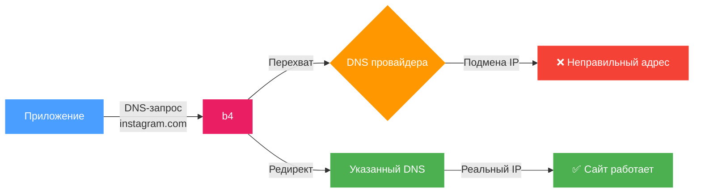
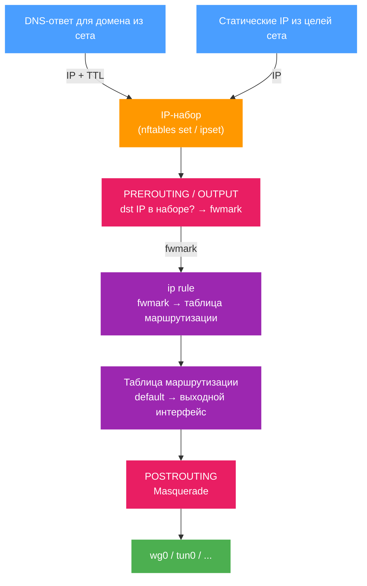

# Маршрутизация

Вкладка маршрутизации управляет тем, как обрабатываются DNS-запросы и куда направляется трафик, совпавший с целями сета. Содержит два раздела: **DNS-редирект** и **Маршрутизация трафика**.

## DNS-редирект

Перенаправляет DNS-запросы для доменов из сета на указанный DNS-сервер.

Некоторые провайдеры перехватывают DNS-ответы и подменяют IP-адреса (DNS poisoning). В результате подключение идёт на неправильный адрес, даже если домен не заблокирован напрямую. DNS-редирект отправляет запрос на альтернативный сервер, минуя перехват.

:::info
Здесь описан обычный DNS-сервер. Про зашифрованный DNS (DoH), закреплённые адреса, DNS поверх TCP и общие настройки DNS смотрите страницу [DNS](../dns.md).
:::



### Настройка

1. Включите **DNS-редирект**
2. Выберите DNS-сервер из списка или введите IP вручную

:::tip
Если не знаете, какой DNS выбрать - начните с любого из списка, кроме Google DNS (8.8.8.8). Google DNS блокируется некоторыми провайдерами в первую очередь.
:::

### Список серверов

При выборе сервера его IP автоматически подставляется в поле. Можно ввести любой другой IP вручную.

:::warning
Если поле DNS-сервера пустое, редирект не будет работать, даже если он включён.
:::

### Фрагментация DNS-запроса

Переключатель **Фрагментировать запрос** разбивает DNS-пакет на несколько частей перед отправкой.

Используется, если провайдер анализирует содержимое DNS-пакетов даже к сторонним серверам и блокирует запросы по содержимому.

:::info
Фрагментация затрагивает только DNS-запросы доменов из текущего сета. Остальной DNS-трафик не изменяется.
:::

---

## Маршрутизация трафика

Направляет трафик, совпавший с целями сета, через указанный сетевой интерфейс - например, VPN, WireGuard или другой туннель.

Маршрутизация всегда уводит трафик по **адресу назначения**: каждое правило, которое создаёт b4, сопоставляет адреса,
собранные сетом из целей по IP и из адресов, в которые resolve-ятся его домены. Исходные устройства и исходные
интерфейсы сужают, *чей* трафик попадёт в это правило, но сами по себе трафик не выбирают. Поэтому сет с включённой
маршрутизацией и без доменов и IP-адресов не уводит ничего: b4 не создаёт для него правило и пишет об этом в лог.

Чтобы отправить весь трафик устройства, оставьте устройство выбранным в разделе
[Исходные устройства](./targets.md#исходные-устройства) и включите **Match any IP address** на вкладке Цели, IP обхода.

**Режим маршрутизации** определяет, что происходит с совпавшим трафиком:

| Режим | Описание |
| --- | --- |
| Выходной интерфейс | Отправляет совпавший трафик через сетевой интерфейс. Описан ниже. |
| Вышестоящий прокси SOCKS5 | Передаёт совпавший трафик прокси SOCKS5. См. [Вышестоящий прокси SOCKS5](#вышестоящий-прокси-socks5). |
| Блокировка | Отбрасывает или отклоняет совпавший трафик. См. [Блокировка](./blocking.md). |

### Общая схема



### Как это работает (подробно)

Маршрутизация использует policy-based routing - маршрутизацию на основе меток пакетов:

1. **Сбор IP-адресов.** Когда b4 видит DNS-ответ для домена из сета, он извлекает из него IP-адреса и добавляет их во внутренний IP-набор (nftables set или ipset). IP-адреса, указанные вручную в [целях сета](./targets.md), добавляются при загрузке конфигурации.

2. **Маркировка пакетов.** b4 создаёт цепочки в firewall для каждого сета:
   - **PREROUTING** (mangle) - маркирует транзитный трафик (от устройств в сети), если IP назначения есть в наборе. Если указаны исходные интерфейсы - маркирует только трафик с этих интерфейсов.
   - **OUTPUT** (mangle) - заново маркирует пакеты, которые b4 создаёт сам: они локальные и иначе ушли бы через обычный аплинк роутера. Он же маркирует остальной трафик, созданный роутером, если [Трафик самого роутера](#трафик-самого-роутера) не запрещает это.

3. **Policy routing.** Для маркированных пакетов создаётся правило `ip rule`: пакеты с определённым `fwmark` направляются в отдельную таблицу маршрутизации, где default route указывает на выходной интерфейс.

4. **Masquerade.** В цепочке **POSTROUTING** (nat) ко всему маркированному трафику, выходящему через целевой интерфейс, применяется masquerade - исходный IP пакета заменяется на IP выходного интерфейса. Это необходимо, чтобы ответные пакеты возвращались через тот же туннель.

5. **Предварительное разрешение.** При включении маршрутизации b4 сразу резолвит все домены из целей сета и добавляет полученные IP в набор. Это обеспечивает маршрутизацию с первого запроса, не дожидаясь DNS-трафика через NFQUEUE.

### Настройка

1. Включите **Маршрутизацию**
2. Выберите **Исходные интерфейсы** - с каких интерфейсов перехватывать трафик
3. Выберите **Выходной интерфейс** - куда направить трафик


После включения в верхней части раздела отображается диаграмма потока:

```text
[Исходные интерфейсы] → B4 → [Выходной интерфейс] → Интернет
```

Диаграмма обновляется при изменении настроек.

### Исходные интерфейсы

Определяют, с каких сетевых интерфейсов перехватывать трафик для маршрутизации. Отображаются как кнопки-бейджи - клик включает/выключает интерфейс.

:::info
Если ни один исходный интерфейс не выбран - маршрутизация применяется ко всему приходящему трафику и, в зависимости от
настройки [Трафик самого роутера](#трафик-самого-роутера), к трафику, который роутер создаёт сам.
Если выбран исходный интерфейс или исходное устройство, сет ограничивается трафиком, пришедшим оттуда, а собственный
трафик роутера остаётся на обычном маршруте: он не приходит ни с какого интерфейса и ни от какого устройства.
:::

Если ранее выбранный интерфейс исчез из системы (например, VPN-подключение разорвалось), он отображается красным с пометкой «stale».

### Выходной интерфейс

Сетевой интерфейс, через который будет отправлен маркированный трафик:

| Интерфейс | Описание |
| --- | --- |
| `wg0`, `wg1` | WireGuard-туннель |
| `tun0`, `tun1` | OpenVPN-туннель |
| `ppp0` | PPP-соединение |

:::warning
Если выбранный выходной интерфейс перестал быть доступен, появится предупреждение. Маршрутизация не будет работать, пока интерфейс не появится снова.
Что происходит с трафиком сета в это время - см. [Аварийное отключение](#аварийное-отключение).
:::

:::info
Если выходной интерфейс - туннель (TUN/TAP или WireGuard), b4 отключает для трафика этого сета изменение пакетов
(подделки, фрагментацию, рассинхронизацию), так же как в режиме прокси. Изменялся бы внутренний пакет, который на роутере
заворачивается или обрывается ещё до того, как его увидит сеть, - пользы никакой, а процессор тратится на каждом
соединении. Соединение по-прежнему видно в журнале соединений с пометкой `routed-><iface>`. Сет, маршрутизированный в
обычный интерфейс (например, во второй аплинк), свою стратегию обхода сохраняет.
:::

### Трафик самого роутера

Идут ли через выходной интерфейс соединения, которые роутер открывает сам - обновление пакетов, проверка доступности,
DNS-резолвер, другая программа на этой же коробке, - когда они адресованы чему-то из сета. Транзитный трафик из сети эта
настройка не затрагивает.

| Значение | Что происходит |
| --- | --- |
| Автоматически (по умолчанию) | Трафик роутера маршрутизируется, кроме случая, когда выходной интерфейс - устройство TUN/TAP, которое читает программа в пользовательском пространстве. Там он остаётся на обычном маршруте. |
| Тоже маршрутизировать | Маршрутизируется всегда. |
| Не трогать | Не маршрутизируется никогда. |

Исключение существует из-за петли. Прокси с TUN-входом - Xray, sing-box, клиент вида `tun2socks` - пакет не пересылает: он
обрывает соединение и открывает **своё** к адресу назначения, с этого же роутера. Это новое соединение адресовано тому же
адресу из сета, поэтому b4 помечает его и отправляет обратно в тот самый TUN, который прокси и читает. Прокси отвечает на
него точно так же, и так далее. Каждый виток идёт с нового исходного порта, поэтому ядро не распознаёт в нём повтор, и
каждый виток стоит прокси ещё одной сессии и ещё одного сокета. На практике память на коробке кончается за минуты.

Такой интерфейс b4 узнаёт по `/sys/class/net/<iface>/tun_flags` - этот файл ядро создаёт для каждого устройства,
открытого через `/dev/net/tun`. WireGuard, PPP, VLAN и физические интерфейсы это не затрагивает: они не могут открыть
соединение заново, поэтому на **Автоматически** трафик роутера продолжает следовать за сетом.

Выбрать **Тоже маршрутизировать** для TUN-интерфейса можно - TUN, читатель которого никогда не ходит к адресу назначения
напрямую, безвреден, - но b4 запишет предупреждение и поставит перед маркировкой ограничение скорости, так что начавшаяся
петля упрётся в 200 новых соединений роутера в секунду и не разгонится.

:::tip
Сет, у которого уже выбран исходный интерфейс или исходное устройство, трафик самого роутера не маршрутизирует никогда,
что бы здесь ни стояло, - поэтому настройка показана неактивной.
:::

:::warning
Если вы маршрутизируете сет в TUN прокси, а прокси настроен ходить к части этих адресов **напрямую** (outbound
`freedom`/`direct`, правило обхода, собственный DNS), - это ровно та самая петля. Оставьте **Автоматически**.
:::

### Аварийное отключение

По умолчанию выключено. Когда выходной интерфейс пропадает - туннель оборвался, VPN-клиент перезапустился, - ядро убирает
маршрут по умолчанию, который b4 положил в таблицу сета. Правило по метке находит пустую таблицу, поиск проваливается в
основную таблицу, и трафик сета тихо уходит через обычный аплинк с настоящим адресом роутера. В правилах при этом ничто не
выглядит неправильным - потому это легко и не заметить.

Со включённым аварийным отключением b4 держит в таблице сета маршрут `blackhole default` с худшей метрикой, чем настоящий.
Пока интерфейс поднят, выигрывает настоящий маршрут и ничего не меняется. Когда интерфейс пропадает, остаётся только
blackhole, и трафик сета отбрасывается, а не утекает. Затронут только трафик этого сета; всё остальное продолжает
пользоваться основной таблицей как обычно.

Настоящий маршрут b4 возвращает сразу, как только интерфейс появляется снова, поэтому после переподключения аварийное
отключение не нужно выключать и включать заново.

### Egress IP

Необязательный параметр. Подменяет адрес источника у трафика этого сета на выходе, вместо того чтобы оставлять собственный адрес выходного интерфейса. В терминах firewall это замена правила `MASQUERADE` на `SNAT --to-source` для этого сета.

Смысл в том, чтобы передать решение о маршруте устройству, которым b4 не управляет. Если туннели подняты на вышестоящем роутере, этот роутер уже умеет выбирать путь по адресу источника, и b4 достаточно проставить нужный источник. На хосте самого b4 не нужны ни интерфейс туннеля, ни отдельная таблица маршрутизации, а в отличие от вышестоящего SOCKS5-прокси подмена выполняется в ядре и не тратит CPU на каждый пакет.

Egress IP требует выходного интерфейса: правило привязывается к нему, чтобы при переключении на второй WAN пакеты не ушли в другой аплинк с адресом источника от первого.

Чтобы это заработало целиком:

- b4 сам добавляет адрес на выходной интерфейс и убирает его, когда сет перестаёт им пользоваться, так что вручную ничего добавлять не нужно и сохранять между перезагрузками тоже. Если интерфейс потерял адрес, например при обновлении аренды DHCP или подъёме линка, b4 это замечает и возвращает адрес на место. Прежде чем занять адрес, b4 отправляет ARP-пробу; если на него отвечает другой хост сегмента или адрес не удаётся добавить, b4 пишет предупреждение и возвращается к masquerade, вместо того чтобы сломать этот хост или отправлять трафик, на который никто не ответит. Адрес, настроенный вами вручную, используется как есть, и b4 удаляет только те адреса, которые добавил сам.
- Вышестоящее устройство должно маршрутизировать этот источник в нужный путь, например `ip rule add from 192.168.1.51 lookup 100` в Linux или правило `mangle` с `src-address` и `action=mark-routing` в RouterOS.
- Вышестоящее устройство не должно отбрасывать пакеты на проверке обратного пути. Роутер со строгим `rp_filter` и без маршрута обратно к машине с b4 для этого адреса отбросит их до того, как дойдёт до правил политики. Это самая частая причина, по которой внешне верная настройка не пропускает трафик.

Семейство адресов должно совпадать. IPv4-адрес подменяет только IPv4. Что при этом произойдёт с IPv6-трафиком сета, зависит от **Поддержки IPv6** в [Настройки → Основные](../settings/core#протоколы):

- **Поддержка IPv6 включена.** IPv6-трафик сета по-прежнему уводится на выходной интерфейс, работает через masquerade и уходит с собственным IPv6-адресом интерфейса. У сета один egress IP, поэтому IPv6-адрес на его месте переносит подмену на IPv6, а IPv4 возвращается к masquerade.
- **Поддержка IPv6 выключена.** У сета вообще нет IPv6-правил. Его IPv6-трафик не маркируется, не уводится и не проходит masquerade: он идёт обычным маршрутом роутера, а для назначения с двойным стеком это значит, что сет обходится стороной, а не маршрутизируется с неверным адресом источника.

:::warning
Egress IP, на который никто не отвечает, ломает трафик молча: пакеты уходят, ответы не возвращаются, а правила сета при этом выглядят корректно. Прежде чем искать проблему в сете, проверьте, что адрес есть на интерфейсе.
:::

:::note
Недоступно в режиме движка TUN с захватом всего маршрута по умолчанию. Там b4 переотправляет пакеты по пути, который обходит это правило, и настройка не действует.
:::

### IP TTL (время жизни записи)

Определяет, сколько секунд IP-адрес, полученный из DNS-ответа, хранится в IP-наборе маршрутизации. По истечении TTL запись удаляется автоматически.

Значение по умолчанию: **3600** секунд (1 час).

IP-адреса, добавленные вручную в целях сета, также получают этот TTL и обновляются при каждой синхронизации конфигурации.

:::tip
Для стабильных сервисов с постоянными IP можно увеличить TTL. Для CDN-сервисов, где IP меняются часто, лучше уменьшить.
:::

### Firewall backend

b4 автоматически определяет доступный backend:

| Backend | Требования | Описание |
| --- | --- | --- |
| **nftables** | бинарник `nft` | Создаёт таблицу `b4_route` с цепочками `prerouting`, `output`, `postrouting`. IP-наборы с поддержкой `interval` и `timeout`. |
| **iptables + ipset** | бинарники `iptables`, `ipset` | Использует таблицы `mangle` и `nat`. Создаёт ipset типа `hash:net` для хранения IP. Также проверяет `iptables-legacy`. |

:::info
Выбор backend происходит автоматически. На системах с nftables используется nftables, на старых системах - iptables. Ручная настройка не требуется.
:::

### FWMark и таблица маршрутизации

Каждому выходному интерфейсу автоматически назначаются:

- **fwmark** - метка пакета (диапазон `0x100`–`0x7EFF`)
- **routing table** - номер таблицы маршрутизации (диапазон `100`–`249`)

Значения вычисляются на основе имени интерфейса и остаются стабильными между перезагрузками. Если несколько сетов используют один и тот же выходной интерфейс - они разделяют `fwmark` и таблицу.

Прежде чем занять таблицу, b4 проверяет, нет ли в ней маршрутов, которые положил не он: в том же диапазоне лежат таблицы,
которые Asuswrt-Merlin отдаёт своим VPN-клиентам, а свою таблицу b4 при уборке очищает целиком. Если таблица занята, b4
берёт следующего кандидата и пишет в журнал, какой именно.

:::info
Ручное указание `fwmark` и `table` доступно через конфигурационный файл. В этом случае автоматическое назначение не используется.
:::

### Очистка

При отключении маршрутизации или удалении сета b4 полностью удаляет все созданные правила:

- Удаляет `ip rule` и записи в таблице маршрутизации
- Удаляет jump-правила из базовых цепочек
- Очищает и удаляет созданные цепочки и IP-наборы

При полной остановке b4 выполняется очистка обоих backend (nftables и iptables) для удаления возможных остаточных правил.

---

## Вышестоящий прокси SOCKS5

Вместо отправки совпавшего трафика через интерфейс b4 может передать его прокси SOCKS5. Установите **Режим маршрутизации** в *Вышестоящий прокси SOCKS5*.

Так b4 включается в цепочку с Xray, sing-box или подобным клиентом - работающим как на самом роутере, так и на другом хосте в сети. Режим полезен и там, где блокировка построена по принципу белого списка и прямые соединения к адресам вне списка отбрасываются.


### Как это работает

1. **Сбор IP.** Источники те же, что и в режиме интерфейса: DNS-ответы, которые видит b4, статические IP из целей сета и предварительное разрешение доменов сета. Кроме того, имя, совпавшее с сетом по суффиксу домена, разрешается целиком, поэтому все его адреса попадают в набор сразу, а не узнаются по одному соединению за раз.

2. **Прозрачный слушатель.** b4 открывает слушателя на порту, вычисленном из сета, и помечает сокет прозрачным, чтобы принимать соединения, адресованные другому узлу.

3. **Перехват.** Правила TPROXY в **PREROUTING** направляют TCP с адресом назначения из набора на этот слушатель вместе с `ip rule` и локальным маршрутом, чтобы пакет доставлялся локально, а не пересылался дальше.

4. **Ретрансляция.** Для каждого принятого соединения b4 открывает SOCKS5 CONNECT к вышестоящему прокси и передаёт байты в обе стороны.

:::info
В режиме прокси манипуляции с пакетами (подделка, фрагментация, десинхронизация) для совпавшего трафика отключены. За доставку до назначения отвечает вышестоящий прокси.
:::

### Требования

Прозрачный перехват требует модулей ядра, которых нет в установке OpenWrt по умолчанию:

```sh
opkg install kmod-nft-tproxy kmod-nft-socket
```

На сборках с `apk`:

```sh
apk add kmod-nft-tproxy kmod-nft-socket
```

В системе с iptables соответствующие модули - `kmod-ipt-tproxy` и `kmod-ipt-socket`.

:::tip
**Настройки -> Диагностика** показывает, доступен ли TPROXY, и называет недостающие модули вместе с пакетами, которые их содержат.
:::

### Настройки

| Настройка | Описание |
| --- | --- |
| Хост вышестоящего SOCKS5 | Имя хоста или IP прокси. Укажите `127.0.0.1`, если он работает на том же роутере, или адрес другого хоста в сети. |
| Порт вышестоящего SOCKS5 | Порт, который слушает прокси. |
| Имя пользователя / Пароль | Заполняются только если прокси требует аутентификацию. |
| Передавать имя домена вышестоящему прокси | Передаёт домен вместо адреса, когда b4 его знает, чтобы прокси разрешил имя сам и выбрал подходящий по географии адрес. |
| Направлять UDP через вышестоящий прокси | Туннелирует совпавший UDP через прокси по UDP ASSOCIATE. См. [QUIC и HTTP/3](#quic-и-http3) ниже. |
| Откат на прямое соединение при отказе прокси | Открывает обычное прямое соединение к исходному адресу, когда прокси недоступен, вместо отказа. Оставьте выключенным, если прямое соединение хуже, чем никакого. |

### QUIC и HTTP/3

Большинство прокси SOCKS5 передают только TCP. Xray и sing-box требуют явно включить UDP на входящем подключении.

При выключенной опции **Направлять UDP через вышестоящий прокси** b4 отклоняет совпавший UDP на порту 443 через ICMP port-unreachable. Браузеры читают это как сигнал откатиться на TCP, который прокси передаёт. Без этого любой сайт, объявляющий HTTP/3 заголовком `alt-svc`, открывался бы по QUIC напрямую, минуя прокси, а браузер запоминает такой выбор на весь срок жизни, указанный в заголовке.

Этот отказ пишется отдельно для каждого семейства адресов. IPv6-половина появляется, только когда включена **Поддержка IPv6** в [Настройки → Основные](../settings/core#протоколы). При выключенной поддержке создаётся только IPv4-правило, поэтому совпавшее с сетом назначение, отвечающее ещё и по IPv6, по-прежнему доступно там по QUIC, и такое соединение через прокси не идёт.

При включённой опции совпавший UDP уходит к прокси через UDP ASSOCIATE. Включайте её, только если вышестоящий прокси это умеет. Если не умеет, совпавший UDP отбрасывается, а b4 пишет предупреждение с именем сета и адресом прокси.

### Как проверить работу

Не судите по тому, отрисовалась ли веб-страница. Страница обычно подтягивает ресурсы с других имён и других адресов, поэтому страница, у которой основной документ маршрутизируется, а ресурсы нет, может выглядеть сломанной, хотя маршрутизация работает верно.

Запросите одну конечную точку:

```sh
curl -s https://ipinfo.io/ip
```

Затем посмотрите в журнале соединений нужную запись. Трафик, прошедший через прокси, помечен `[proxy]`:

```text
TCP 192.168.1.37:20854 → 34.117.59.81:443 sni-set=ipinfo.io [proxy]
```

Если строки `[proxy]` нет, соединение не было перехвачено. Обычная причина - адрес, к которому оно шло, отсутствует в наборе.

### Когда не отвечает сам upstream

Строка `[proxy]` говорит лишь о том, что соединение дошло до b4, но не о том, что прокси ответил. Если upstream отклоняет соединения или молча их отбрасывает, каждое перехваченное соединение принимается, удерживается всё время ожидания подключения и закрывается - из браузера это выглядит как зависший и так и не открывшийся сайт.

b4 сообщает об этом в журнале:

```text
tproxy: set "TMDB" cannot reach its upstream 10.8.0.1:1080 (1 consecutive failures),
traffic matched by this set is not getting through: dial upstream: dial tcp 10.8.0.1:1080: i/o timeout
```

Пока upstream недоступен, сообщение повторяется не чаще раза в минуту, а когда он снова отвечает - в журнал попадает парная запись. То же состояние есть в **Настройки → Диагностика** в разделе `upstreams`, поэтому по диагностическому отчёту видно, был ли прокси доступен на момент его снятия:

```json
{
  "set_name": "TMDB",
  "upstream": "10.8.0.1:1080",
  "reachable": false,
  "consecutive_failures": 12,
  "last_error": "dial upstream: dial tcp 10.8.0.1:1080: i/o timeout"
}
```

:::warning
Учтите, что это касается **каждого** адреса в сете и всех TCP-портов - включая адреса, выученные с общего CDN, на который разрешаются и посторонние сайты. Поэтому недоступный upstream способен сломать сайты, ради которых сет не создавался.
:::

:::warning
Если клиент разрешает имена через DNS-over-HTTPS или DNS-over-TLS, b4 не видит его DNS-запросов, и набор наполняется только предварительным разрешением и доменами из TLS-рукопожатий. Отключите шифрованный DNS на клиенте либо добавьте домены в сет, чтобы они разрешались заранее.
:::
