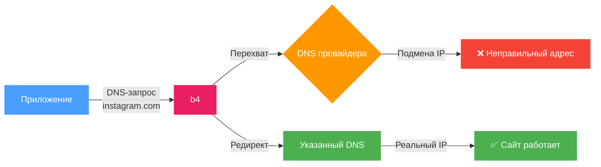
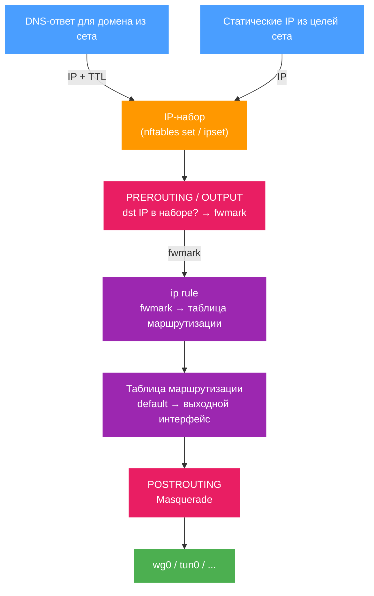
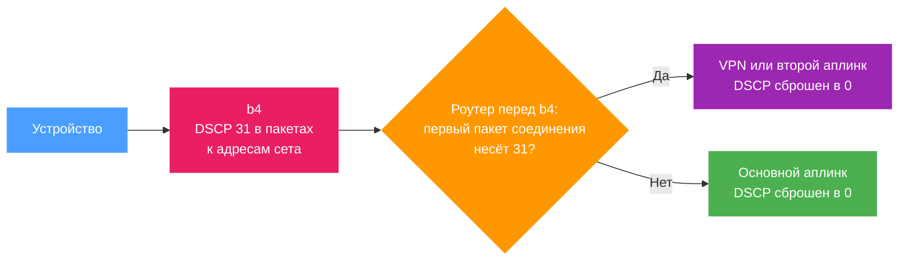

# Маршрутизация

Вкладка маршрутизации управляет тем, как обрабатываются DNS-запросы и куда направляется трафик, совпавший с целями сета. Содержит два раздела: **DNS-редирект** и **Маршрутизация трафика**.

## DNS-редирект

Перенаправляет DNS-запросы для доменов из сета на указанный DNS-сервер.

Некоторые провайдеры перехватывают DNS-ответы и подменяют IP-адреса (DNS poisoning). В результате подключение идёт на неправильный адрес, даже если домен не заблокирован напрямую. DNS-редирект отправляет запрос на альтернативный сервер, минуя перехват.

:::info
Здесь описан обычный DNS-сервер. Про зашифрованный DNS (DoH), закреплённые адреса, DNS поверх TCP и общие настройки DNS смотрите страницу [DNS](../dns.md).
:::


```mermaid
flowchart LR
    A["Приложение"] -->|"DNS-запрос<br/>instagram.com"| B["b4"]
    B -->|"Перехват"| C{"DNS провайдера"}
    C -->|"Подмена IP"| X["❌ Неправильный адрес"]
    B -->|"Редирект"| D["Указанный DNS"]
    D -->|"Реальный IP"| E["✅ Сайт работает"]

    style A fill:#4a9eff,color:#fff,stroke:none
    style B fill:#e91e63,color:#fff,stroke:none
    style C fill:#ff9800,color:#fff,stroke:none
    style X fill:#f44336,color:#fff,stroke:none
    style D fill:#4caf50,color:#fff,stroke:none
    style E fill:#4caf50,color:#fff,stroke:none
```

### Настройка

1. Включите **DNS-редирект**
2. Выберите DNS-сервер из списка или введите IP вручную

:::tip
Если не знаете, какой DNS выбрать - начните с любого из списка, кроме Google DNS (8.8.8.8). Google DNS блокируется некоторыми провайдерами в первую очередь.
:::

### Список серверов

При выборе сервера его IP автоматически подставляется в поле. Можно ввести любой другой IP вручную.

:::warning
Если поле DNS-сервера пустое, редирект не будет работать, даже если он включён.
:::

### Фрагментация DNS-запроса

Переключатель **Фрагментировать запрос** разбивает DNS-пакет на несколько частей перед отправкой.

Используется, если провайдер анализирует содержимое DNS-пакетов даже к сторонним серверам и блокирует запросы по содержимому.

:::info
Фрагментация затрагивает только DNS-запросы доменов из текущего сета. Остальной DNS-трафик не изменяется.
:::

---

## Маршрутизация трафика

Направляет трафик, совпавший с целями сета, через указанный сетевой интерфейс - например, VPN, WireGuard или другой туннель.

Маршрутизация всегда уводит трафик по **адресу назначения**: каждое правило, которое создаёт b4, сопоставляет адреса,
собранные сетом из целей по IP и из адресов, в которые resolve-ятся его домены. Исходные устройства и исходные
интерфейсы сужают, *чей* трафик попадёт в это правило, но сами по себе трафик не выбирают. Поэтому сет с включённой
маршрутизацией и без доменов и IP-адресов не уводит ничего: b4 не создаёт для него правило и пишет об этом в лог.

Чтобы отправить весь трафик устройства, оставьте устройство выбранным в разделе
[Исходные устройства](./targets.md#исходные-устройства) и включите **Match any IP address** на вкладке Цели, IP обхода.

**Режим маршрутизации** определяет, что происходит с совпавшим трафиком:

| Режим | Описание |
| --- | --- |
| Выходной интерфейс | Отправляет совпавший трафик через сетевой интерфейс. Описан ниже. |
| Вышестоящий прокси SOCKS5 | Передаёт совпавший трафик прокси SOCKS5. См. [Вышестоящий прокси SOCKS5](#вышестоящий-прокси-socks5). |
| Telegram через WebSocket (встроенный) | Перехватывает совпавший трафик Telegram и ретранслирует его через WebSocket-узел Telegram. Переключатель в разделе Настройки, Telegram делает то же для всей сети без сета. См. [Telegram через WebSocket](../telegram/websocket-bridge.md). |
| Блокировка | Отбрасывает или отклоняет совпавший трафик. См. [Блокировка](./blocking.md). |

### Общая схема


```mermaid
flowchart TB
    DNS["DNS-ответ для домена из сета"] -->|"IP + TTL"| IPSET
    STATIC["Статические IP из целей сета"] -->|"IP"| IPSET
    IPSET["IP-набор<br/>(nftables set / ipset)"]

    IPSET --> MARK["PREROUTING / OUTPUT<br/>dst IP в наборе? → fwmark"]

    MARK -->|"fwmark"| RULE["ip rule<br/>fwmark → таблица маршрутизации"]
    RULE --> ROUTE["Таблица маршрутизации<br/>default → выходной интерфейс"]
    ROUTE --> MASQ["POSTROUTING<br/>Masquerade"]
    MASQ --> IFACE["wg0 / tun0 / ..."]

    style DNS fill:#4a9eff,color:#fff,stroke:none
    style STATIC fill:#4a9eff,color:#fff,stroke:none
    style IPSET fill:#ff9800,color:#fff,stroke:none
    style MARK fill:#e91e63,color:#fff,stroke:none
    style MASQ fill:#e91e63,color:#fff,stroke:none
    style RULE fill:#9c27b0,color:#fff,stroke:none
    style ROUTE fill:#9c27b0,color:#fff,stroke:none
    style IFACE fill:#4caf50,color:#fff,stroke:none
```

### Как это работает (подробно)

Маршрутизация использует policy-based routing - маршрутизацию на основе меток пакетов:

1. **Сбор IP-адресов.** Когда b4 видит DNS-ответ для домена из сета, он извлекает из него IP-адреса и добавляет их во внутренний IP-набор (nftables set или ipset). Пересланный или закреплённый ответ, который приносит адреса, не записанные b4 в сет в последнее время, передаётся клиенту после того, как b4 закончил обновление сета для этих адресов, поэтому следующее за ним соединение обычно идёт маршрутом сета. Каждый раз, когда b4 видит ответ, он ждёт не дольше 250 мс; если обновление занимает больше времени, например пока b4 заново применяет правила маршрутизации, ответ уходит по истечении срока, и первое соединение может пойти мимо сета. Ответ, который b4 сам получает через DNS-перенаправление сета, уходит после записи адресов, без этого ограничения. Ответы, пришедшие, пока обновление сета ждёт своей очереди, попадают в него же, поэтому пачка ответов обходится несколькими обновлениями, а не отдельным обновлением на каждый, а ответ, адреса которого записаны недавно, обычно не задерживается. При движке TUN ответ не задерживается, и первое соединение к новому адресу может уйти раньше, чем адрес окажется в наборе. IP-адреса, указанные вручную в [целях сета](./targets.md), добавляются при загрузке конфигурации.

2. **Маркировка пакетов.** b4 создаёт цепочки в firewall для каждого сета:
   - **PREROUTING** (mangle) - маркирует транзитный трафик (от устройств в сети), если IP назначения есть в наборе. Если указаны исходные интерфейсы - маркирует только трафик с этих интерфейсов.
   - **OUTPUT** (mangle) - заново маркирует пакеты, которые b4 создаёт сам: они локальные и иначе ушли бы через обычный аплинк роутера. Он же маркирует остальной трафик, созданный роутером, если [Трафик самого роутера](#трафик-самого-роутера) не запрещает это.

3. **Policy routing.** Для маркированных пакетов создаётся правило `ip rule`: пакеты с определённым `fwmark` направляются в отдельную таблицу маршрутизации, где default route указывает на выходной интерфейс.

4. **Masquerade.** В цепочке **POSTROUTING** (nat) ко всему маркированному трафику, выходящему через целевой интерфейс, применяется masquerade - исходный IP пакета заменяется на IP выходного интерфейса. Это необходимо, чтобы ответные пакеты возвращались через тот же туннель.

5. **Предварительное разрешение.** При включении маршрутизации b4 сразу резолвит все домены из целей сета и добавляет полученные IP в набор. Это обеспечивает маршрутизацию с первого запроса, не дожидаясь DNS-трафика через NFQUEUE. Имена разрешаются через собственный резолвер сета, если в его DNS-перенаправлении он задан; см. [Запросы, которые b4 делает сам](../dns.md#запросы-которые-b4-делает-сам).

### Настройка

1. Включите **Маршрутизацию**
2. Выберите **Исходные интерфейсы** - с каких интерфейсов перехватывать трафик
3. Выберите **Выходной интерфейс** - куда направить трафик


После включения в верхней части раздела отображается диаграмма потока:

```text
[Исходные интерфейсы] → B4 → [Выходной интерфейс] → Интернет
```

Диаграмма обновляется при изменении настроек.

### Исходные интерфейсы

Определяют, с каких сетевых интерфейсов перехватывать трафик для маршрутизации. Отображаются как кнопки-бейджи - клик включает/выключает интерфейс.

:::info
Это входящий фильтр, и это не та же настройка, что **Интерфейсы захвата** в разделе
**Настройки, Основные, Движок пакетов**, которая решает, что разбирает движок, и сравнивает
интерфейс, через который пакет уходит. Рядом все три разобраны в разделе
[Какой интерфейс за что отвечает](/ru/docs/guides/interfaces).
:::

:::info
Если ни один исходный интерфейс не выбран - маршрутизация применяется ко всему приходящему трафику и, в зависимости от
настройки [Трафик самого роутера](#трафик-самого-роутера), к трафику, который роутер создаёт сам.
Если выбран исходный интерфейс или исходное устройство, сет ограничивается трафиком, пришедшим оттуда, а собственный
трафик роутера остаётся на обычном маршруте: он не приходит ни с какого интерфейса и ни от какого устройства.
:::

Если ранее выбранный интерфейс исчез из системы (например, VPN-подключение разорвалось), он отображается красным с пометкой «stale».

### Выходной интерфейс

Сетевой интерфейс, через который будет отправлен маркированный трафик:

| Интерфейс | Описание |
| --- | --- |
| `wg0`, `wg1` | WireGuard-туннель |
| `tun0`, `tun1` | OpenVPN-туннель |
| `ppp0` | PPP-соединение |

:::warning
Если выбранный выходной интерфейс перестал быть доступен, появится предупреждение. Маршрутизация не будет работать, пока интерфейс не появится снова.
Что происходит с трафиком сета в это время - см. [Аварийное отключение](#аварийное-отключение).
:::

:::info
Если выходной интерфейс - поднятый туннель (TUN/TAP или WireGuard), b4 не трогает пакеты этого сета, так же как в режиме
прокси: ни подделок, ни фрагментации, ни рассинхронизации, а также ни проверки SYN, ни эскалации по мёртвым IP, ни
определения блокировки по IP, ни дублирования TCP. Изменялся бы внутренний пакет, который на роутере заворачивается или
обрывается ещё до того, как его увидит сеть, - пользы никакой, а процессор тратится на каждом соединении. Соединение
по-прежнему видно в журнале соединений с пометкой `routed-><iface>`. Стратегию обхода сохраняют три случая: сет,
маршрутизированный в обычный интерфейс (например, во второй аплинк); сет, у которого выходной интерфейс есть, но он не
поднят, то есть везти трафик всё равно некому; и сет «только по домену» без IP-целей, который тоже ничего не
маршрутизирует. Сет, ограниченный исходным интерфейсом или устройством, отдаёт пакеты так же, как любой другой: движок
сопоставляет только адрес назначения и не может отличить клиента в области действия сета от клиента, которого правила
маршрутизации не касаются.
:::

### Трафик самого роутера

Идут ли через выходной интерфейс соединения, которые роутер открывает сам - обновление пакетов, проверка доступности,
DNS-резолвер, другая программа на этой же коробке, - когда они адресованы чему-то из сета. Транзитный трафик из сети эта
настройка не затрагивает.

| Значение | Что происходит |
| --- | --- |
| Автоматически (по умолчанию) | Трафик роутера маршрутизируется, кроме случая, когда выходной интерфейс - устройство TUN/TAP, которое читает программа в пользовательском пространстве. Там он остаётся на обычном маршруте. |
| Тоже маршрутизировать | Маршрутизируется всегда. |
| Не трогать | Не маршрутизируется никогда. |

Исключение существует из-за петли. Прокси с TUN-входом - Xray, sing-box, клиент вида `tun2socks` - пакет не пересылает: он
обрывает соединение и открывает **своё** к адресу назначения, с этого же роутера. Это новое соединение адресовано тому же
адресу из сета, поэтому b4 помечает его и отправляет обратно в тот самый TUN, который прокси и читает. Прокси отвечает на
него точно так же, и так далее. Каждый виток идёт с нового исходного порта, поэтому ядро не распознаёт в нём повтор, и
каждый виток стоит прокси ещё одной сессии и ещё одного сокета. На практике память на коробке кончается за минуты.

Такой интерфейс b4 узнаёт по `/sys/class/net/<iface>/tun_flags` - этот файл ядро создаёт для каждого устройства,
открытого через `/dev/net/tun`. WireGuard, PPP, VLAN и физические интерфейсы это не затрагивает: они не могут открыть
соединение заново, поэтому на **Автоматически** трафик роутера продолжает следовать за сетом.

Выбрать **Тоже маршрутизировать** для TUN-интерфейса можно - TUN, читатель которого никогда не ходит к адресу назначения
напрямую, безвреден, - но b4 запишет предупреждение и поставит перед маркировкой ограничение скорости, так что начавшаяся
петля упрётся в 200 новых соединений роутера в секунду на каждый список адресов и не разгонится. Ограничение считает
только соединения к адресам, которые сет сопоставляет, - обычный трафик роутера его бюджет израсходовать не может. Оно
ставится там, где выход может открыть соединение заново: на устройстве TUN или TAP, а также на интерфейсе, который b4 ещё
не может определить, потому что на момент построения правил его нет. Обычный интерфейс и туннель WireGuard его не
получают. На iptables нужен модуль `xt_hashlimit`: b4 загружает его сам и предупреждает, если в ядре его нет.

:::tip
Сет, у которого уже выбран исходный интерфейс или *включающий* список исходных устройств, трафик самого роутера не
маршрутизирует никогда, что бы здесь ни стояло, - поэтому настройка показана неактивной. Исключающий список так сет не
ограничивает, и там выбор по-прежнему действует.
:::

:::warning
Если вы маршрутизируете сет в TUN прокси, а прокси настроен ходить к части этих адресов **напрямую** (outbound
`freedom`/`direct`, правило обхода, собственный DNS), - это ровно та самая петля. Для такого случая и предназначено
значение **Автоматически**.
:::

### Аварийное отключение

По умолчанию выключено. Когда выходной интерфейс пропадает - туннель оборвался, VPN-клиент перезапустился, - ядро убирает
маршрут по умолчанию, который b4 положил в таблицу сета. Правило по метке находит пустую таблицу, поиск проваливается в
основную таблицу, и трафик сета тихо уходит через обычный аплинк с настоящим адресом роутера. В правилах при этом ничто не
выглядит неправильным - потому это легко и не заметить.

Со включённым аварийным отключением b4 держит в таблице сета маршрут `blackhole default` с худшей метрикой, чем настоящий.
Пока интерфейс поднят, выигрывает настоящий маршрут и ничего не меняется. Когда интерфейс пропадает, остаётся только
blackhole, и трафик сета отбрасывается, а не утекает. Затронут только трафик этого сета; всё остальное продолжает
пользоваться основной таблицей как обычно. Сеты с общим выходным интерфейсом обычно делят одну таблицу маршрутизации,
поэтому сету со включённым аварийным отключением выделяется собственная таблица, чтобы он не отбрасывал трафик соседей.
Это касается таблиц, которые b4 назначает сам; два сета, вручную закреплённых за одной `routing.table`, её по-прежнему
делят, и тогда отключение работает для обоих, если включено хотя бы у одного.

Настоящий маршрут b4 возвращает сразу, как только интерфейс появляется снова, поэтому после переподключения аварийное
отключение не нужно выключать и включать заново.

### Egress IP

Необязательный параметр. Подменяет адрес источника у трафика этого сета на выходе, вместо того чтобы оставлять собственный адрес выходного интерфейса. В терминах firewall это замена правила `MASQUERADE` на `SNAT --to-source` для этого сета.

Смысл в том, чтобы передать решение о маршруте устройству, которым b4 не управляет. Если туннели подняты на вышестоящем роутере, этот роутер уже умеет выбирать путь по адресу источника, и b4 достаточно проставить нужный источник. На хосте самого b4 не нужны ни интерфейс туннеля, ни отдельная таблица маршрутизации, а в отличие от вышестоящего SOCKS5-прокси подмена выполняется в ядре и не тратит CPU на каждый пакет.

Egress IP требует выходного интерфейса: правило привязывается к нему, чтобы при переключении на второй WAN пакеты не ушли в другой аплинк с адресом источника от первого.

Чтобы это заработало целиком:

- b4 сам добавляет адрес на выходной интерфейс и убирает его, когда сет перестаёт им пользоваться, так что вручную ничего добавлять не нужно и сохранять между перезагрузками тоже. Если интерфейс потерял адрес, например при обновлении аренды DHCP или подъёме линка, b4 это замечает и возвращает адрес на место. Прежде чем занять адрес, b4 отправляет ARP-пробу; если на него отвечает другой хост сегмента или адрес не удаётся добавить, b4 пишет предупреждение и возвращается к masquerade, вместо того чтобы сломать этот хост или отправлять трафик, на который никто не ответит. Адрес, настроенный вами вручную, используется как есть, и b4 удаляет только те адреса, которые добавил сам.
- Вышестоящее устройство должно маршрутизировать этот источник в нужный путь, например `ip rule add from 192.168.1.51 lookup 100` в Linux или правило `mangle` с `src-address` и `action=mark-routing` в RouterOS.
- Вышестоящее устройство не должно отбрасывать пакеты на проверке обратного пути. Роутер со строгим `rp_filter` и без маршрута обратно к машине с b4 для этого адреса отбросит их до того, как дойдёт до правил политики. Это самая частая причина, по которой внешне верная настройка не пропускает трафик.

Семейство адресов должно совпадать. IPv4-адрес подменяет только IPv4. Что при этом произойдёт с IPv6-трафиком сета, зависит от **Поддержки IPv6** в [Настройки, Основные, Движок пакетов](../settings/core#protocols):

- **Поддержка IPv6 включена.** IPv6-трафик сета по-прежнему уводится на выходной интерфейс, работает через masquerade и уходит с собственным IPv6-адресом интерфейса. У сета один egress IP, поэтому IPv6-адрес на его месте переносит подмену на IPv6, а IPv4 возвращается к masquerade.
- **Поддержка IPv6 выключена.** У сета вообще нет IPv6-правил. Его IPv6-трафик не маркируется, не уводится и не проходит masquerade: он идёт обычным маршрутом роутера, а для назначения с двойным стеком это значит, что сет обходится стороной, а не маршрутизируется с неверным адресом источника.

:::warning
Egress IP, на который никто не отвечает, ломает трафик молча: пакеты уходят, ответы не возвращаются, а правила сета при этом выглядят корректно. Прежде чем искать проблему в сете, проверьте, что адрес есть на интерфейсе.
:::

:::note
Недоступно в режиме движка TUN с захватом всего маршрута по умолчанию. Там b4 переотправляет пакеты по пути, который обходит это правило, и настройка не действует.
:::

### Шлюз

Необязательный параметр. Следующий узел, через который идёт маршрут по умолчанию сета. Он применяется к сету, который
маршрутизируется через [выходной интерфейс](#выходной-интерфейс), где b4 иначе берёт маршрут по умолчанию, уже имеющийся у
интерфейса, а если его нет - пишет простой `default dev <iface>` вообще без следующего узла. Указанный здесь шлюз заменяет
оба варианта: найденный b4 шлюз игнорируется.

b4 пишет в таблицу сета один маршрут:

```
ip route replace default via <шлюз> dev <интерфейс> [src <egress ip>] table <таблица>
```

Перед записью b4 проверяет сам шлюз: он должен лежать в подсети интерфейса или под `scope link`-маршрутом
таблицы main через этот интерфейс, и не должен быть собственным адресом роутера, адресом сети или
широковещательным адресом подсети. Шлюз, не прошедший проверку, отвергается с записью в журнале, а сет
возвращается к маршруту, который у интерфейса уже есть, вместо того чтобы оставить таблицу вовсе без
маршрута по умолчанию - пустая таблица отправит трафик сета обычным аплинком, то есть ровно тем исходом,
ради которого существует маршрутизация.

Семейство адресов должно совпадать с несомым трафиком: IPv4-шлюз обслуживает IPv4-маршрут сета,
а IPv6-маршрут возвращается к маршруту самого интерфейса, и наоборот. Неразбираемый, неопределённый,
loopback- или multicast-адрес, широковещательный адрес, а также любой адрес, уже имеющийся на роутере,
отвергаются при сохранении конфигурации.

Два сета на одном интерфейсе с одним egress IP, но разными шлюзами больше не разделяют метку и таблицу, поскольку одна
таблица не может держать два маршрута по умолчанию. См. [Метки пакетов](/ru/docs/guides/marks#какие-биты-использует-b4).

:::warning
Шлюз, на который никто не отвечает, ломает трафик молча: пакеты уходят, ответы не возвращаются, а правила сета при этом
выглядят корректно. Прежде чем искать проблему в сете, проверьте, что этот адрес интерфейс действительно может достичь.
:::

### IP TTL (время жизни записи)

Определяет, сколько секунд IP-адрес, полученный из DNS-ответа, хранится в IP-наборе маршрутизации. По истечении TTL запись удаляется автоматически.

Значение по умолчанию: **3600** секунд (1 час).

IP-адреса, указанные в целях сета, хранятся постоянно: они записываются при каждой синхронизации конфигурации и удаляются из набора ядра, когда их убирают из целей.

:::tip
Для стабильных сервисов с постоянными IP можно увеличить TTL. Для CDN-сервисов, где IP меняются часто, лучше уменьшить.
:::

### Firewall backend

| Backend | Требования | Описание |
| --- | --- | --- |
| **nftables** | бинарник `nft` | Создаёт таблицу `b4_route` с цепочками `prerouting`, `output`, `postrouting`. IP-наборы с поддержкой `interval` и `timeout`. |
| **iptables + ipset** | бинарники `iptables`, `ipset` | Использует таблицы `mangle` и `nat`. Создаёт ipset типа `hash:net` для хранения IP. Также проверяет `iptables-legacy`. |

Маршрутизация работает на backend из настройки [Движок файрвола](../settings/core.md#firewall-rules), а при **Автоопределении** - на том, который b4 выбрал для остальных своих правил. На iptables маршрутизации нужен ещё бинарник `ipset`. Без него, как и без бинарника iptables, маршрутизация переходит на nftables, если есть бинарник `nft`, даже когда проверка nftables при **Автоопределении** не прошла. Если не подходит ни один backend, b4 не ставит ни одного правила маршрутизации. В Docker-образе b4 есть все три: `nft`, `iptables` и `ipset`.

Пока ни у одного включённого сета не включена маршрутизация и выключен переключатель «Telegram через WebSocket», для маршрутизации не создаётся ничего, даже таблица `b4_route`.

### Если правила не ставятся {#install-failures}

b4 ставит правила маршрутизации при запуске, при каждом сохранении конфигурации и когда монитор файрвола не находит их на месте. Если backend отвергает основу правил, например таблицу `b4_route`, не ставится ни один сет, а в логе появляется строка:

```text
[ERROR] Routing: failed to ensure base during sync (nftables): ensure table: ..., it will be retried
```

Если не ставятся только некоторые сеты, о каждом из них пишется отдельная строка, `Routing: failed to ensure rule for set '<name>' during sync: ...`, а остальные сеты ставятся.

Дальше b4 повторяет попытку сам. Первый повтор идёт через 10 секунд после ошибки, после каждого неудачного повтора пауза удваивается: 20, 40, 80, 160 и 320 секунд; затем b4 повторяет попытку каждые 10 минут, пока она не удастся. Свои строки повторы пишут на уровне trace, и в логе они видны только при уровне логирования `trace` или `debug`. На уровне `info` от цикла остаются три строки:

| Строка | Уровень | Когда |
| --- | --- | --- |
| `Routing: failed to ensure base during sync ...` или `Routing: failed to ensure rule for set ...` | ERROR | Первая ошибка для этой конфигурации |
| `Routing: the routing sync keeps failing; b4 retries it every 10m0s ...` | WARN | Не удался шестой повтор, через 10 минут 30 секунд после первой ошибки |
| `Routing: the routing sync that failed has been retried successfully` | INFO | Повтор удался |

Сохранение конфигурации или перезапуск начинают цикл заново: снова строка ERROR и первый повтор через 10 секунд. Пока после ошибки на основе правил ждёт повтор, монитор файрвола не трогает правила маршрутизации и при каждой проверке пишет на уровне trace `Monitor: a newer routing configuration is waiting to be retried, leaving routing alone this tick`.

Если в ядре нет того, что нужно backend, например семейства `inet` у nftables или модуля `ip_set` для iptables, каждый повтор заканчивается той же ошибкой, и удаться повтор может только после смены ядра или backend.

Если не подходит ни один backend или нет команды `ip`, b4 пишет предупреждение при каждом запуске и сохранении, ничего не ставит и попыток не повторяет. Наличие этих команд b4 проверяет один раз за запуск, поэтому установленная позже утилита начинает действовать после перезапуска.

:::info Маршрутизация в информации о системе
Строка **Сеты маршрутизации** раздела **Firewall** в окне [Информация о системе](../settings/system.md#system-info) показывает, сколько сетов с включённой маршрутизацией установлено, и backend. Пока правила не ставятся, строки под ней дают ошибку или ошибку каждого не установленного сета, время начала сбоя и время следующей попытки, а также называют недостающую утилиту, обычно `ipset`, если из-за её отсутствия маршрутизация идёт через nftables.
:::

### FWMark и таблица маршрутизации

Каждому сету с выходным интерфейсом автоматически назначаются:

- **fwmark** - метка пакета: из хеша в диапазоне `0x100`-`0x7EFF`, а если все такие значения заняты, перебором начиная с `0x66`
- **routing table** - номер таблицы маршрутизации (диапазон `100`-`249`)

Значения вычисляются на основе имени интерфейса, адреса источника, шлюза и настройки аварийного отключения и остаются стабильными между перезагрузками. Сеты, у которых совпадают все четыре, разделяют `fwmark` и таблицу; сет, отличающийся хотя бы одним - например, со включённым аварийным отключением рядом с выключенным, - получает свои.

Прежде чем занять таблицу, b4 проверяет, нет ли в ней маршрутов, которые положил не он (в том же диапазоне лежат таблицы,
которые Asuswrt-Merlin отдаёт своим VPN-клиентам), и пропускает таблицы, названные в файлах `rt_tables`
(`/etc/iproute2/rt_tables` с `rt_tables.d/*.conf`, а также такие же файлы в `/opt/etc/iproute2`, `/usr/share/iproute2` и
`/usr/lib/iproute2`) или указанные в `ip rule` другого сервиса. Если таблица занята, b4 берёт следующего кандидата и пишет в журнал, какой именно.
При уборке b4 удаляет из таблицы только маршруты, которые добавил сам.

:::info
Ручное указание `fwmark` и `table` доступно через конфигурационный файл. Они применяются, если заданы оба, метка лежит внутри `0x27FFF`, не равна `0x24BAB` (метка Telegram через WebSocket, которую b4 убирает из сета), не содержит всех битов [метки очереди](/ru/docs/guides/marks#метка-очереди) и не равна её битам под `0x27FFF`; иначе b4 назначает свои.
:::

:::info
Все метки, правила `ip rule` и таблицы, которые ставит b4, и значения некоторых других сервисов на роутере перечислены на странице [Метки пакетов](/ru/docs/guides/marks).
:::

### Очистка

При отключении маршрутизации или удалении сета b4 полностью удаляет все созданные правила:

- Удаляет `ip rule` и записи в таблице маршрутизации
- Удаляет jump-правила из базовых цепочек
- Очищает и удаляет созданные цепочки и IP-наборы

При полной остановке b4 выполняется очистка обоих backend (nftables и iptables) для удаления возможных остаточных правил.

---

## Вышестоящий прокси SOCKS5

Вместо отправки совпавшего трафика через интерфейс b4 может передать его прокси SOCKS5. Установите **Режим маршрутизации** в *Вышестоящий прокси SOCKS5*.

Так b4 включается в цепочку с Xray, sing-box или подобным клиентом - работающим как на самом роутере, так и на другом хосте в сети. Режим полезен и там, где блокировка построена по принципу белого списка и прямые соединения к адресам вне списка отбрасываются.


```mermaid
flowchart LR
    A["Устройство в сети"] -->|"Соединение с совпавшим доменом"| B["b4<br/>прозрачный слушатель"]
    B -->|"SOCKS5 CONNECT"| C["Вышестоящий прокси<br/>host:port"]
    C --> D["Интернет"]

    style A fill:#4a9eff,color:#fff,stroke:none
    style B fill:#e91e63,color:#fff,stroke:none
    style C fill:#9c27b0,color:#fff,stroke:none
    style D fill:#4caf50,color:#fff,stroke:none
```

### Как это работает

1. **Сбор IP.** Источники те же, что и в режиме интерфейса: DNS-ответы, которые видит b4, статические IP из целей сета и предварительное разрешение доменов сета. Кроме того, имя, совпавшее с сетом по суффиксу домена, разрешается целиком, поэтому все его адреса попадают в набор сразу, а не узнаются по одному соединению за раз. Адрес, который b4 узнаёт из SNI в TLS ClientHello, а не из DNS-ответа, попадает в набор только после того, как соединение с этим ClientHello уже ушло напрямую; следующие соединения к этому адресу перехватываются.

2. **Прозрачный слушатель.** b4 открывает слушателя на порту, вычисленном из сета, и помечает сокет прозрачным, чтобы принимать соединения, адресованные другому узлу.

3. **Перехват.** Правила TPROXY в **PREROUTING** направляют TCP, а при включённой опции **Маршрутизировать UDP через upstream** и UDP, с адресом назначения из набора на этот слушатель вместе с `ip rule` и локальным маршрутом, чтобы пакет доставлялся локально, а не пересылался дальше. Адреса самого роутера, широковещательные и групповые адреса не перехватываются никогда, поэтому сет, совпадающий с любым адресом, оставляет привязанному к нему устройству доступ к DNS, DHCP и веб-интерфейсу роутера.

4. **Ретрансляция.** Для каждого принятого соединения b4 открывает SOCKS5 CONNECT к вышестоящему прокси и передаёт байты в обе стороны.

:::info
В режиме прокси манипуляции с пакетами (подделка, фрагментация, десинхронизация) для совпавшего трафика отключены. За доставку до назначения отвечает вышестоящий прокси.
:::

### Требования

Прозрачный перехват требует модулей ядра, которых нет в установке OpenWrt по умолчанию:

```sh
opkg install kmod-nft-tproxy kmod-nft-socket
```

На сборках с `apk`:

```sh
apk add kmod-nft-tproxy kmod-nft-socket
```

В системе с iptables соответствующие модули - `kmod-ipt-tproxy` и `kmod-ipt-socket`, а также `iptables-mod-tproxy` для самого расширения iptables. На Keenetic эти модули входят в прошивку в `/lib/modules` и загружаются самим сервисом; устанавливать ничего не требуется.

Правило, которое не даёт перехватывать адреса самого роутера, использует сопоставление по типу адреса: `kmod-ipt-extra` вместе с `iptables-mod-extra` в системе с iptables, `kmod-nft-fib` на nftables. Там, где это сопоставление отклоняется, сервис записывает вместо него явный список адресов роутера, обновляемый при следующей пересборке сета, и сообщает об этом в логе.

:::tip
Кнопка **Информация о системе** в разделе **Настройки, Система, Сервис** показывает в разделе **Возможности ядра**, доступен ли TPROXY, и называет пакеты с недостающими модулями.
:::

### Bridge netfilter

Когда `net.bridge.bridge-nf-call-iptables` равен `1`, ядро прогоняет правила IPv4 из PREROUTING для трафика, который входит через сетевой мост (bridge), например `br-lan` или `docker0` от Docker, прямо в коде моста и не прогоняет их повторно, когда пакет доходит до уровня IP. Правило TPROXY привязывает соединение к слушателю b4 именно в этом проходе, а уровень IP сбрасывает привязку, когда мост передаёт ему пакет. Метка маршрутизации при этом сохраняется, поэтому пакет всё равно доставляется локально, но его не принимает ни один сокет, а ответить от исходного адреса назначения ядро тоже не может. Соединения устройств за мостом висят до таймаута, и строк о соединениях для них в логе b4 нет. Соединения, которые открывает сам роутер, через мост не проходят и перехватываются как обычно. `net.bridge.bridge-nf-call-ip6tables` делает то же самое для IPv6. Кроме того, у каждого моста есть собственные атрибуты `nf_call_iptables` и `nf_call_ip6tables` в `/sys/class/net/<bridge>/bridge/`. Ядро выполняет этот проход, если `1` стоит либо в глобальной настройке, либо в атрибуте моста, поэтому `0`, записанный в атрибут, выключает проход для этого моста только при глобальной настройке, тоже равной `0`.

На OpenWrt обе настройки включает при загрузке пакет `dockerd` через файл `/etc/sysctl.d/12-br-netfilter-ip.conf`. Выключаются они без перезагрузки командами:

```sh
sysctl -w net.bridge.bridge-nf-call-iptables=0
sysctl -w net.bridge.bridge-nf-call-ip6tables=0
```

Чтобы значение пережило перезагрузку (кроме двух конфигураций Docker, описанных ниже), те же строки добавляются в `/etc/sysctl.conf`, который применяется после файлов из `/etc/sysctl.d`:

```sh
printf 'net.bridge.bridge-nf-call-iptables=0\nnet.bridge.bridge-nf-call-ip6tables=0\n' >> /etc/sysctl.conf
```

С выключенным bridge netfilter контейнеры в сети Docker, созданной с `icc=false`, перестают быть изолированы друг от друга, а при отключённом userland proxy Docker контейнер не достаёт до портов, которые публикуют другие контейнеры той же сети. Конфигурация Docker в OpenWrt по умолчанию не использует ни то, ни другое. В обеих конфигурациях dockerd сам снова выставляет `net.bridge.bridge-nf-call-iptables` в `1` всякий раз, когда настраивает затронутую сеть, в том числе при каждом своём запуске, который на OpenWrt происходит уже после применения sysctl при загрузке, а для сети с IPv6 делает то же с `net.bridge.bridge-nf-call-ip6tables`, поэтому выключенными эти настройки там не остаются.

:::info
Пока bridge netfilter включён для моста с портами и активен сет в этом режиме или в режиме «Telegram через WebSocket» либо переключатель «Telegram через WebSocket», сервис пишет в лог предупреждение с именем моста и настройкой, которую нужно изменить. Окно **Информация о системе** в разделе **Настройки, Система, Сервис** показывает то же в строке **Bridge netfilter** раздела **Firewall**, а карточка «Telegram через WebSocket» при включённом переключателе показывает предупреждение.
:::

### Настройки

| Настройка | Описание |
| --- | --- |
| Хост вышестоящего SOCKS5 | Имя хоста или IP прокси. Укажите `127.0.0.1`, если он работает на том же роутере, или адрес другого хоста в сети. |
| Порт вышестоящего SOCKS5 | Порт, который слушает прокси. |
| Имя пользователя / Пароль | Заполняются только если прокси требует аутентификацию. |
| Передавать имя домена в upstream | Передаёт имя хоста вместо адреса, когда его удаётся связать с соединением, чтобы прокси разрешил имя сам и выбрал подходящий по географии адрес. См. [Имя назначения](#имя-назначения). |
| Маршрутизировать UDP через upstream | Туннелирует совпавший UDP через прокси по UDP ASSOCIATE. См. [QUIC и HTTP/3](#quic-и-http3) ниже. |
| Откат на прямое соединение при отказе прокси | Открывает обычное прямое соединение к исходному адресу, когда прокси недоступен, вместо отказа. Оставьте выключенным, если прямое соединение хуже, чем никакого. |

### QUIC и HTTP/3

Большинство прокси SOCKS5 передают только TCP. Xray и sing-box требуют явно включить UDP на входящем подключении.

При выключенной опции **Маршрутизировать UDP через upstream** b4 отклоняет совпавший UDP на порту 443 через ICMP port-unreachable. Браузеры читают это как сигнал откатиться на TCP, который прокси передаёт. Без этого любой сайт, объявляющий HTTP/3 заголовком `alt-svc`, открывался бы по QUIC напрямую, минуя прокси, а браузер запоминает такой выбор на весь срок жизни, указанный в заголовке.

Этот отказ пишется отдельно для каждого семейства адресов. IPv6-половина появляется, только когда включена **Поддержка IPv6** в [Настройки, Основные, Движок пакетов](../settings/core#protocols). При выключенной поддержке создаётся только IPv4-правило, поэтому совпавшее с сетом назначение, отвечающее ещё и по IPv6, по-прежнему доступно там по QUIC, и такое соединение через прокси не идёт.

При включённой опции совпавший UDP уходит к прокси через UDP ASSOCIATE. Включайте её, только если вышестоящий прокси это умеет. Если не умеет, совпавший UDP отбрасывается, а b4 пишет предупреждение с именем сета и адресом прокси.

### Имя назначения

При включённой опции **Передавать имя домена в upstream** SOCKS5 CONNECT несёт имя хоста вместо адреса назначения всякий раз, когда b4 может связать имя с соединением, и прокси разрешает это имя сам.

Если соединение начинается с TLS ClientHello или обычного HTTP-запроса, имя из него (SNI или `Host`) передаётся, только если его что-то подтверждает: DNS-ответ для этого адреса, который b4 видел за последние 30 минут, неважно для какого устройства или для самого b4 при разрешении доменов одного из сетов, или список доменов самого сета. В остальных случаях соединение идёт по адресу. VLESS Reality, ShadowTLS и fake-TLS прокси Telegram подключаются к одному адресу и предъявляют имя постороннего сайта, и передача такого имени увела бы соединение на этот посторонний сайт.

Если в соединении нет имени, которое можно прочитать, как у протоколов, где первым говорит сервер (SMTP, IMAP, FTP), имя берётся, по порядку: из DNS-ответа, по которому это устройство получило этот адрес, из имени, выученного раньше по ClientHello, совпавшему с сетом, и из имени, которое b4 сам разрешил для доменов этого сета. Имена, которые запрашивали другие устройства, и имена, которые b4 разрешил для других сетов, для такого соединения не используются.

Пока хотя бы один proxy-сет передаёт имена, b4 запоминает имя из вопроса каждого ответа A и AAAA на UDP-порту 53, который отвечает на увиденный им запрос, а также ответов, которые он сам собирает для DNS-перенаправления сета. Закреплённые ответы не запоминаются, а имя, закреплённое в DNS-настройках сета, всегда идёт по адресу, чтобы прокси не разрешил его во что-то кроме закреплённого адреса.

Чтобы прочитать ClientHello, b4 ждёт первых байтов соединения до отправки CONNECT. Клиент, который говорит первым, присылает их сразу. Соединение, в котором первым говорит сервер, ждёт 250 мс, кроме случаев, когда это устройство получило для адреса ровно одно имя или когда прочитанное имя всё равно нечем подтвердить: для адреса нет DNS-ответа, а в сете нет доменов.

Если прокси отказывает в имени, например выходной узел Tor не может его разрешить, b4 повторяет CONNECT с адресом.

Опция относится к TCP. UDP через UDP ASSOCIATE всегда передаёт адрес.

:::info
С `SafeSocks 1` Tor отклоняет соединение, полученное по адресу, и пишет в лог `Your application (using socks5 to port 443) is giving Tor only an IP address`. Соединения без имени, которое b4 может подтвердить, по-прежнему приходят по адресу, например с устройства, которое разрешает имена через DoH, DoT или «Частный DNS» Android и открывает адрес, совпавший по целям IP, CIDR или GeoIP, под именем, которого нет в сете. SOCKS-порт Tor не поддерживает UDP ASSOCIATE, поэтому сет, направленный в Tor, работает с выключенной опцией **Маршрутизировать UDP через upstream**.
:::

### Соединения через встроенный SOCKS5-прокси

Клиент собственного [SOCKS5-прокси](../settings/core.md#socks5-proxy) b4, который запрашивает имя хоста, совпадающее с сетом, передаётся в upstream сета напрямую, без правил файрвола. CONNECT к upstream несёт это имя по тем же правилам, что описаны выше: имя, закреплённое в DNS-настройках сета, идёт по закреплённому адресу, при выключенной опции **Передавать имя домена в upstream** b4 разрешает имя сам и передаёт адрес, а имя, которое upstream отклонил, повторяется с адресом. Для этих запросов используется собственный резолвер сета, если в его DNS-перенаправлении он задан, а иначе резолвер роутера; см. [Запросы, которые b4 делает сам](../dns.md#запросы-которые-b4-делает-сам). Имя `.onion` никогда не разрешается локально и никогда не уходит в прямое соединение. **Откат на прямое соединение при отказе прокси** срабатывает, когда upstream недоступен, а не когда он отклоняет назначение.

Это не зависит от того, видел ли b4 DNS-ответ для имени. Так это работает и в режиме TUN, где ответы на собственные запросы роутера до b4 не доходят, и для имён, у которых нет адреса вне upstream, например `.onion` в Tor.

Решает первый сет, совпавший с именем, как и для DNS-ответа. Передача касается сета в режиме прокси, у которого работает слушатель, который принимает собственный трафик роутера (не ограничен исходными интерфейсами или включающим списком исходных устройств) и не использует сопоставление только по домену. Запрос по адресу и имя, которое решающий сет не покрывает, открывает сам роутер, и такое соединение проходит через правила файрвола, как любое другое соединение роутера.

### Сет, который захватывает собственный upstream

Proxy-сет перенаправляет и соединения, которые сам роутер открывает к адресам из сета. Вышестоящий прокси, работающий на роутере, открывает соединение к своему серверу тоже с роутера, поэтому сет, в цели которого попадает адрес этого сервера, например `0.0.0.0/0` или широкая категория GeoIP, отдал бы прокси его же соединение, и оно ушло бы по кругу. b4 распознаёт такое соединение по процессу, которому оно принадлежит: тому, что держит слушающий сокет на порту вышестоящего прокси. Это соединение уходит прямо к назначению, а не в прокси. Хост прокси, заданный именем, для этой проверки разрешается, а `0.0.0.0` считается самим роутером.

Процессы прокси на другом устройстве в сети b4 не видит. Соединение с такого устройства уходит напрямую в двух случаях: сет нацелен на `0.0.0.0/0` или `::/0`, либо b4 в этот момент ведёт через этот прокси соединение к тому же назначению, и это собственное исходящее соединение прокси вернулось обратно. Всё остальное с этого устройства проходит через прокси как обычно. Прокси на другом устройстве, адрес сервера которого попадает в широкий GeoIP-сет, не распознаётся; сет, из исходных устройств которого это устройство исключено, его трафик не трогает.

При первом таком случае лог называет сет и процесс, а для прокси на другом устройстве - адрес этого устройства.

Собственный трафик прокси при этом всё равно проходит через b4. Метка на исходящих сокетах прокси полностью выводит его из-под перенаправления сета: цепочки прокси пропускают любой пакет, в метке которого есть бит внутри `0x27FFF`, например `sockopt.mark` со значением `255` на исходящем подключении Xray. Какие биты читает b4, см. на странице [Метки пакетов](/ru/docs/guides/marks#рядом-с-другими-сервисами).

### Как проверить работу

Не судите по тому, отрисовалась ли веб-страница. Страница обычно подтягивает ресурсы с других имён и других адресов, поэтому страница, у которой основной документ маршрутизируется, а ресурсы нет, может выглядеть сломанной, хотя маршрутизация работает верно.

Запросите одну конечную точку:

```sh
curl -s https://ipinfo.io/ip
```

Затем посмотрите в журнале соединений нужную запись. Трафик, прошедший через прокси, помечен `[proxy]`:

```text
TCP 192.168.1.37:20854 → 34.117.59.81:443 ipinfo.io sni-set=ipinfo.io [proxy]
```

Имя в строке есть независимо от того, включено ли **Передавать имя домена в upstream**. Это имя, которое b4 уже связывает с адресом, из DNS-ответа устройства (пока настройка включена) или из более раннего соединения, а если такого имени нет, то SNI или заголовок Host самого соединения. Поле `tls=` появляется, только если b4 прочитал ClientHello. У соединения, где нет ни того, ни другого, имени нет.

Если строки `[proxy]` нет, соединение не было перехвачено. Обычная причина - адрес, к которому оно шло, отсутствует в наборе.

### Когда не отвечает сам upstream

Строка `[proxy]` говорит лишь о том, что соединение дошло до b4, но не о том, что прокси ответил. Если upstream отклоняет соединения или молча их отбрасывает, каждое перехваченное соединение принимается, удерживается всё время ожидания подключения и закрывается - из браузера это выглядит как зависший и так и не открывшийся сайт.

b4 сообщает об этом в журнале:

```text
tproxy: set "TMDB" cannot reach its upstream 10.8.0.1:1080 (1 consecutive failures),
traffic matched by this set is not getting through: dial upstream: dial tcp 10.8.0.1:1080: i/o timeout
```

Пока upstream недоступен, сообщение повторяется не чаще раза в минуту, а когда он снова отвечает - в журнал попадает парная запись. То же состояние есть в разделе `upstreams` диагностики, которую копирует кнопка **Копировать JSON** в окне **Информация о системе** (**Настройки, Система, Сервис**), поэтому по диагностическому отчёту видно, был ли прокси доступен на момент его снятия:

```json
{
  "set_name": "TMDB",
  "upstream": "10.8.0.1:1080",
  "reachable": false,
  "consecutive_failures": 12,
  "last_error": "dial upstream: dial tcp 10.8.0.1:1080: i/o timeout"
}
```

:::warning
Учтите, что это касается **каждого** адреса в сете и всех TCP-портов - включая адреса, выученные с общего CDN, на который разрешаются и посторонние сайты. Поэтому недоступный upstream способен сломать сайты, ради которых сет не создавался.
:::

:::warning
Если клиент разрешает имена через DNS-over-HTTPS или DNS-over-TLS, b4 не видит его DNS-запросов, и набор наполняется только предварительным разрешением и доменами из TLS-рукопожатий. Отключите шифрованный DNS на клиенте либо добавьте домены в сет, чтобы они разрешались заранее.
:::

---

## DSCP {#dscp}

Сет может записывать собственное значение DSCP в пакеты, которые этот хост отправляет на адреса сета. DSCP - шестибитное поле заголовка IP, и, в отличие от меток b4, оно покидает хост вместе с пакетом. По нему роутер перед b4 отличает трафик сета и после обработки в b4 отправляет его собственным маршрутом, например через VPN или второй аплинк. Сам b4 по этому значению не маршрутизирует.


```mermaid
flowchart LR
    D["Устройство"] --> B["b4<br/>DSCP 31 в пакетах<br/>к адресам сета"]
    B --> R{"Роутер перед b4:<br/>первый пакет соединения<br/>несёт 31?"}
    R -->|"Да"| V["VPN или второй аплинк<br/>DSCP сброшен в 0"]
    R -->|"Нет"| M["Основной аплинк<br/>DSCP сброшен в 0"]

    style D fill:#4a9eff,color:#fff,stroke:none
    style B fill:#e91e63,color:#fff,stroke:none
    style R fill:#ff9800,color:#fff,stroke:none
    style V fill:#9c27b0,color:#fff,stroke:none
    style M fill:#4caf50,color:#fff,stroke:none
```

Значение записывают правила [Задать DSCP](../settings/core.md#dscp) из раздела **Настройки, Основные, Файрвол**, после значения **Задать DSCP**, которое оно заменяет в пакетах к адресам сета. Записывается оно независимо от того, включено ли **Задать DSCP**. Пока **Задать DSCP** выключено, все остальные пакеты сохраняют значение, которое записал отправитель. Пакеты, которые **Задать DSCP** не трогает, сохраняют своё значение и здесь: трафик loopback, пакеты, которые b4 отправляет клиентам в LAN, и пакеты обратного направления своего соединения. Список интерфейсов **Задать DSCP** точно так же ограничивает и значения сетов, в том числе пока **Задать DSCP** выключено.

### Поля {#dscp-settings}

Блок **DSCP** завершает раздел **DNS & Маршрутизация → Маршрутизация трафика** в редакторе сета. Он виден независимо от того, включено ли **Включить маршрутизацию**.

| Поле | Поле в конфигурации | Описание | По умолчанию |
| --- | --- | --- | --- |
| **Включить DSCP для сета** | `dscp.enabled` | Записывает значение сета в пакеты, которые идут на адреса сета. При включении со значением `0` подставляется первое из `7`, `31`, `6` и `25`, которое не занято другим сетом и не совпадает со значением **Задать DSCP**; если другие сеты заняли все четыре - первое, которое не совпадает со значением **Задать DSCP** | Выкл |
| **Значение DSCP** | `dscp.value` | 0-63, видно, пока переключатель включён. `0` обнуляет поле. См. [Выбор значения](#dscp-values) | `0` |

Если значение нельзя применить, блок называет причину, и пока она остаётся, переключатель не включается. Блок также предупреждает, когда **Задать DSCP** включено с тем же значением: тогда роутеру перед b4 не по чему отличить трафик сета. В файле конфигурации блок хранится как [`dscp` сета](../advanced/config.md#set-dscp).

Значение не покидает этот роутер: [общий сет](./sharing.md#что-покидает-роутер) его никогда не несёт, сет, обновлённый из хаба, сохраняет своё, а MCP изменить его не может, см. [Изменение настроек](../settings/mcp.md#изменение-настроек).

### Какие пакеты получают значение {#dscp-addresses}

Значение выбирается только по адресу назначения. Пакет к одному из адресов сета получает его при любом протоколе и порте и независимо от того, какой сет b4 выбрал для стратегии соединения. Фильтры портов сета и **Фильтр версии TLS** его не сужают, а адрес, который CDN делит между несколькими сайтами, несёт значение для всех них.

| Адреса | Откуда берутся | Срок жизни |
| --- | --- | --- |
| Статические | Цели сета: IP и CIDR, категории GeoIP и ASN | Пока они есть в сете |
| Узнанные из DNS | Ответы для доменов сета, которые видит b4, по UDP и TCP: пересланные устройству, ответы из закреплённых адресов и ответы через DNS-перенаправление сета | [IP TTL](#ip-ttl-время-жизни-записи) сета, пока у него включена маршрутизация, иначе 1 час |
| Узнанные из эскалации | Адреса хоста, который [эскалация](./escalation.md) передаёт сету | Как у узнанных из DNS |
| Узнанные из TLS и QUIC | Адрес назначения соединения, TLS ClientHello или QUIC Initial которого совпадает с сетом по имени | 10 минут |
| Собственные запросы b4 | Первые 256 записей списка доменов сета, кроме записей `regexp:`; категории GeoSite не запрашиваются. b4 запрашивает их, когда сет начинает записывать значение или меняются его домены или настройки резолвера, затем каждые полсрока жизни, но не чаще раза в 5 минут, через резолвер сета, если он задан в DNS-перенаправлении ([Запросы, которые b4 делает сам](../dns.md#запросы-которые-b4-делает-сам)) | Как у узнанных из DNS |

Узнанный адрес, который встретился снова, получает новый срок жизни, когда от прежнего осталось меньше половины, а если его нашёл собственный запрос b4 - сразу; более короткий срок никогда не урезает более длинный.

Адреса сужают такие настройки целей:

- **Фильтр версии IP** (`targets.ip_version`) со значением `4` или `6` исключает адреса другого семейства, и статические, и узнанные.
- **Только по домену** (`targets.domain_only`) выключает узнавание адресов: значение получают только цели IP, CIDR, GeoIP и ASN.

Если адреса нескольких сетов пересекаются, действует одно значение:

1. Адрес, узнанный для сета, важнее любого статического диапазона, и своего сета, и чужих.
2. Среди статических диапазонов побеждает самый длинный префикс: `/32` из одного сета внутри `/16` другого получает значение `/32`.
3. Если несколько сетов перечисляют один и тот же префикс или узнали один и тот же адрес, побеждает сет, который стоит выше в списке сетов.

Участвуют только сеты, значение которых применяется. Более узкая цель сета без собственного значения не выводит адрес из более широкого диапазона сета со значением.

### Первое соединение {#dscp-first-connection}

Пакет к адресу, который b4 ещё не записал для сета, уходит без значения сета. Статические цели записываются, как только применяется конфигурация, а адрес домена нужно узнать до начала соединения:

| Как b4 узнаёт адрес | Следующее соединение |
| --- | --- |
| Пересланный ответ или ответ из закреплённого адреса по UDP, движок NFQUEUE | Несёт значение с первого пакета. b4 задерживает ответ, пока адрес не записан, не дольше 250 мс, так же как для [маршрутизации](#как-это-работает-подробно) |
| Ответ через DNS-перенаправление сета и любой ответ по TCP | Несёт значение с первого пакета. Адрес записывается до отправки ответа, в пределах тех же 250 мс |
| Пересланный ответ или ответ из закреплённого адреса по UDP, движок TUN | Может начаться без значения: ответ не задерживается |
| TLS ClientHello или QUIC Initial самого соединения | Начинается без значения и получает его, когда b4 записал адрес. Следующие соединения к этому адресу несут его с первого пакета |
| Собственный запрос b4 | Несёт значение с первого пакета, если устройство получило тот же адрес. CDN может ответить устройству другим |

Если DNS устройств не проходит через b4, адреса доменов сета b4 узнаёт только из имён в TLS и QUIC и из собственных запросов. Так бывает, когда b4 работает [контейнером на MikroTik](../install/mikrotik.md), а устройства разрешают имена через RouterOS, и с устройствами, которые сами разрешают имена через DoH, DoT или DoQ (см. [Что перехватывает b4](../dns.md#что-перехватывает-b4)). Значение с первого пакета соединения там дают цели IP, CIDR, GeoIP и ASN.

### Режим маршрутизации и область действия {#dscp-modes}

| Сет | Значение записывается | Причина в диагностике |
| --- | --- | --- |
| Маршрутизация выключена | Да | - |
| **Выходной интерфейс** | Да, в пакеты сета, которые уходят через интерфейс, на который действует список интерфейсов. За туннелем, например WireGuard, роутер перед b4 видит только собственные пакеты туннеля, а в них этого значения обычно нет: WireGuard записывает в их поле DSCP 0 | - |
| **Вышестоящий прокси SOCKS5** | Нет. Трафик сета уходит собственными соединениями b4 к прокси, и файрвол не может связать их с сетом | `routing_proxy` |
| **Telegram через WebSocket (встроенный)** | Нет. Трафик сета уходит через общие WebSocket-соединения, и файрвол не может связать их с сетом | `routing_mtproto_ws` |
| **Блокировка** | Нет. Пакеты сета не покидают роутер | `routing_block` |
| Задано хотя бы одно [исходное устройство](./targets.md#исходные-устройства), включаемое или исключаемое | Нет. Этап файрвола, который записывает значение, не видит, с какого устройства пришёл пакет | `source_devices` |
| Маршрутизация ограничена списком **Исходные интерфейсы** | Нет. Этот этап не видит, через какой интерфейс пришёл пакет | `source_interfaces` |
| [Фильтрация устройств](../settings/core.md#device-filtering) включена и выбрано устройство | Нет, ни для одного сета | `device_filter` |
| Нет ни доменов, ни IP, ни GeoIP, ни ASN, или включено **Только по домену** без целей IP, GeoIP и ASN | Нет. Нет адресов, для которых записывать значение | `no_addresses` |

При включённом **Пропустить настройку IPTables/NFTables** b4 не ставит правил файрвола, и ни один сет не записывает значение.

Остальное, что отправляет хост, тоже получает значение по адресу назначения:

- соединения, которые открывает сам роутер, в том числе собственные соединения b4, и соединения, которые [SOCKS5-прокси](../settings/core.md#socks5-proxy) b4 открывает для своих клиентов напрямую. [Трафик самого роутера](#трафик-самого-роутера) на значение не влияет;
- фейки, фрагменты и сегменты, которые b4 отправляет для обхода DPI: они идут на тот же адрес, что и настоящие пакеты их соединения, и несут то же значение.

Собственный DNS-трафик сета тоже получает значение по адресу назначения: запросы b4 к резолверу сета, обычный DNS или DoH, несут значение, только если какой-нибудь сет перечисляет адрес резолвера, и тогда его несёт каждый запрос к этому резолверу, включая запросы устройств.

### Как следующий роутер читает значение {#dscp-reader}

Роутер перед b4, который маршрутизирует по значению, должен:

1. **Решать по первому пакету соединения и сохранять решение.** Роутер маркирует соединение, если значение несёт пакет, который его открывает, и маршрутизирует все следующие пакеты соединения по этой метке. Если маршрутизировать каждый пакет по его собственному полю DSCP, соединение переходит на другой маршрут, когда значение появляется или пропадает посреди него, как бывает, когда b4 узнаёт адрес из ClientHello самого соединения или срок адреса истекает. За NAT соединение, сменившее маршрут, меняет адрес источника и обрывается. Соединение, начавшееся без значения, всё время остаётся на основном маршруте, а начавшееся со значением остаётся на втором.
2. **Сравнивать поле целиком.** `ip dscp` в nftables и `dscp=` в RouterOS сравнивают все шесть бит. Для IPv4 селектор `tos` в `ip rule` сравнивает только часть из них: для него `7`, `15`, `31` и `63` неразличимы.
3. **Сбрасывать поле на выходе в интернет и на туннеле.** Без сброса провайдер или сервер на другом конце туннеля видит значение на каждом соединении сета. Правило сброса на пути пересылки не видит пакетов, которые FastTrack, flowtable в nftables или аппаратный NAT проводят мимо него.
4. **Не давать другим устройствам выбирать маршрут.** Пока **Задать DSCP** выключено, пакет, который не идёт ни на один адрес сета, сохраняет значение отправителя, и устройство, которое само записывает значение сета в свои пакеты, маршрутизируется как этот сет. Проверка, что пакет пришёл от b4, по его адресу или MAC-адресу, отсекает устройства, которые обращаются к роутеру напрямую. Устройства, трафик которых идёт через b4, она не отсекает: их трафик тоже приходит от b4. Их отсекает включённое **Задать DSCP**, которое записывает своё значение во весь этот трафик.
5. **Пропускать ответы второго маршрута.** Строгая проверка обратного пути, `rp_filter` `1` в Linux или `rp-filter=strict` в RouterOS, отбрасывает ответы, которые возвращаются через второй аплинк.

Пока b4 остановлен или перезапускается, новые соединения идут без значения и основным маршрутом.

#### Linux с nftables {#dscp-reader-nftables}

Роутер с Linux читает значение одной таблицей nftables. В примере роутер видит b4 через `br-lan`, основной аплинк - `wan`, второй маршрут - аплинк `wanb`, у b4 адреса `192.168.50.2` и `fd50::2`, значение сета - `31`. Таблица хранится в отдельном файле, например `/etc/dscp_route.nft`, и загружается командой `nft -f /etc/dscp_route.nft`; повторная загрузка файла заменяет таблицу, а не добавляет копию.

```text
table inet dscp_route
delete table inet dscp_route
table inet dscp_route {
    chain prerouting {
        type filter hook prerouting priority mangle; policy accept;
        iifname "br-lan" ip saddr 192.168.50.2 ct state new ct status & confirmed == 0 ip dscp 31 ct mark set ct mark | 0x01000000
        iifname "br-lan" ip6 saddr { fd50::2, fd10::/64 } ct state new ct status & confirmed == 0 ip6 dscp 31 ct mark set ct mark | 0x01000000
        iifname "br-lan" ct mark & 0x01000000 == 0x01000000 meta mark set meta mark | 0x01000000
    }
    chain postrouting {
        type filter hook postrouting priority mangle; policy accept;
        oifname { "wan", "wanb" } ip dscp != 0 ip dscp set 0
        oifname { "wan", "wanb" } ip6 dscp != 0 ip6 dscp set 0
    }
    chain srcnat {
        type nat hook postrouting priority srcnat; policy accept;
        oifname { "wan", "wanb" } masquerade
    }
}
```

Маркированные соединения идут по таблице маршрутизации `100`, маршрут по умолчанию в которой ведёт через `wanb`:

```sh
ip rule add fwmark 0x1000000/0x1000000 iif br-lan lookup 100 priority 1000
ip route add default via 100.64.2.1 dev wanb table 100
ip -6 rule add fwmark 0x1000000/0x1000000 iif br-lan lookup 100 priority 1000
ip -6 route add default via 2001:db8:b::1 dev wanb table 100
```

Апплет `ip` из busybox 1.37 принимает те же строки. Ни таблица, ни эти команды сами по себе перезагрузку не переживают: их место в скриптах запуска роутера.

| В примере | Что это |
| --- | --- |
| `br-lan` | Имя устройства ядра для интерфейса роутера, ведущего к b4. `iifname` и `ip rule iif` принимают имена устройств, а не имена интерфейсов OpenWrt |
| `192.168.50.2` | IPv4-адрес b4 в этом сегменте, лучше закреплённый статической арендой. Пересылаемый IPv4-трафик несёт его, только пока в b4 включено **Включить NAT Masquerade** (см. [NAT Masquerade](../settings/core.md#nat-masquerade)); без маскарада к нему добавляется подсеть за b4: `ip saddr { 192.168.50.2, <подсеть> }` |
| `fd50::2`, `fd10::/64` | Собственный IPv6-адрес b4 и IPv6-префикс устройств, трафик которых идёт через b4. Без собственного адреса b4 его собственные IPv6-соединения остаются на основном маршруте. Если IPv6 через b4 не идёт, строка не нужна |
| `31` | Значение сета. Каждому следующему значению нужна своя пара строк маркировки |
| `0x01000000` | Бит метки соединения и метки пакета, который на роутере больше ничто не использует, один и тот же в строках маркировки, строке восстановления и обеих строках `ip rule`. Следующему маршруту нужны другой бит и другая таблица |
| `wan`, `wanb` | Основной и второй аплинки |
| `100`, `1000` | Таблица второго аплинка и свободный приоритет правила: меньше `32766` у основной таблицы и раньше других правил policy routing |
| `100.64.2.1`, `2001:db8:b::1` | Шлюзы второго аплинка |
| Цепочка `srcnat` | Маскарад на обоих аплинках, который, возможно, уже делает собственный файрвол роутера |

Проверка обратного пути в ядре, `rp_filter`, действует только на IPv4. При `1`, строгой проверке, роутер отбрасывает ответы, которые приходят через `wanb`, и IPv4-соединения через него не работают; при `2`, нестрогой, или при `0` ответы проходят. Ядро берёт большее из значения `net.ipv4.conf.all.rp_filter` и собственного значения интерфейса, здесь `net.ipv4.conf.wanb.rp_filter`.

Что делают строки:

- `ct state new ct status & confirmed == 0` совпадает только с пакетом, который создаёт запись соединения. Один `ct state new` совпадает и со следующими пакетами до первого ответа, например с повторно отправленным SYN или пакетами QUIC до ответа сервера, и переводит такое соединение на `wanb` посередине: с маскарадом один пакет теряется и соединение начинается заново, с SNAT оно обрывается. nft 1.0.2 и новее показывают это условие как `ct status ! confirmed`, а nft 0.9.8 такую запись на входе не принимает.
- `ct mark set ct mark | 0x01000000` и `meta mark set meta mark | 0x01000000` меняют только свой бит. Программы, которые меняют только свои биты метки соединения, уживаются с таблицей; программа, которая перезаписывает метку соединения целиком, ломает маршрутизацию.
- Строка восстановления маркирует только пакеты, пришедшие из `br-lan`: ответы, возвращающиеся через `wanb`, идут по основной таблице обратно к b4.
- `ip dscp != 0 ip dscp set 0` обнуляет поле на обоих аплинках и сохраняет два бита ECN. Обнуляется любое значение, в том числе то, что устройства в LAN записывают для собственного трафика.

Если b4 стоит в одном Ethernet-сегменте с роутером, вместо его адресов можно проверять его MAC-адрес. Проверка тогда охватывает собственный и пересылаемый трафик b4 обоих семейств, с NAT Masquerade и без. Первые две строки `prerouting` становятся такими:

```text
iifname "br-lan" ether saddr 02:00:00:00:00:b4 ct state new ct status & confirmed == 0 ip dscp 31 ct mark set ct mark | 0x01000000
iifname "br-lan" ether saddr 02:00:00:00:00:b4 ct state new ct status & confirmed == 0 ip6 dscp 31 ct mark set ct mark | 0x01000000
```

Когда соединение берёт на себя flowtable nftables, например программный flow offloading в OpenWrt, его пакеты проходят мимо сброса в `postrouting` и уходят со значением. При включённом offloading нужны ещё два правила и таблица, которая сбрасывает поле на выходе из аплинков:

```sh
ip rule add oif wanb lookup 100 priority 1001
ip -6 rule add oif wanb lookup 100 priority 1001
```

```text
table netdev dscp_wash
delete table netdev dscp_wash
table netdev dscp_wash {
    chain egress {
        type filter hook egress devices = { "wan", "wanb" } priority 0; policy accept;
        ip dscp != 0 ip dscp set 0
        ip6 dscp != 0 ip6 dscp set 0
    }
}
```

Хуку `egress` нужен Linux 5.16 или новее; nft 1.0.2 и новее загружают таблицу, nft 0.9.8 - нет. Вместо таблицы поле сбрасывает cake с `wash` на обоих аплинках: `tc qdisc add dev wan root cake wash` и то же для `wanb`. Без правил `oif` каждый UDP-поток через `wanb` теряет одну датаграмму, когда переходит в offload. Без `iif br-lan` в правилах `fwmark` ответы IPv6, переведённые в offload, уходят обратно через `wanb`, и IPv6-соединения через него не работают.

:::note Фейки с неверной контрольной суммой
Пока `net.netfilter.nf_conntrack_checksum` стоит в значении ядра по умолчанию, `1`, роутер не связывает со своим соединением пакеты с неверной контрольной суммой TCP, в том числе фейки стратегии **TCP Check**. Такие фейки соединения на втором маршруте не получают ни метки, ни NAT и уходят через основной аплинк с собственным адресом b4. OpenWrt ставит значение `0`, и с ним они идут вместе со своим соединением.
:::

:::info
Таблицы и строки `ip` выше проверены на Linux 7.0 с nft 0.9.8, 1.0.2, 1.0.6 и 1.1.6, вне firewall4 из OpenWrt и без аппаратного flow offloading.
:::

#### RouterOS {#dscp-reader-routeros}

RouterOS читает значение правилами mangle. Раздел [Маршрутизация трафика сета по значению DSCP](../install/mikrotik.md#routing-by-dscp) приводит их с именами из схемы с контейнером.

### Выбор значения {#dscp-values}

Сначала `7` и `31`, затем `6` и `25`. Эти четыре значения сохраняют обычный приоритет в Wi-Fi, cake и pfifo_fast на Linux. `0` обнуляет поле. Остальные значения могут отправить пакеты в другую очередь:

| Значения | Куда могут попасть |
| --- | --- |
| `1` | Самый низкий приоритет |
| `2`-`5`, `27`, `29` | Другая очередь cake или pfifo_fast |
| `8`-`23` | Фоновая очередь Wi-Fi |
| `24`, `26`, `28`, `30`, `32`-`63` | Очереди видео и голоса в Wi-Fi |

В pfSense нельзя выбрать `7`, `31`, `6` и `25`: из его классов меньше всего мешают трафику AF11-AF13 (`10`, `12`, `14`). В OPNsense можно выбрать любое значение. Сетам, которые должны идти разными маршрутами, нужны разные значения.

### Правила файрвола и нагрузка {#dscp-firewall}

Правила сетов стоят после правила **Задать DSCP**, в его цепочке `B4_DSCP` при iptables или в его таблице `inet b4_dscp` при nftables, которые b4 ставит, пока включено **Задать DSCP** или включённый сет записывает собственное значение.

| Backend | Что добавляют сеты | Что нужно |
| --- | --- | --- |
| iptables | Правило, которое завершает цепочку для пакета, не идущего ни на один адрес сетов, затем по одному правилу на каждое значение и на каждый сет, который узнаёт адреса. Адреса хранятся в ipset `b4d_u_v4`, `b4d_ul_v4`, `b4d_s<value>_v4` и `b4d_l_<set>_v4` и в их парах `_v6` | Команда `ipset` и модуль ядра `xt_set`. Без них b4 пишет предупреждение в лог, и это семейство адресов получает только значение **Задать DSCP** |
| nftables | Карты `s4_<n>` и `s6_<n>`, цепочка `v<value>` для каждого значения и наборы `l_<set>_4` и `l_<set>_6` с адресами, которые узнал каждый сет | Ничего сверх **Задать DSCP** |

`<set>` получается из id сета. Команды, которые показывают эти объекты, и то, что хранит каждый из них, приведены в разделе [Как посмотреть метки на роутере](../guides/marks.md#как-посмотреть-метки-на-роутере). При включённом **Пропустить настройку IPTables/NFTables** ничего из этого не ставится.

Каждый пакет, который отправляет хост, кроме пропущенных в начале цепочки, проверяется по дополнительным наборам адресов:

- с nftables - по карте статических диапазонов и по набору узнанных адресов каждого сета, который узнаёт адреса;
- с iptables - по одному или двум ipset, `b4d_u_v4` и `b4d_ul_v4` или их паре `_v6`; пакет к адресу сета затем ещё по одному на каждое значение и на каждый сет, который узнаёт адреса.

:::info DSCP в информации о системе
Среди правил раздела **Firewall** в окне **Диагностика системы**, которое открывает кнопка [Информация о системе](../settings/system.md#system-info), есть группа `Per-set DSCP`, пока у включённого сета включено собственное значение. В ней строка на каждый такой сет, строка на каждый бинарник iptables, который не может работать с ipset, и последняя строка, которая называет backend установленных правил или сообщает, что правила не установлены:

```text
"Video" (0c5d7e4a-2b1f-4c3d-9e8f-1a2b3c4d5e6f): DSCP 31, applied, 0 static entries, learned addresses written: 412 from DNS answers, 9 from TLS/QUIC names, 37 from lookups
"Ads" (5b8e2f10-7c4a-4e9d-8a1b-3c2d4e5f6a7b): DSCP 7, refused: routing_block
installed with nftables
```

`refused` называет причину из таблицы [Режим маршрутизации и область действия](#dscp-modes). `not applied` вместо `applied` означает, что правила сета не установлены, например при iptables без команды `ipset`.
:::
