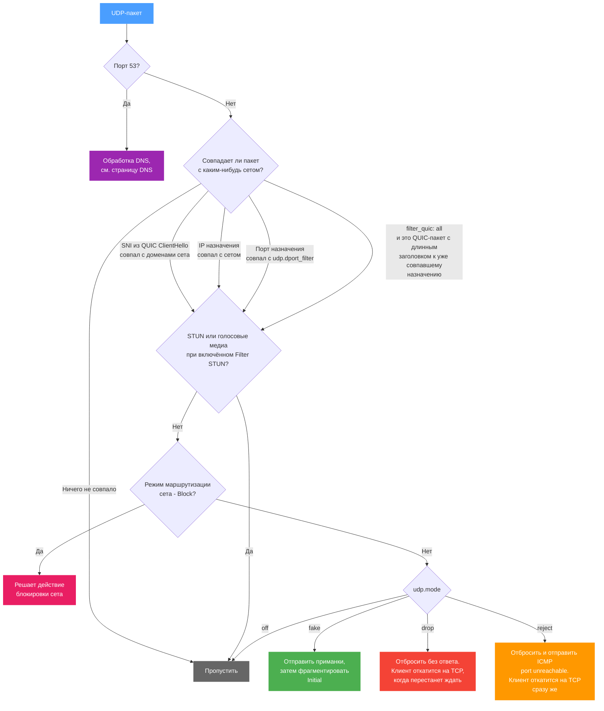

# UDP

На вкладке UDP два независимых набора настроек, и они отвечают на разные вопросы:

- **Фильтр QUIC** (`udp.filter_quic`) и **Фильтр портов** (`udp.dport_filter`) определяют, **какой** UDP совпадает с сетом.
- **Режим действия** (`udp.mode`) определяет, **что** b4 делает с совпавшим пакетом.

Чаще всего эта вкладка нужна не для обхода DPI на UDP, а для отказа в QUIC, чтобы браузер откатился на TCP, где работают TCP-стратегии сета. См. [Почему отказ в QUIC часто оказывается верным решением](#почему-отказ-в-quic-часто-оказывается-верным-решением).

## Как b4 обрабатывает UDP



Два момента на этой схеме стоит проговорить отдельно.

**ClientHello читается всегда.** Как только пакет выглядит как QUIC-пакет с длинным заголовком, b4 разбирает его в поисках SNI - независимо от значения `filter_quic`. Именно так сет с доменными целями вообще совпадает с QUIC, и именно так b4 узнаёт, какие адреса принадлежат домену: увиденный в QUIC Initial SNI запоминается вместе с IP назначения, и сет маршрутизации может подхватить этот адрес позже.

**Block идёт первым.** Если у сета в режиме [маршрутизации](./routing.md) выбран **Block**, судьбу пакета решает действие блокировки, а `udp.mode` не учитывается.

## Какой UDP совпадает с сетом

### Фильтр QUIC

QUIC - транспорт поверх UDP, который браузеры используют для HTTP/3 (YouTube, Google, Discord и другие). Шифруется он иначе, чем TCP с TLS, поэтому TCP-стратегии на него не переносятся.

| Значение | Конфиг | С чем совпадает |
| --- | --- | --- |
| **По SNI** (по умолчанию) | `sni` | SNI извлекается из QUIC ClientHello, и пакет совпадает, если этот домен есть среди целей сета |
| **По SNI или по совпавшему назначению** | `all` | Всё, что покрывает совпадение по SNI, плюс любой QUIC-пакет с длинным заголовком к назначению, которое сет уже совпадает по IP или по порту - SNI при этом не нужен |

`all` нужен там, где у сета нет доменных целей для сравнения либо назначение было выучено из предыдущего трафика, а не перечислено вручную, но QUIC к этому назначению всё равно должен обрабатываться.

:::info Старые конфигурации
Раньше `filter_quic` принимал значения `disabled` и `parse`. Оба вели себя так же, как теперь ведёт себя `sni`, поскольку разбор SNI никогда на самом деле не выключался, и оба переводятся в `sni` при загрузке конфигурации. Править вручную ничего не нужно.
:::

:::warning Совпадению по SNI нужны домены
Со значением `sni` и без доменов в разделе [Цели](./targets) сет совпадёт только с тем QUIC, который идёт на адреса или порты, совпавшие по другим признакам.
:::

### Фильтр портов

Совпадение с определёнными UDP-портами - то, что нужно для VoIP, игр и других UDP-приложений. Формат: `5000-6000,8000`. Оставьте пустым, чтобы совпадать с любым портом.

Фильтр портов ограничивает и остальную часть сета: сет с `udp.dport_filter` равным `8443` ничего не сделает с UDP на порту 443, как бы ни совпадали его домены и адреса.

### Фильтровать STUN-пакеты

Пропускать STUN и голосовые медиа-пакеты без обработки. STUN используется в WebRTC для NAT traversal в голосовых и видеозвонках.

:::info
Оставьте включённым, если пользуетесь голосовыми или видеозвонками (Discord, Telegram, WhatsApp). Вмешательство в STUN их ломает.
:::

---

## Почему отказ в QUIC часто оказывается верным решением

С QUIC у b4 гораздо меньше рычагов, чем с TCP, и это стоит понимать до того, как тратить время на настройки фейков.

- **Читается только Initial.** ClientHello едет в QUIC-пакете Initial. Всё, что идёт после него, защищено AEAD на ключах, выведенных из этого хендшейка, поэтому b4 не может переписать, разрезать или переупорядочить последующие пакеты так, чтобы обе стороны их приняли.
- **QUIC нельзя рассинхронизировать так, как TCP.** TCP-стратегии работают за счёт того, что DPI и сервер читают одни и те же байты по-разному: TTL, неверные контрольные суммы, перекрывающиеся сегменты, границы записей. Пакеты QUIC аутентифицированы, поэтому изменённый пакет отбрасывается, а не трактуется иначе. Остаются приманки и фрагментация Initial, и это слабые рычаги.
- **Цензор, который просто гасит UDP/443, ничего не отвечает.** Ни RST, ни ICMP-ошибки, поэтому у клиента нет причины перестать пробовать QUIC. Для пользователя это выглядит как видео, которое никогда не начинается, а не как страница, которая упала и повторила попытку по другому протоколу.

Отказ в QUIC на роутере даёт клиенту тот отказ, которого не дал цензор. Клиент получает ICMP port unreachable, отказывается от HTTP/3 для этого хоста и подключается по TCP, где стратегии вкладки [TCP](./tcp/) уже применимы. К тому же браузеры запоминают объявление `alt-svc` на весь указанный в нём срок, так что без отказа хост, однажды ответивший по QUIC, будет и дальше опрашиваться по QUIC.

Для видеосервисов и всего остального, где HTTP/3 используется по умолчанию, сочетание такое:

```json
"udp": { "filter_quic": "all", "mode": "reject" }
```

Переключатель **Блокировать QUIC** на этой вкладке выставляет оба значения сразу, поэтому типовой случай делается одним нажатием, а отдельные настройки остаются доступны для всего остального.

---

## Что b4 делает с совпавшим трафиком

### Лимит пакетов соединения

Сколько пакетов в начале UDP-соединения анализируется. Не может превышать глобальный лимит из [Настройки → Основные → Очередь](../settings/core#очередь-и-обработка-пакетов).

### Режим действия

| Режим | Конфиг | Что происходит |
| --- | --- | --- |
| **Выключено** | `off` | Совпавший UDP проходит без изменений. Подходит, когда сет совпадает с UDP только ради того, чтобы b4 выучил адреса из QUIC или чтобы сет маршрутизации увёл этот трафик, а с самими пакетами делать ничего не нужно |
| **Fake & Fragment** (по умолчанию) | `fake` | Перед реальным пакетом отправляются пакеты-приманки, а Initial фрагментируется |
| **Drop** | `drop` | Пакет отбрасывается без ответа. Клиент откатится на TCP, когда перестанет ждать, - обычно через несколько секунд |
| **Reject** | `reject` | Пакет отбрасывается, а клиенту уходит ICMP port unreachable или его ICMPv6-аналог, и клиент переключается на TCP, не дожидаясь таймаута |

:::tip Drop против Reject
И то и другое заканчивается на TCP. При **Drop** клиент сначала вырабатывает собственный таймаут, и пользователь видит подвисание. **Reject** отвечает сразу, поэтому переключение незаметно. Выбирайте **Reject**, если только что-то в сети не реагирует плохо на ICMP-ошибки.
:::

:::note IPv6
ICMPv6-отказ, как и всё остальное на этой странице, применяется к IPv6 только при включённой **Поддержке IPv6** в [Настройки → Основные](../settings/core#протоколы). Если она выключена, b4 вообще не видит IPv6-пакетов, и назначение, отвечающее по IPv6, продолжит работать там по QUIC. См. [Основные настройки](../settings/core#протоколы).
:::

---

## Настройки Fake & Fragment

Доступны в режиме **Fake & Fragment**.

### Стратегия фейка

Как фейковый пакет делается непригодным для сервера:

| Стратегия | Описание |
| --- | --- |
| **Нет** | Без стратегии, фейковые пакеты отправляются как есть |
| **TTL** | Низкий TTL: фейковые пакеты истекают на промежуточном узле и не доходят до сервера |
| **Checksum** | Повреждённая контрольная сумма UDP: сервер отбрасывает пакет как испорченный |

### Параметры

| Параметр | Описание | Диапазон |
| --- | --- | --- |
| Количество фейковых пакетов | Сколько фейковых пакетов отправить перед реальным | 1–20 |
| Размер фейкового пакета | Размер payload каждого фейкового UDP-пакета в байтах | 32–1500 |
| Задержка между сегментами | Задержка между фейками и реальным пакетом. Задаётся диапазоном мин–макс, для каждого соединения выбирается случайное значение | 0–1000 мс |
