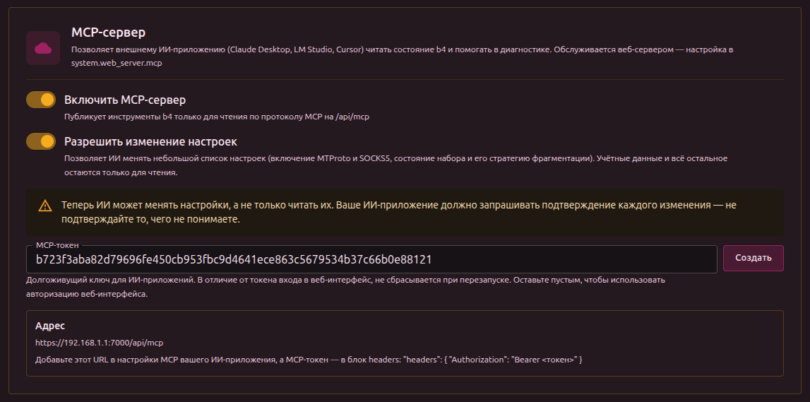

Внешнее ИИ-приложение читает состояние b4 по протоколу [Model Context Protocol](https://modelcontextprotocol.io/) и отвечает на вопросы о нём: какой сет соответствует домену, дошёл ли трафик до b4, что написано в логе. Протокол понимают Claude Desktop, LM Studio, Cursor и Jan.

Модель работает внутри этого приложения. b4 не обращается ни к какому ИИ-провайдеру и не требует API-ключа.

Настраивается в **Настройки -> Интеграции -> MCP-сервер**.

## Поля



| Поле | Описание |
| --- | --- |
| **Включить MCP-сервер** | Переключатель в заголовке карточки. Публикует точку доступа на `/api/mcp`. По умолчанию выключено. |
| **Разрешить изменение настроек** | Позволяет ИИ не только читать настройки, но и менять их. По умолчанию выключено. См. [Изменение настроек](#изменение-настроек). |
| **Токен доступа** | Ключ, который предъявляют ИИ-приложения. Кнопка **Создать** генерирует его, **Пересоздать** заменяет. |
| **Настройка клиента** | URL точки доступа и блок заголовков для вставки в ИИ-приложение. Кнопка **Копировать** кладёт в буфер весь блок целиком, с полным токеном. |

:::info Обслуживается веб-сервером
Точка доступа использует порт, TLS-сертификат и адрес привязки веб-сервера. Если веб-сервер выключен (порт 0), она недоступна, и b4 пишет предупреждение при запуске.
:::

## Токен

Кнопка **Создать** выдаёт токен из 64 символов. До сохранения конфигурации он не записывается.

Пока токен задан, только он и принимается на `/api/mcp`. Доступа больше ни к чему он не даёт: на любом другом маршруте API он отклоняется.

:::tip Лучше задать токен, чем полагаться на вход в веб-интерфейс
Если поле оставить пустым, точка доступа переходит на авторизацию веб-интерфейса. Токен входа истекает через сутки и сбрасывается при каждом перезапуске, поэтому настроенное на него ИИ-приложение однажды перестаёт подключаться без предупреждения. MCP-токен перезапуск переживает.
:::

:::danger По обычному HTTP токен виден
Токен передаётся в заголовке каждого запроса. Без HTTPS его может прочитать и повторно использовать любой на пути следования. Настройте HTTPS в разделе [Безопасность](./security) до того, как порт станет доступен за пределами доверенной сети.
:::

:::warning Пустой токен и без входа в веб-интерфейс
Если поле токена пусто, а имя пользователя и пароль в разделе [Безопасность](./security) не заданы, любой, кто дотянется до порта, прочитает статус, конфигурацию и диагностику b4.
:::

## Подключение приложения

Нужны два значения: URL точки доступа и заголовок `Authorization: Bearer <токен>`.

**VS Code** читает `.vscode/mcp.json` в рабочей папке или пользовательский `mcp.json`:

```json
{
  "inputs": [
    {
      "id": "b4-token",
      "type": "promptString",
      "description": "b4 MCP token",
      "password": true
    }
  ],
  "servers": {
    "b4-asuswrt": {
      "type": "http",
      "url": "https://192.168.1.1:7000/api/mcp",
      "headers": {
        "Authorization": "Bearer ${input:b4-token}"
      }
    }
  }
}
```

**LM Studio** использует тот же файл с другим ключом верхнего уровня и без `type`:

```json
{
  "mcpServers": {
    "b4-asuswrt": {
      "url": "https://192.168.1.1:7000/api/mcp",
      "headers": {
        "Authorization": "Bearer <токен>"
      }
    },
    "b4-local": {
      "url": "http://localhost:7000/api/mcp",
      "headers": {
        "Authorization": "Bearer <токен>"
      }
    }
  }
}
```

Каждая запись появляется в панели **Integrations** как `mcp/<имя>` с переключателем рядом. Записей может быть несколько сразу, например роутер и локальный экземпляр, и включаются они независимо.

:::tip Держите токен вне файла
Блок `inputs` в VS Code заставляет редактор спросить токен, а не хранить его. Приложения без такого механизма держат токен открытым текстом, поэтому файл не следует коммитить.
:::

Обслуживается только `POST`. `GET` и `DELETE` возвращают 405 - для этого транспорта это штатное поведение, а не ошибка.

## Инструменты

| Инструмент | Что отвечает | Пример запроса |
| --- | --- | --- |
| `b4_status` | Версия, движок захвата, бэкенд файрвола, сколько сетов есть и включено, аптайм | «Работает ли b4 и какой движок захвата активен?» |
| `b4_get_topic` | Что делает настройка, в чём измеряется, каково её реальное значение по умолчанию и что означает ноль или пустое значение | «Что на самом деле делает переключатель strict в DNS сета?» |
| `b4_geo_lookup` | Какие категории geosite и geoip существуют, что лежит в одной из них и какие покрывают домен или адрес | «Какая категория geosite покрывает rutracker.org?» |
| `b4_edit_set_targets` | Добавляет и убирает домены, адреса, гео-категории и устройства-источники в одном сете | «Добавь rutracker.org в сет video.» |
| `b4_test_domain_now` | Загружает домен через b4 и ещё раз в обход b4 и говорит, какой из двух вариантов работает | «Открывается ли rutracker.org прямо сейчас?» |
| `b4_watchdog` | Последний вердикт по каждому отслеживаемому домену, а также add/remove/enable/check | «Какие из отслеживаемых сайтов не работают?» |
| `b4_check_domain` | Какие сеты нацелены на домен, как совпало, включён ли такой сет | «Покрыт ли rutracker.org каким-нибудь сетом?» |
| `b4_list_sets` | Все сеты в порядке приоритета с числом доменов и основной стратегией | «Перечисли сеты и сколько доменов в каждом.» |
| `b4_get_set` | Один сет целиком | «Покажи полную конфигурацию сета video.» |
| `b4_get_config` | Конфигурация целиком или один её раздел | «Покажи раздел DNS из конфигурации.» |
| `b4_recent_connections` | Соединения, обработанные b4, с указанием совпавшего сета | «Доходил ли до b4 трафик на youtube.com?» |
| `b4_logs_tail` | Хвост лога ошибок и системных сообщений b4 | «Подними уровень лога до debug и покажи последние 50 строк.» |
| `b4_metrics` | Счётчики пакетного движка | «Какова текущая частота соединений и расход памяти?» |
| `b4_diagnostics` | ОС, ядро, интерфейсы, бэкенд файрвола и установленные b4 группы правил | «Правила файрвола b4 действительно установлены?» |
| `b4_list_writable_paths` | Какие настройки можно менять, с типами и допустимыми значениями | «Что ты можешь изменить в сете video?» |
| `b4_set_config_value` | Меняет одну настройку и применяет её на лету | «Переключи сет video на стратегию extsplit.» |
| `b4_revert_last_change` | Восстанавливает конфигурацию, какой она была до последнего изменения | «Стало хуже, верни как было.» |

Вместе с инструментами публикуется готовый промпт `diagnose_domain`. Приложения, поддерживающие промпты, показывают его отдельно. Он принимает домен и по порядку проводит модель через проверку статуса, покрытия, конфигурации и файрвола.

## Основа для ответов

У некоторых настроек b4 имя читается не так, как они работают, а ноль в них обычно означает «использовать фиксированное значение», а не «выключено». b4 несёт с собой описание каждой такой настройки, и модели предписано прочитать его прежде, чем объяснять или менять что-либо.

Одни и те же описания публикуются дважды. `b4_get_topic` - инструмент: `topic` для точного ключа, `path` для настройки, которую называет путь `b4_set_config_value` - `sets[video].tcp.win.mode` подойдёт, сет игнорируется, - или `query` для поиска. Вызов без аргументов перечисляет все документированные ключи. Ресурсы `b4://topics/<ключ>` содержат тот же самый текст.

Дублирование сделано намеренно. Ресурсы подходят для этого лучше, но большинство приложений вообще не показывает их модели: LM Studio и мосты, совместимые с OpenAI, перечисляют ресурсы для пользователя, а не для ассистента. Описание, доступное только как ресурс, - это описание, которое модель никогда не прочитает, поэтому оно есть и как инструмент.

Запрос о настройке, у которой описания пока нет, возвращает пометку об этом и список документированных настроек рядом. Такой ответ тоже сделан намеренно: он велит модели сказать, что она не уверена, а не угадывать единицу измерения по имени поля.

:::info Два разных вопроса про домен
`b4_check_domain` отвечает, *настроен* ли домен в каком-нибудь сете. `b4_recent_connections` отвечает, *дошёл* ли трафик до b4 и какой сет совпал. Домен может быть настроен, но трафика по нему не будет - именно это отличает ошибку в целях от ошибки в маршрутизации.
:::

Ещё b4 публикует по ресурсу на каждую документированную настройку с описанием того, что она делает. Несколько настроек b4 означают не то, что подсказывает их название, поэтому ответы модели, прочитавшей эти ресурсы, надёжнее ответов, выведенных из одних имён полей.

## Что вырезается

Вывод инструментов может быть передан сторонней модели, поэтому учётные данные из ответов удаляются: пароль и имя пользователя веб-интерфейса, учётные данные SOCKS5, секреты MTProto, токен ipinfo, сам MCP-токен, а также имя пользователя и пароль прокси, который прописан в сете как вышестоящий.

:::warning Диагностика опознаёт сеть
В `b4_diagnostics` учётных данных нет, но он сообщает имя хоста, все адреса интерфейсов и действующий набор правил файрвола. Этого достаточно, чтобы опознать сеть, из которой он пришёл.
:::

## Изменение настроек

Пока **Разрешить изменение настроек** выключено, ИИ не может изменить в b4 ничего. Когда включено, доступными для записи становятся две области:

- все настройки внутри сета: цели, фрагментация, faking, TCP и UDP, DNS, эскалация, маршрутизация
- подсистемы MTProto и SOCKS5
- настройки логирования, чтобы ИИ мог поднять уровень лога, воспроизвести проблему и прочитать результат

`b4_list_writable_paths` сообщает точные пути с их типами, текущими и допустимыми значениями, чтобы модели не приходилось угадывать путь.

Отклоняется независимо от этой настройки:

| Что отклоняется | Почему |
| --- | --- |
| Все учётные данные | Веб-интерфейс, SOCKS5, MTProto, вышестоящий прокси сета |
| Настройки веб-сервера | Перенос или блокировка интерфейса убирает способ отменить изменение |
| Сами настройки MCP | ИИ не может расширить собственные права |
| Движок захвата пакетов и TUN | Переключение под работающей сетью может отрезать машину |
| Бэкенд файрвола | Неверное значение оставляет машину вообще без правил |
| Метки пакетов, таблицы маршрутизации | На них держится собственный трафик b4 |
| Идентификатор сета | На него ссылаются цели эскалации |
| Каталог логов и расположение файлов геоданных | Это расположение на диске, а не содержимое: неверный каталог логов тихо прекращает запись в файл, а неверный путь к геоданным разом опустошает все категории geosite |

:::info Отклонить путь - не то же самое, что закрыть доступ
Отклоняется только *расположение*, но никогда не содержимое. `b4_logs_tail` читает лог при любом значении каталога, а `system.logging.level` доступен для записи, так что модель может поднять уровень, воспроизвести проблему и прочитать лог, не имея возможности перенести файл туда, где она его не найдёт.
:::

:::info Граница проходит по обратимости, а не по чувствительности
Неверное значение внутри сета ломает часть сайтов - это видно и это обратимо. Неверный порт веб-сервера или движок захвата может оставить машину недоступной без пути назад. Всё из второй группы остаётся отклонённым, как бы полезно оно ни выглядело.
:::

Области для записи заданы в бинарнике целыми поддеревьями, а исключения внутри них помечены прямо на полях, поэтому настройка, добавленная в b4 позже, недоступна для записи, пока её не разрешат отдельно.

Изменение проходит через тот же путь проверки и применения, что и веб-интерфейс. Недопустимый результат отклоняется, и ничего не сохраняется. Принятое изменение вступает в силу сразу, включая правила файрвола, если включение сета меняет набор перехватываемых портов. Инструмент сообщает прежнее и новое значение.

:::warning Списочные настройки заменяются целиком, а не дополняются
Запись доменов сета заменяет весь список. Модели следует прочитать текущее значение и вернуть его полностью; прежнее значение сообщается, чтобы изменение можно было отменить.
:::

## Отмена изменения

`b4_revert_last_change` восстанавливает конфигурацию в том виде, в каком она была до последнего изменения, и применяет её на лету. Повторный вызов уходит дальше назад, по одному изменению за раз.

История хранится в памяти и охватывает только изменения, сделанные через MCP с момента последнего запуска b4. Правки из веб-интерфейса в неё не входят, а перезапуск её очищает.

:::tip Просите откат в том же разговоре
У модели прежнее значение есть в ответе инструмента, поэтому «стало хуже, верни как было» достаточно.
:::

## Origin браузера

Запросы с заголовком `Origin` принимаются, только если это собственный адрес b4, записанный как IP-адрес или `localhost`. Так посещённая веб-страница не сможет добраться до b4 через браузер. ИИ-приложения заголовок `Origin` не отправляют, и на них это не влияет.

:::info Почему имени хоста недостаточно
Сверять origin с адресом, на который отправлен запрос, бесполезно. При DNS-ребиндинге именем владеет атакующий: страница, загруженная с `evil.example`, продолжает работать, пока он отвечает на это имя адресом b4, поэтому браузер отправляет `Origin: http://evil.example` вместе с `Host: evil.example`, и они совпадают. Чего атакующий сделать не может - это отдать страницу с origin того адреса, которым он не владеет; поэтому автоматически принимаются только литеральные адреса.
:::

Обращение к b4 из браузера по имени хоста поэтому требует внести это имя в `allowed_origins` - поля в веб-интерфейсе у него нет, он правится в файле конфигурации. Одиночная `*` принимает любой origin и отключает проверку.
