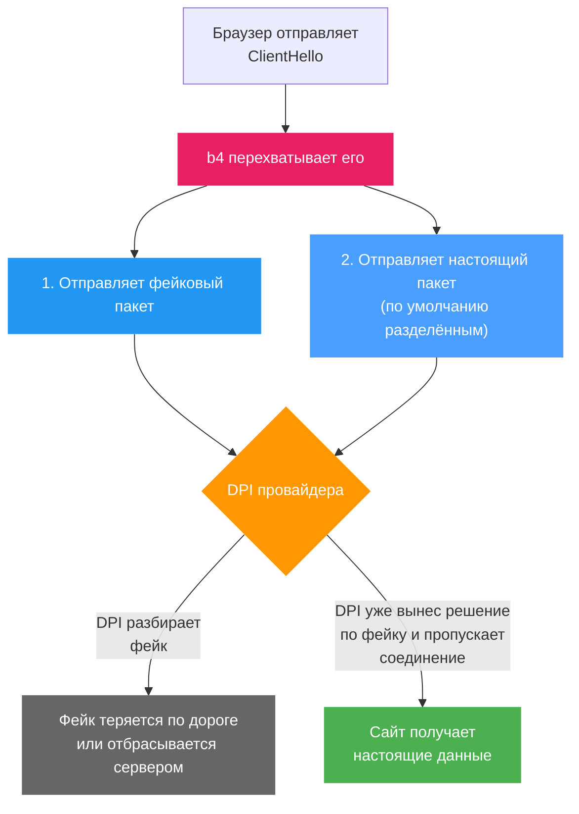

# Пэйлоады

Вкладка **Настройки, Пэйлоады** хранит файлы, которые фейковые пакеты могут нести вместо встроенного пэйлоада. Пэйлоад генерируется по доменному имени или загружается из файла и хранится под именем и протоколом. TLS-пэйлоады предназначены для фейков, которые сет отправляет по TCP, QUIC-пэйлоады - для фейков по UDP. Генерация, загрузка и удаление выполняются на роутере сразу, кнопка **Сохранить** для них не нужна.

## Зачем нужны пэйлоады

Один из способов обойти DPI - отправить перед настоящим пакетом **фейковый**. DPI разбирает фейк, а стратегия фейка в настройках сета не даёт серверу его принять. Данные, которые несёт фейк, и есть **пэйлоад**.

Почему сервер не принимает фейк, зависит от поля **Стратегия фейка** сета. При **TTL** время жизни фейка истекает на промежуточном узле, и до сервера он не доходит; при остальных стратегиях он доходит до сервера и отбрасывается им, например из-за неожиданного sequence number или неверной контрольной суммы. Новый сет использует **Past Sequence**. Стратегии описаны в разделе [Faking](../sets/tcp/faking.md#стратегия-фейка).

## Типы пэйлоадов

Поле **Тип фейкового payload** сета (**TCP, Фейкинг, Фейковые SNI-пакеты**) выбирает, что несёт фейк:

| Тип | Содержимое |
| --- | --- |
| **Случайное** | 1200 случайных байт, новых для каждого соединения |
| **Пресет: Google (классический)** | Записанный TLS ClientHello для `www.google.com`, 1235 байт. С этого типа начинает новый сет |
| **Пресет: DuckDuckGo** | Записанный TLS ClientHello для `staticcdn.duckduckgo.com`, 517 байт |
| **Пресет: STUN** | STUN Binding Request на 100 байт, без TLS |
| **Свой файл payload** | Пэйлоад с этой вкладки, выбранный в поле **Сгенерированный payload**, которое появляется при этом типе |
| **Все нули** | 1200 нулевых байт |
| **Инвертированный оригинал** | Содержимое настоящего пакета, в котором инвертирован каждый бит; длина та же |
| **Сгенерированный из домена** | ClientHello от того же генератора, что и кнопка **Сгенерировать** на этой вкладке, для имени из поля **Домен** сета. Собирается заново при запуске и при каждом сохранении конфигурации |

:::note Запасной вариант - пресет Google
При типе **Свой файл payload** фейк несёт **Пресет: Google (классический)**, пока пэйлоад не выбран или выбранный файл не читается. То же происходит при типе **Сгенерированный из домена** с пустым полем **Домен**.
:::

:::tip Какой выбрать
Отправная точка - тип пэйлоада из результата Дискавери. Поведение DPI зависит от провайдера и может меняться со временем.
:::

## Генерация пэйлоада

Карточка **Сгенерировать пэйлоад** собирает TLS ClientHello для имени из поля **Домен**:

1. Введите имя в поле **Домен**, например `youtube.com`.
2. Нажмите **Сгенерировать** или Enter.

ClientHello собирается на самом роутере. Соединение не устанавливается, имя не резолвится и не проверяется, поэтому принимается любое. Префикс `http://` или `https://` и путь отбрасываются (`https://youtube.com/watch` превращается в `youtube.com`), имя приводится к нижнему регистру. Размер пэйлоада - 648 байт плюс длина имени, для `example.com` это 659 байт.

Генерируются только TLS-пэйлоады. У каждого имени не больше одного пэйлоада на протокол: если у имени уже есть TLS-пэйлоад, сгенерированный или загруженный, он остаётся как есть, а вкладка сообщает, что пэйлоад уже существует.

### Почему SNI-first

В каждом сгенерированном ClientHello расширение SNI стоит первым. Среди расширений после него - `supported_versions` с TLS 1.3 и 1.2, ALPN с `h2` и `http/1.1`, `key_share` для X25519 и P-256 и расширение `encrypted_client_hello` со случайным содержимым. Random, session ID и ключи в `key_share` в каждом пэйлоаде случайные.

Генератор построен в расчёте на особенность ТСПУ: если SNI - первое расширение, имя сверяется с белым списком, и разрешённое имя проходит по ускоренному пути. Срабатывает ли это, зависит от оборудования провайдера.

## Загрузка своего пэйлоада

Карточка **Загрузить свой пэйлоад** добавляет пэйлоад из файла:

| Поле | Описание |
| --- | --- |
| **Имя/Домен** | Имя, под которым пэйлоад виден в сетах и в Дискавери, в нижнем регистре. С содержимым файла оно никак не связано. Если поле пустое, при выборе файла оно заполняется именем файла без `.bin` и без префикса `tls_` или `quic_`, с точками вместо подчёркиваний, так что `tls_youtube_com.bin` даёт `youtube.com` |
| **Протокол** | **TLS (для TCP-фейков)** или **QUIC (для UDP-фейков)**, по умолчанию TLS. При выборе файла определяется по первым байтам. TLS handshake record (`16 03`) означает TLS, а QUIC long header Initial (первый байт от `0xC0` до `0xCF`) означает QUIC. Если не подходит ни то, ни другое, решает префикс `tls_` или `quic_` в имени файла, а без него поле сохраняет прежнее значение |
| **Выбрать файл...** | Открывает окно выбора файла с фильтром по `.bin`. После выбора на кнопке видно имя файла, а рядом с ней его размер |
| **Загрузить** | Отправляет файл. Доступна, когда выбран файл и задано имя. После загрузки карточка очищается, а **Протокол** возвращается к TLS |

Запрос загрузки целиком ограничен 64 КБ (65536 байт), поэтому сам файл должен быть немного меньше. Пустой файл отклоняется. Содержимое сохраняется как есть, без какой-либо проверки. Загрузка под уже существующими именем и протоколом заменяет пэйлоад без подтверждения.

:::info Пэйлоады в общих сетах
[Общий сет](../sets/sharing.md#файлы-payload) несёт файл пэйлоада, только если файл разбирается. Пэйлоад TCP-фейка должен быть TLS ClientHello с именем сервера, пэйлоад UDP-фейка - QUIC Initial с читаемым ClientHello, и любой из них не больше 16 КБ. Загруженный файл, который не разбирается, в общий сет не попадает. Пэйлоады, установленные из общего сета, появляются на этой вкладке.
:::

## Использование в сетах

Сет хранит путь к файлу пэйлоада, например `captures/tls_youtube_com.bin`, в `faking.payload_file` для TCP-фейков и в `udp.fake_payload_file` для UDP-фейков.

### TCP-фейки

1. Откройте сет, его вкладку **TCP** и в ней **Фейкинг**.
2. В секции **Фейковые SNI-пакеты**, когда переключатель **Включить фейковый SNI** включён, выберите в поле **Тип фейкового payload** вариант **Свой файл payload**.
3. Выберите пэйлоад в поле **Сгенерированный payload**.

Список показывает все пэйлоады этой вкладки по имени и размеру, включая QUIC-пэйлоады, без указания протокола. Рядом со списком есть ссылка на эту вкладку. Пока пэйлоадов нет, список скрыт, а на его месте видно уведомление с этой ссылкой.

### UDP-фейки

Во вкладке **UDP** сета, когда в поле **Режим действия** выбран **Fake & Fragment**, поле **Payload фейкового пакета** задаёт тело фейковых UDP-пакетов:

| Вариант | Тело |
| --- | --- |
| **(заполнение нулями)** | Нули. Этот вариант использует новый сет |
| **(авто: QUIC Initial)** | Новый QUIC Initial со случайными connection ID и случайным содержимым для каждого фейка |
| **QUIC preset 1**, **QUIC preset 2** | Встроенные QUIC Initial на 1200 и 1357 байт |
| Пэйлоад с этой вкладки | В списке выглядит как `[quic] example.org (1250 bytes)`, QUIC-пэйлоады идут первыми |

При любом варианте длина тела равна значению **Размер фейкового пакета**; длинный пэйлоад обрезается, короткий дополняется нулями. Новый сет отправляет 64 байта, поэтому полный QUIC Initial уходит целиком, только когда размер увеличен до его длины. Остальные настройки UDP-фейков описаны в разделе [UDP](../sets/udp.md#настройки-fake--fragment).

## Использование в Дискавери

На странице **Дискавери** в панели **Параметры** есть поле **Захваченный ClientHello как содержимое фейков**. Оно предлагает TLS-пэйлоады этой вкладки по имени; QUIC-пэйлоадов в нём нет, а выбор сбрасывается при уходе со страницы. Дискавери пробует выбранные пэйлоады раньше встроенных (пресетов STUN, Google и DuckDuckGo) и дальше использует самый быстрый из сработавших. Стратегия, найденная с выбранным пэйлоадом, ссылается на его файл, и сет, который принимает эту стратегию, использует **Свой файл payload** с этим пэйлоадом. Остальные параметры описаны в разделе [Дискавери](../discovery.md#параметры).

:::info
Если со встроенными пэйлоадами Дискавери ничего не находит, запуск можно повторить с пэйлоадами, сгенерированными для нескольких имён. Результат зависит от того, как DPI провайдера реагирует на содержимое фейка.
:::

## Управление

Список **Сгенерированные пэйлоады** показывает все пэйлоады на роутере, будь то сгенерированные, загруженные или установленные из общего сета. На карточке видны имя, размер в байтах, протокол (TLS или QUIC) и время добавления пэйлоада. Пока пэйлоадов нет, вместо списка вкладка показывает **Пэйлоадов пока нет**.

Кнопки здесь - иконки, ниже указаны их подсказки.

| Кнопка | Действие |
| --- | --- |
| **Просмотр/Копирование hex** (карточка) | Открывает **Hex данные пэйлоада** с содержимым в hex. **Копировать и закрыть** копирует его в буфер обмена и закрывает окно |
| **Скачать .bin** (карточка) | Сохраняет пэйлоад как `<протокол>_<имя>.bin`, с подчёркиваниями вместо точек в имени |
| **Удалить** (карточка) | Сразу удаляет пэйлоад, без подтверждения |
| **Обновить список** (рядом с **Сгенерировать**) | Заново загружает список с роутера |
| **Очистить все** (рядом с **Сгенерировать**, если список не пуст) | Удаляет все пэйлоады после подтверждения |

:::warning Удаление пэйлоада, который использует сет
Удаление пэйлоада не меняет сеты, которые на него ссылаются. b4 читает файлы пэйлоадов сетов при запуске и при каждом сохранении конфигурации. Если файла к этому моменту нет, в лог пишется ошибка, а фейки переходят на **Пресет: Google (классический)** для TCP и на заполнение нулями для UDP. Пэйлоад, заменённый загрузкой, попадает в сеты в те же моменты.
:::

## Где хранятся пэйлоады

Пэйлоады лежат в каталоге `captures/` рядом с конфигурационным файлом, то есть в `/etc/b4/captures/` или `/opt/etc/b4/captures/` в зависимости от платформы (см. [Конфигурационный файл](../advanced/config.md#расположение-по-платформам)). Каждый пэйлоад - файл `<протокол>_<имя>.bin`, где точки в имени заменены подчёркиваниями, а все символы, кроме латинских букв, цифр и дефиса, отброшены. Файл `payloads.json` в том же каталоге хранит имя, протокол, размер и время каждого пэйлоада.

Вкладка показывает то, что записано в `payloads.json`, а b4 читает этот файл один раз за запуск. Файл `.bin`, скопированный в каталог вручную, на вкладке не появляется; добавить его можно загрузкой.
