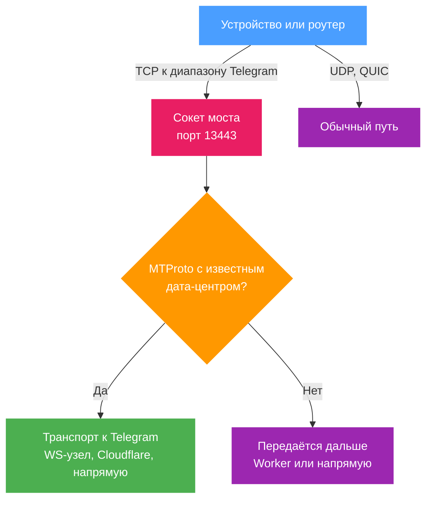

# Telegram через WebSocket

b4 принимает TCP-соединения, которые устройства за ним открывают к дата-центрам Telegram, разбирает сессию MTProto и ретранслирует её через WebSocket-узел Telegram, а за ним идут маршруты через Cloudflare. В самом Telegram на устройстве ничего не настраивается, VPS не участвует.

Мост включается для всей сети в разделе Настройки, Telegram. Режим маршрутизации сета направляет трафик в тот же мост, но только для выбранных устройств или интерфейсов; он описан [в конце страницы](#мост-только-для-части-устройств-или-интерфейсов). Ни одному из вариантов не нужен включённый MTProto-прокси.

## Включение

Настройки, **Telegram**, карточка **Telegram через WebSocket**, переключатель **Включить Telegram через WebSocket**. Он хранится как `system.mtproto.bridge.enabled` и по умолчанию выключен. Пока страница не сохранена кнопкой **Сохранить**, карточка показывает **Сохраните, чтобы применить**; после сохранения переключатель действует без перезапуска сервиса. Сет для этого не нужен, файлы GeoIP и GeoSite тоже.


Пока переключатель включён, b4 направляет TCP-соединения к [диапазонам адресов](#список-адресов) Telegram в слушающий сокет моста на порту 13443. Порт фиксированный. Перенаправление охватывает:

- все устройства за b4;
- соединения, которые открывает сам роутер, например Telegram Desktop, запущенный на той же машине.

[Фильтрация устройств](../settings/core.md#фильтрация-устройств) в разделе Настройки, Основные действует и здесь: в режиме разрешающего списка перенаправляются только выбранные устройства, а собственные соединения роутера остаются на обычном пути, в режиме запрещающего выбранные устройства остаются на обычном пути. Собственного ограничения по исходным интерфейсам или устройствам у переключателя нет; для этого остаётся [режим маршрутизации сета](#мост-только-для-части-устройств-или-интерфейсов).

Правила перенаправления существуют, только пока слушающий сокет работает. Если порт 13443 занять не удалось, b4 повторяет попытки, а до успеха соединения Telegram идут обычным путём и не уходят в закрытый порт. Если не открылся только сокет IPv6, IPv4 идёт через мост, Telegram по IPv6 идёт обычным путём, а карточка показывает замечание; сокет IPv6 пробуется снова только при перезапуске слушающего сокета.



## Требования

Мост работает через TPROXY, которому нужны модули ядра `tproxy` и `socket`. В OpenWrt это `kmod-nft-tproxy` и `kmod-nft-socket`, полный список для других файрволов и систем - в разделе [Маршрутизация, требования](../sets/routing.md#требования). Без них b4 не устанавливает для переключателя правило перенаправления, Telegram идёт обычным путём, а карточка показывает **Не работает** и называет пакеты с недостающими модулями. После установки пакетов **Проверить снова** на карточке повторяет проверку ядра и устанавливает правило. Кнопка **Информация о системе** в разделе Настройки, Основные показывает тот же результат в разделе **Возможности ядра**, в строке **Прозрачный прокси (TPROXY)**.

Перенаправление - это правило файрвола, поэтому файрволом должен управлять b4. Если в разделе [Настройки, Основные](../settings/core#фаервол) включено **Пропустить настройку IPTables/NFTables** (`system.tables.skip_setup`, флаг `--skip-tables`), при старте правила не устанавливаются. Сохранение настроек всё же устанавливает правила маршрутизации, и они остаются до следующего перезапуска.

С движком TUN мост не проверялся, и карточка сообщает об этом, пока b4 работает в этом режиме.

Диапазоны IPv6 перенаправляются, только пока в разделе [Настройки, Основные](../settings/core#протоколы) включена **Поддержка IPv6**. Без неё Telegram по IPv6 идёт обычным путём.

На iptables правило другой программы, проверяющее локальные сокеты, например `DIVERT`, которое XrayUI добавляет при каждом запуске xray, забирает пакеты перенаправленных соединений у слушателя. b4 держит правило перенаправления выше таких правил, как описано в разделе [b4 вместе с Xray или XrayUI](../guides/xray.md#правило-tproxy-от-xrayui-и-соединения-которые-перенаправляет-b4).

## Список адресов

b4 держит список диапазонов адресов Telegram. Встроенный список, вшитый в b4, входит в него всегда. Поверх встроенного b4 использует один из этих источников, в порядке предпочтения:

1. Список, который Telegram публикует по адресу `https://core.telegram.org/resources/cidr.txt`.
2. Тот же файл с зеркал b4, сначала `proxy.b4core.app`, затем `proxy2.b4core.app`, когда telegram.org недоступен.
3. Последнюю скачанную копию, сохранённую как `telegram_cidr.txt` рядом с файлом конфигурации.
4. Категорию `telegram` из настроенного файла GeoIP.

Список скачивается в фоне после включения переключателя и при старте, пока переключатель включён, а затем раз в сутки. Неудачное скачивание оставляет список, который уже используется; следующая попытка идёт через 30 секунд, а после каждой новой неудачи пауза удваивается, но не больше часа, пока скачивание не удастся и не вернётся расписание раз в сутки. **Обновить адреса** на карточке скачивает его заново сразу. Запись шире /12 для IPv4 или /24 для IPv6 из скачанного списка отбрасывается, поэтому повреждённый файл не может завести в мост большую часть адресного пространства.

Файлы GeoIP и GeoSite для переключателя не обязательны. GeoSite в работе моста не участвует вовсе.

## Проверка работы

Когда переключатель включён и сохранён, карточка показывает **Работает**, если правило перенаправления установлено, слушатель моста запущен и выше правила перенаправления нет правила другой программы, проверяющего локальные сокеты, и **Не работает** в остальных случаях; подсказка на статусе называет, чего не хватает. Ниже идут порт слушателя, активные соединения, сколько диапазонов Telegram используется и откуда они взяты, число переправленных сессий и время последней. Поля карточки перечислены в разделе [Настройки, Telegram](../settings/mtproto.md#telegram-через-websocket), а каждое её предупреждение разобрано в разделе [Устранение неполадок](./troubleshooting.md#предупреждения-на-карточке-telegram-через-websocket).

Переправленная сессия пишет в лог одну строку на уровне info:

```text
[tg-bridge c=5] bridge relay 149.154.167.51:443 -> DC2 via ws://kws2.web.telegram.org@149.154.167.220 [dc-from=ip]
```

Соединения, прошедшие через мост, видны в [логах](../logs.md) и на странице [Трафик](../connections.md) с именем сета **Telegram bridge**, а на странице «Трафик» у них есть ещё и метка **Мост Telegram**. Сета с таким именем в списке сетов нет, имя лишь помечает то, что перенаправил переключатель.

Через [MCP](../settings/mcp.md) состояние моста сообщает `b4_status`, а при разрешённых изменениях конфигурации переключатель доступен для записи как `system.mtproto.bridge.enabled`.

## В какой дата-центр идёт сессия

Telegram Desktop называет свой дата-центр в первых байтах соединения. Приложение для Android оставляет это поле случайным, поэтому для его соединений b4 определяет дата-центр по адресу, на который ушло соединение: по списку, который Telegram публикует для прокси, по встроенной в b4 таблице и по диапазонам адресов каждого дата-центра. Поле `dc-from` в строке о переправленной сессии начинается с источника, который решил, `handshake`, `ip` или `ip-range`, а за ним идёт `+learned`, если прежний `-444` перевёл адрес в другой дата-центр, и `+handshake-media`, если рукопожатие пометило сессию как медиа.

Дата-центр отвечает `-444` на сессию, которая принадлежит другому. Если дата-центр был определён по адресу, а клиент не назвал тот же самый, b4 обрывает такую сессию и не понижает использованный маршрут, потому что маршрут доставил сессию туда, куда её направил b4. Следующие сессии на тот же адрес шесть часов идут в другой дата-центр той же площадки, 4 вместо 2 или 3 вместо 1 и наоборот, и лог один раз сообщает об этом. Адрес, который отвечает `-444` обоим или дата-центру 5 либо 203, у которых пары нет, 30 минут обрабатывается как соединение, которое b4 не может отнести к дата-центру, и [передаётся дальше](#соединения-которые-мост-передаёт-дальше). Сессия, клиент которой сам назвал дата-центр, обрабатывается как у прокси-сервера, и `-444` понижает маршрут.

## Порядок среди сетов

Правила переключателя стоят первыми среди сетов маршрутизации, не ограниченных устройствами или интерфейсами. Обычный сет маршрутизации, который тоже покрывает адреса Telegram, например сет, отправляющий весь трафик через VPN, не забирает соединения Telegram у моста.

Сет, ограниченный конкретными устройствами (включающим или исключающим списком исходных устройств) или исходными интерфейсами, по-прежнему первым обрабатывает свои устройства, если тоже совпадает с адресами Telegram. Так трафик Telegram одного устройства можно оставить на другом маршруте, пока переключатель покрывает всех остальных.

Когда фильтрация устройств в разделе Настройки, Основные работает в режиме разрешающего списка, каждый сет маршрутизации ограничен выбранными устройствами, и переключатель стоит перед всеми ними.

:::warning Сет блокировки блокирует и мост
Сет блокировки, не ограниченный исходными интерфейсами или включающим списком исходных устройств, цели которого покрывают адреса Telegram, по-прежнему блокирует соединения самого роутера к этим адресам. Собственные исходящие соединения моста - среди них, поэтому такой сет отрезает мост от всех адресов, которые покрывает.
:::

## Обработка DPI

Соединения с устройств и с самого роутера передаются мосту нетронутыми обработкой пакетов b4, поэтому faking, фрагментация и десинхронизация к ним не применяются. Мост завершает TCP-соединение клиента на своём сокете и открывает собственные.

Исходящие соединения моста обрабатываются по маршрутам, и соединения прокси-сервера MTProto с Telegram - так же:

| Маршрут | Обработка пакетов |
| --- | --- |
| WebSocket-узел Telegram, с именем для фронтинга или без | Проходит; обычный сет, с целями которого соединение совпадает, применяет свои настройки DPI |
| Прямой TCP к дата-центру | Проходит; обычный сет, с целями которого соединение совпадает, применяет свои настройки DPI |
| Домены через Cloudflare, свой WebSocket-домен | Не проходит; faking, фрагментация и десинхронизация к ним не применяются ни одним сетом |
| Cloudflare Worker | Не проходит, пока выключен переключатель **Обрабатывать соединения с Worker сетами**; с ним обычный сет, с целями которого соединение совпадает, применяет свои настройки DPI |

Маршруты через Cloudflare - это релеи, которые доходят до Telegram, не обращаясь к его адресам, а сет, покрывающий Cloudflare ради других сайтов, например с GeoIP- или GeoSite-категорией `cloudflare`, иначе применял бы свою стратегию и к ним. В сети, где такая стратегия ломает соединения с Cloudflare, это оборвало бы все эти маршруты разом.

В некоторых сетях вместо этого замедляют `workers.dev`: TLS-рукопожатие с Worker завершается, а поток останавливается после первых нескольких килобайт. Переключатель **Обрабатывать соединения с Worker сетами**, который появляется на карточке транспорта к Telegram, когда задан домен Worker, отдаёт соединения с Worker в обработку пакетов, и сет, цели которого покрывают Worker по домену `workers.dev` или по адресам Cloudflare, применяет к ним свою стратегию. Переключатель касается только Worker; домены через Cloudflare и свой WebSocket-домен в любом случае остаются вне обработки пакетов. По умолчанию он выключен и применяется без перезапуска.

Сет в режиме маршрутизации **Telegram через WebSocket** ведёт себя иначе. Если он не ограничен включающим списком исходных устройств, он сам совпадает с собственными соединениями моста к адресам из своих целей (к WebSocket-узлу Telegram и напрямую к дата-центрам) и пропускает их без изменений. Собственные настройки DPI такого сета для TCP к TCP-трафику Telegram не применяются никогда.

## Что мост берёт из настроек транспорта

Общие настройки [транспорта к Telegram](./upstream.md) действуют, но с двумя подменами, которые мост делает для каждой сессии, каким бы способом он ни был включён:

- Режим транспорта принудительно ставится в **Авто**, что бы ни было выбрано в списке.
- **DC Relay** очищается. Релей, настроенный для прокси-сервера, здесь не используется, поэтому сеть, где заблокирован WebSocket-транспорт, в этом режиме релеем не спасается.

Пока прокси-сервер работает в режиме **Авто** или **Только WebSocket**, мост берёт прогретые WebSocket-соединения из его пула. В остальное время мост держит собственный пул, который наполняется после первой сессии через мост к каждому дата-центру, поэтому дата-центр, через который за последние несколько минут не шло ни одной сессии моста, начинает «на холодную».

Если не загружаются медиа, добавляют [домен Cloudflare Worker](./cloudflare-worker.md): дата-центры, которые не обслуживает собственный узел Telegram, достигаются через маршруты Cloudflare.

## Границы

Через мост идут только TCP-сессии MTProto.

- Соединение, которое b4 не может разобрать или сопоставить с дата-центром, [передаётся дальше](#соединения-которые-мост-передаёт-дальше) в Cloudflare Worker или напрямую.
- Голосовые звонки не перехватываются. Они идут по UDP, слушающий UDP-сокет не создаётся, и звонки идут обычным путём.
- Правило отклонения QUIC не устанавливается, поэтому клиент, предпочитающий QUIC к адресу Telegram, обходит мост без единой строки в логе.
- У перенаправления нет фильтра по порту назначения. В слушающий сокет попадает любое TCP-соединение к диапазону Telegram, включая обычный HTTPS к веб-хостам Telegram внутри этих диапазонов, например `web.telegram.org` или `t.me`. Такое соединение читается, опознаётся как не-MTProto и [передаётся дальше](#соединения-которые-мост-передаёт-дальше).

Соединение, дошедшее до слушающего сокета и не приславшее ни байта, занимает его на время **Ожидания рукопожатия в мосте**, по умолчанию 180 секунд; поле находится в разделе **Резервные источники** карточки «Транспорт к Telegram (общий)». Значение `-1` означает ожидание без ограничения, а не отключение ожидания.

### Соединения, которые мост передаёт дальше

Соединение, которое не является MTProto или которое b4 не может отнести к дата-центру, без изменений пересылается на исходный адрес и учитывается в счётчике **Передано без разбора** на карточке. Маршрут зависит от порта и от того, что везло прежние соединения к тому же адресу:

| Случай | Маршрут |
| --- | --- |
| Порт не 443 | Напрямую. Worker всегда подключается к порту 443 переданного ему адреса. |
| Порт 443, Worker не задан или все Worker отложены после зависания | Напрямую |
| Порт 443, есть рабочий Worker | Сначала Worker; напрямую, если ни один Worker не подключился |
| Порт 443, адрес запомнен как прямой | Сначала напрямую, с ожиданием подключения 5 секунд; Worker, если прямое соединение не открылось |

Адрес запоминается как прямой на 30 минут, когда Worker зависает на соединении к нему или когда прямое соединение к нему передало данные. Прямое соединение, которое не удалось открыть или которое открылось и ничего не вернуло, убирает адрес из памяти, и следующее снова сначала идёт в Worker. Зависание засчитывается и самому Worker: два за пять минут откладывают этот Worker на десять минут для всех маршрутов.

## Мост только для части устройств или интерфейсов

Режим маршрутизации **Telegram через WebSocket (встроенный)** у сета направляет трафик в тот же мост, но с ограничением по источникам и местом в списке сетов, как у любого сета. Это способ пустить через мост только часть устройств или интерфейсов. Пока включён переключатель, сет в этом режиме избыточен, и карточка предупреждает об этом.

1. Создать сет и указать ему **GeoIP**-категорию `telegram`. Правило перехвата сопоставляет адреса, поэтому трафик направляет именно GeoIP-категория. База GeoIP должна быть настроена: сет, в котором указана категория, а путь к базе пуст, отклоняется при сохранении конфигурации.
2. На вкладке сета **DNS & Маршрутизация** включить маршрутизацию и выбрать **Режим маршрутизации** *Telegram через WebSocket (встроенный)*.
3. Выбрать **Исходные интерфейсы** на той же вкладке или [исходные устройства](../sets/targets.md#исходные-устройства) на вкладке **Цели**, чтобы ограничить, чей трафик идёт через мост. Если оба списка пусты, сет покрывает все устройства.

```json
{
  "name": "telegram-ws",
  "targets": {
    "geoip_categories": ["telegram"]
  },
  "enabled": true,
  "routing": { "enabled": true, "mode": "mtproto-ws" }
}
```

Сет, в котором указана ещё и GeoSite-категория `telegram`, как в прежней версии этого примера, продолжает работать. GeoSite-категория лишь добавляет в перенаправление веб-хосты Telegram, которые мост опознаёт как не-MTProto и передаёт дальше, и для самого MTProto ничего не даёт.

:::warning Ограничение по источникам делает больше, чем кажется
Правила, отправляющие в мост собственный трафик роутера, устанавливаются только пока сет не ограничен исходными интерфейсами или устройствами. Выбор исходного интерфейса исключает из моста и сам роутер, а не только устройства на других интерфейсах. Так же действует фильтрация устройств в режиме разрешающего списка.
:::

Соединения, которые переносит сет в этом режиме, видны в логах и на странице «Трафик» под собственным именем сета, с той же меткой **Мост Telegram**.
