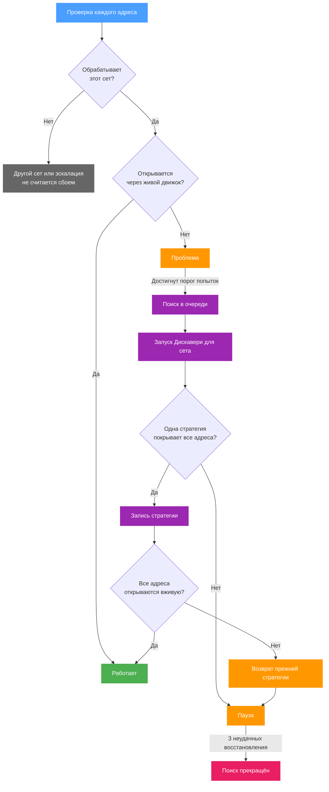

# Мониторинг (Watchdog)

Мониторинг по расписанию запрашивает страницы и, если они продолжают не открываться, запускает [Дискавери](./discovery), чтобы найти стратегию, с которой они снова загружаются. Он работает с двумя видами целей:

- **отслеживаемые сеты** - сеты, у которых собственный мониторинг включён на [вкладке Дискавери](./sets/discovery#мониторинг). Все адреса Дискавери сета проверяются вместе, а восстановление поддерживает рабочей собственную стратегию этого сета;
- **старый список доменов** - домены, которые проверяются по одному, и каждый восстанавливается через тот сет, в котором он указан в этот момент.

Страница **Мониторинг** показывает оба в разделах **Отслеживаемые сеты** и **Старый список доменов**. Общий переключатель и интервалы находятся в разделе **Настройки, Дискавери** и действуют для обоих. Подход к реактивному обнаружению вдохновлён проектом [belotserkovtsev/ladon](https://github.com/belotserkovtsev/ladon).

## Мониторинг сета

Сет отслеживается, пока включён его переключатель **Поддерживать работу сета с помощью мониторинга**, а сам сет включён, имеет адреса Дискавери, не использует маршрутизацию, не ограничен отдельными устройствами через список включения и имеет цели-домены или категории GeoSite. На [вкладке Дискавери](./sets/discovery#мониторинг) эти условия перечислены вместе с тем, что происходит с переключателем, когда одно из них не выполнено.

### Проверки

Сет проверяется сразу, как только становится отслеживаемым, затем через каждый **Интервал проверки**, а пока у него статус «Проблема» - через **Интервал после ошибки**. Каждый адрес проходит два шага.

**Принадлежность.** Движок сообщает, какой сет он использует для имени хоста адреса с точки зрения роутера. Адрес, который обрабатывает другой сет или никакой, помечается **Другой сет**; адрес, который [эскалация](./sets/escalation) сейчас отправляет в другой сет, помечается **Эскалация**. Ни то, ни другое сбоем не считается: стратегия, записанная в этот сет, на такой адрес не действует.

**Запрос.** Адрес, который обрабатывает этот сет, запрашивается через живой движок так же, как к нему обращается устройство за роутером:

| Правило | Результат |
| --- | --- |
| Проверка TLS-сертификата включена, по системным корневым сертификатам и тем, что Entware ставит в `/opt/etc/ssl` (`ca-bundle` или `ca-certificates`) | Ошибка сертификата делает адрес **Непригодным**. На роутере без корневых сертификатов сертификат не проверяется. |
| Сервер требует клиентский сертификат | **Непригоден**. |
| Частные и локальные адреса отклоняются на каждом шаге, включая перенаправления | **Непригоден**. |
| Выполняется до 3 перенаправлений | Больше - ошибка; перенаправление на известную страницу блокировки - ошибка. |
| HTTP 400, 451 и любой 5xx | Ошибка. |
| Читается не больше 100 КБ тела, а первые 4 КБ проверяются на страницу блокировки | Страница блокировки - ошибка. |
| Прочитано меньше 1 КБ | Ошибка. |
| Тело оборвано до конца: меньше 90% объявленной длины без закрывающего `</html>` или ошибка чтения | Ошибка. |
| IPv6 | Используется, только пока движок захвата обрабатывает IPv6; иначе запрос идёт только по IPv4. |

Весь запрос ограничен **Таймаутом проверки**. **Непригодный** адрес указывает на проблему, которую стратегия не меняет, поэтому он никогда не восстанавливается и в восстановлении не участвует.

Если все проверенные адреса открылись, сет получает статус **Работает**. Если хотя бы один не открылся, проверка считается неудачной, и сет получает статус **Проблема**. Если проверить нельзя ни одного адреса, потому что каждый обрабатывает другой сет, уходит в эскалацию или непригоден, сет получает статус **Нельзя проверить** с указанием причины и не восстанавливается, пока так остаётся.

### Очередь восстановления и лимит времени

После **Макс. попыток** неудачных проверок подряд сет ставится в очередь на восстановление (**Поиск в очереди**). Восстановления идут по одному, в порядке очереди, и делят среду Дискавери с запусками вручную: пока идёт запуск Дискавери, начатый на странице Дискавери или через MCP, восстановление ждёт, а во время восстановления ручной запуск не начинается. Сет, изменённый, пока он ждал в очереди, из неё убирается и сначала проверяется заново, а изменение его адресов возвращает его в статус **В очереди** для новой проверки.

Восстановление - это [запуск Дискавери для сета](./discovery#запуск-для-сета) на адресах, которые сет обрабатывает и которые можно проверить:

- проверка DNS пропускается;
- первой проверяется текущая стратегия сета;
- во время поиска каждая стратегия должна пройти три запроса подряд;
- поиск останавливается на первой стратегии, подтверждённой на всех адресах вместе.

Запуск виден на странице Дискавери, как любой другой, но остановить его оттуда нельзя. Через 15 минут поиск останавливается, и найденное к этому моменту подтверждается. Через 20 минут запуск отменяется, ничего не записывается, а восстановление считается неудачным.

### Что записывается

Записывается только вердикт **одна стратегия покрывает все адреса**, и только стратегия, по тем же правилам, что и [запись в существующий сет](./discovery#запись-в-существующий-сет) из Дискавери:

| Часть сета | После восстановления |
| --- | --- |
| TCP | Из результата, кроме фильтра портов и защиты от RST, которые остаются от сета. Обнаружение IP-блокировок остаётся прежним, если результат его не включает. |
| Фрагментация и фейки | Из результата. |
| DNS | Меняется, только если результат использует DNS-перенаправление; закрепления сета сохраняются. |
| UDP, цели, маршрутизация, эскалация, адреса Дискавери | Не меняются. |

Если сет изменили, пока шло восстановление, ничего не записывается. Любой другой вердикт ничего не записывает и считается неудачным восстановлением с указанием причины.

### Проверка и откат

После записи эскалации, которые b4 держит для хостов сета, сбрасываются, чтобы адреса снова попадали в этот сет, и каждый адрес, на котором шло восстановление, запрашивается через живой движок по тем же правилам, что и при проверке, до двух попыток на адрес. Если открылись все, восстановление завершено: сет получает статус **Работает**, а записанная стратегия показывается как последнее восстановление.

Если какой-то адрес по-прежнему не открывается, разделы стратегии этого сета (TCP, UDP, фрагментация, фейки и DNS) возвращаются к состоянию до восстановления, а восстановление считается неудачным. Возврат не выполняется, если сет изменили после того, как восстановление его записало, - ручная правка никогда не перезаписывается; последняя ошибка тогда сообщает, что сет не восстановлен. Другие сеты не затрагиваются.

### Пауза и прекращение поиска

После каждой попытки восстановления, удачной или нет, сет ждёт **Перерыв между discovery**, прежде чем снова проверяться. Изменение адресов Дискавери сета прерывает ожидание, и сет проверяется сразу. После трёх неудачных восстановлений подряд мониторинг прекращает поиск для сета (**Поиск прекращён**): проверки продолжаются с обычным интервалом, но восстановление не ставится в очередь, пока не произойдёт одно из:

- проверка показала, что все адреса открываются;
- для сета нажата кнопка **Проверить сейчас** на странице мониторинга;
- мониторинг сета выключен и снова включён.

### Статусы

Отслеживаемый сет показывает один из этих статусов на странице мониторинга, на своей вкладке Дискавери и цветом бейджа **Мониторинг** на карточке:

| Статус | Значение |
| --- | --- |
| **В очереди** | Ещё не проверялся или ждёт новой проверки после изменения. |
| **Работает** | При последней проверке открылись все адреса, которые удалось проверить. **Непригодный** адрес или адрес другого сета сохраняет свой статус в списке адресов и не учитывается. |
| **Проблема** | Хотя бы один адрес не открылся; показано число неудачных проверок подряд. Повторная проверка - через интервал после ошибки. |
| **Поиск в очереди** | Достигнуто значение **Макс. попыток**, восстановление ждёт своей очереди. |
| **Идёт поиск** | Идёт запуск Дискавери для восстановления. |
| **Пауза** | Попытка восстановления не удалась или результат не записан; следующая проверка ждёт окончания паузы. |
| **Нельзя проверить** | Ни один адрес сета нельзя проверить: каждый обрабатывает другой сет, уходит в эскалацию или непригоден. |
| **Поиск прекращён** | Три восстановления подряд не удались. Проверки продолжаются, восстановления - нет. |

Каждый адрес сета показывает один из этих статусов:

| Статус | Значение |
| --- | --- |
| **В очереди** | Ещё не проверялся. |
| **Работает** | Открылся через живой движок. |
| **Ошибка** | Не открылся по правилам из раздела [Проверки](#проверки). Считается сбоем. |
| **Другой сет** | С точки зрения роутера хост обрабатывает другой сет или никакой; этот сет назван. Сбоем не считается. |
| **Эскалация** | Эскалация отправляет хост в другой сет. Сбоем не считается. |
| **Непригоден** | Ошибка сертификата, требуется клиентский сертификат либо адрес частный или локальный. Не восстанавливается. |

Причина под статусом сета объясняет, почему он в этом состоянии или чем закончилось последнее восстановление. Код во втором столбце - то, что сообщают инструмент [MCP](./settings/mcp) и API:

| Кратко | Код | Значение |
| --- | --- | --- |
| Другой сет | `not_owned` | Адреса сета обрабатывает другой сет или никакой, поэтому стратегия, записанная в этот сет, на них не действует. |
| Эскалация | `escalated` | Эскалация отправляет адреса в другой сет. |
| Нельзя восстановить | `unusable` | Ошибка сертификата, требуется клиентский сертификат либо адрес частный или локальный. |
| Текущая стратегия работает | `current_works` | При отдельной проверке собственная стратегия сета открывает адреса, но живая проверка не проходит. Мешает что-то помимо стратегии: другой сет, DNS или IPv6. Ничего не изменено. |
| Обход не нужен | `not_needed` | При отдельной проверке адреса открываются без обхода, но живая проверка не проходит. Причины те же. Ничего не изменено. |
| Частичный результат | `partial` | Поиск нашёл стратегию только для части адресов, поэтому ничего не записано. |
| Ничего не найдено | `none` | Поиск не нашёл рабочей стратегии. |
| Не завершён | `incomplete` | Поиск закончился без подтверждённого результата. |
| Лимит времени | `budget` | Поиск шёл дольше 20 минут и был отменён. Следующая попытка - после паузы. |
| Не запустился | `start_failed` | Запуск Дискавери не удалось начать. |
| Проверка не пройдена | `verify_failed` | Записанная стратегия не прошла живую проверку и была отменена. |
| Сет изменён | `edited` | Сет изменился во время проверки, пока ждал в очереди или во время поиска. Ничего не записано, сет будет проверен снова, после паузы, если поиск уже шёл. |
| Занято | `busy` | Среду Дискавери занимает другой запуск. Восстановление ждёт. |

### Раздел «Отслеживаемые сеты»

Каждая строка раздела **Отслеживаемые сеты** ведёт на вкладку Дискавери сета и показывает его статус, причину с числом неудачных проверок подряд и последней ошибкой, время последней проверки, последнее восстановление с записанной стратегией, число неудачных восстановлений и время окончания паузы. Строка разворачивается в список адресов сета со статусом, другим сетом, который их обрабатывает, HTTP-ответом с объёмом прочитанного и скоростью, временем последней проверки и последней ошибкой.

**Проверить сейчас** назначает немедленную проверку всех адресов и сбрасывает паузу, счётчик неудачных восстановлений и прекращение поиска; пока восстановление в очереди или идёт, кнопка недоступна. **Перестать отслеживать сет** выключает мониторинг сета.

## Параметры

Настраиваются в разделе **Настройки, Дискавери**, в [блоке «Мониторинг»](./settings/discovery#мониторинг). Переключатель **Включить мониторинг** включает и выключает весь мониторинг, и для сетов, и для старого списка, а интервалы действуют для обоих.

| Параметр | Описание | Диапазон | По умолчанию |
| --- | --- | --- | --- |
| **Интервал проверки** | Как часто проверяется каждый отслеживаемый сет или домен, пока всё работает | 60-1800 сек | `300` сек (5 мин) |
| **Интервал после ошибки** | Как часто повторно проверяется сет или домен со статусом «Проблема» | 10-300 сек | `60` сек |
| **Перерыв между discovery** | Пауза после попытки восстановления перед следующей проверкой этого сета или домена | 60-3600 сек | `900` сек (15 мин) |
| **Таймаут проверки** | Максимальное время одного запроса | 3-30 сек | `15` сек |
| **Макс. попыток** | Сколько неудачных проверок подряд ставят восстановление в очередь | 1-10 | `3` |

Ещё два значения есть только в файле конфигурации, в `system.checker.watchdog`: `heal_validation_tries` (по умолчанию `3`) - сколько запросов подряд стратегия должна пройти во время поиска при восстановлении, и `verify_tries` (по умолчанию `2`) - сколько попыток получает каждый адрес в проверке после того, как восстановление записало стратегию.

## Старый список доменов

Этот список появился раньше мониторинга сетов и продолжает работать рядом с ним. Он редактируется в разделе **Настройки, Дискавери** (**Старый список доменов**) и в разделе **Старый список доменов** страницы мониторинга. Запись - домен или полный URL: URL проверяется как есть, домен - как `https://<домен>/`.

Каждая запись проверяется отдельно, с теми же интервалами. После **Макс. попыток** неудачных проверок подряд для домена запускается Дискавери без проверки DNS. Результат записывается, только если он подтверждён и домену нужен обход, и попадает:

- в первый включённый сет без маршрутизации, в списке доменов которого указан этот домен или его родительский домен; совпадение через категорию GeoSite не считается;
- иначе в новый сет с именем `watchdog-<домен>`, который создаётся в начале списка.

Записывается только стратегия, по тем же правилам, что и для отслеживаемого сета: фильтр портов, защита от RST и настройки UDP существующего сета сохраняются. Если сет совпал через родительский домен, сам домен тоже добавляется в его список доменов. Если запись меняет набор портов, которые перехватывает b4, - как это может сделать новый сет, - правила файрвола обновляются.

:::warning Сеты с маршрутизацией не трогаются
Домен из списка никогда не записывается в сет с включённой маршрутизацией (блокировка, прокси, интерфейс, мост Telegram). Совпадение через категорию GeoSite, например поддомен `ads.youtube.com` в `category-ads-all`, тоже не считается - учитывается только домен, указанный в списке доменов сета. Так отслеживаемый сайт не попадает в блокирующий сет.
:::

Мониторинг сета обходится без лишнего сета `watchdog-<домен>`: его восстановление всегда записывает в отслеживаемый сет и проверяет все адреса этого сета вместе.

Запись, хост которой уже проверяет отслеживаемый сет или сет которой сам отслеживается, из списка не проверяется; в таблице она показана как **Проверяется через сет &lt;имя&gt;**.

| Статус | Значение |
| --- | --- |
| **Доступен** | При последней проверке домен открылся. |
| **Проблема** | Зафиксированы ошибки, но значение **Макс. попыток** ещё не достигнуто. |
| **Восстановление** | Для домена идёт запуск Дискавери. |
| **В очереди** | Домен ожидает следующей проверки. |

### Отслеживание через сет

Если движок отдаёт хост записи какому-то сету, у записи появляется кнопка **Отслеживать через &lt;сет&gt;**. Она добавляет адрес записи в адреса Дискавери этого сета, включает для сета мониторинг, убирает запись из списка и назначает проверку сета. Кнопка недоступна, а подсказка называет причину, если сет нельзя отслеживать или у него уже пять адресов на других хостах.

## Страницы, открытые до восстановления

Восстановление меняет конфигурацию само, возможно, пока открыта страница с более старой её копией. Страница **Настройки** и редактор сета при каждом сохранении отправляют ревизию конфигурации или сета, которую загрузили. Если с тех пор конфигурация на роутере изменилась, например восстановлением, сохранение отклоняется с сообщением, предлагающим перезагрузить данные. Перезагрузка показывает текущее состояние и отбрасывает несохранённые изменения на этой странице, поэтому страница, открытая до восстановления, не может незаметно его отменить.

:::info
Инструмент `b4_watchdog` [MCP-сервера](./settings/mcp) читает и меняет и отслеживаемые сеты, и старый список, а `b4_find_bypass_strategy` запускает Дискавери для сета с первой проверкой его текущей стратегии и остановкой на первой подтверждённой стратегии, как и восстановление; в отличие от восстановления, он оставляет проверку DNS, если не задан `skip_dns`.
:::
